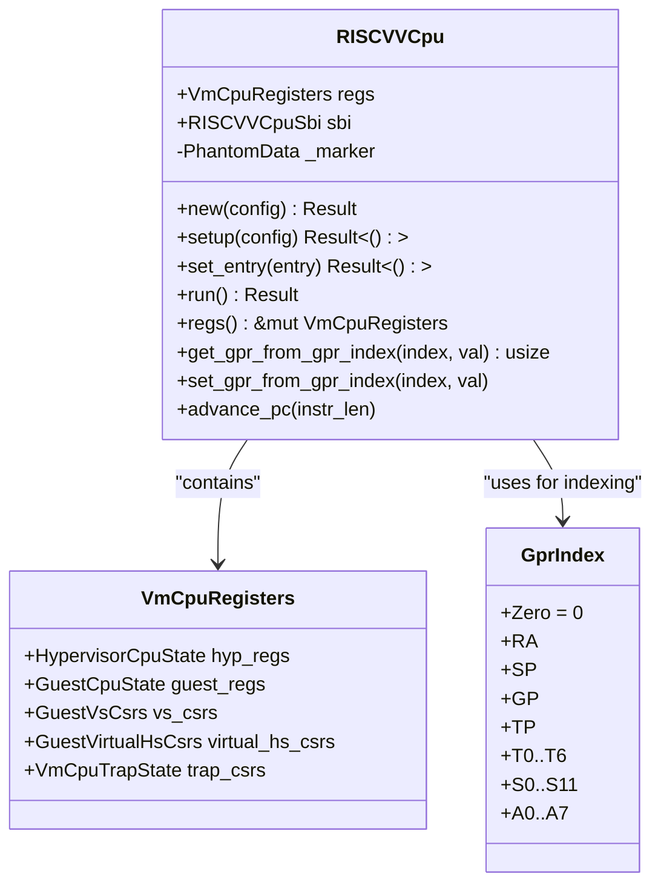
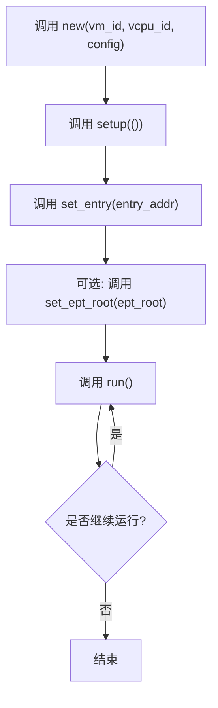
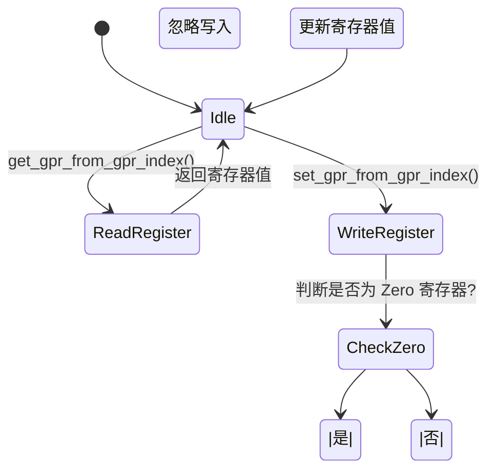

# RISCVVCpu 结构体

<cite>
**Referenced Files in This Document**   
- [vcpu.rs](file://src/vcpu.rs)
- [regs.rs](file://src/regs.rs)
- [lib.rs](file://src/lib.rs)
</cite>

## 目录
1. [简介](#简介)
2. [核心组件](#核心组件)
3. [API 详细说明](#api-详细说明)
4. [调用顺序与约束](#调用顺序与约束)
5. [状态管理与寄存器访问](#状态管理与寄存器访问)
6. [错误处理与调试建议](#错误处理与调试建议)
7. [代码示例](#代码示例)

## 简介

`RISCVVCpu` 是一个为 RISC-V 架构设计的虚拟 CPU（vCPU）实现，专用于嵌入式和教育场景下的 hypervisor。该结构体提供了完整的 vCPU 抽象层，支持 RISC-V 虚拟化扩展（RVH），能够在 `no_std` 环境中运行。它封装了虚拟机控制结构（VMCS）、扩展页表（EPT）以及每 CPU 数据结构等关键功能。

本 API 文档旨在详尽描述 `RISCVVCpu` 的创建、配置、执行及状态管理的所有公共方法，并结合实际使用场景提供指导。

**Section sources**
- [README.md](file://README.md#L0-L59)

## 核心组件

`RISCVVCpu` 结构体是整个模块的核心，负责管理虚拟 CPU 的生命周期和运行时行为。其内部包含多个关键字段：
- `regs`: 存储 vCPU 的完整寄存器状态，包括通用寄存器（GPRs）、CSR 寄存器等。
- `sbi`: 实现 SBI（Supervisor Binary Interface）调用转发机制。
- `_marker`: 类型标记，确保与特定硬件抽象层（HAL）绑定。

该结构体实现了 `axvcpu::AxArchVCpu` trait，从而标准化了跨架构的 vCPU 接口。



**Diagram sources**
- [vcpu.rs](file://src/vcpu.rs#L38-L39)
- [regs.rs](file://src/regs.rs#L145-L159)

**Section sources**
- [vcpu.rs](file://src/vcpu.rs#L38-L39)
- [regs.rs](file://src/regs.rs#L145-L159)

## API 详细说明

### new() 构造函数

`new()` 方法用于根据提供的 `RISCVVCpuCreateConfig` 配置创建一个新的 `RISCVVCpu` 实例。此方法会进行参数验证并完成初始化流程。

在初始化过程中，`a0` 寄存器被设置为 hart ID，`a1` 寄存器被设置为设备树二进制文件（DTB）的物理地址。这些值对于 guest OS 启动至关重要。

**Section sources**
- [vcpu.rs](file://src/vcpu.rs#L58-L74)

### run() 方法

`run()` 方法启动 vCPU 执行循环，将控制权交给 guest 操作系统。该方法通过调用底层汇编函数 `_run_guest` 来进入虚拟化模式。

当发生 VM exit 时，`run()` 会调用 `vmexit_handler()` 处理退出原因，并返回一个 `AxVCpuExitReason` 枚举值。可能的退出原因包括：
- `SystemDown`: Guest 请求关机
- `CpuUp`: HSM 扩展请求启动新 CPU
- `Hypercall`: 发生超调用（Hypercall）
- `ExternalInterrupt`: 外部中断
- `NestedPageFault`: 嵌套页错误

**Section sources**
- [vcpu.rs](file://src/vcpu.rs#L108-L118)
- [vcpu.rs](file://src/vcpu.rs#L278-L486)

### set_entry() 方法

`set_entry()` 方法用于设置 guest 的入口点地址（即 sepc 寄存器）。这是运行 guest 前必须完成的关键步骤之一。

如果未正确设置入口地址就调用 `run()`，guest 将从无效地址开始执行，可能导致不可预测的行为或立即触发异常。

**Section sources**
- [vcpu.rs](file://src/vcpu.rs#L98-L102)

### setup() 方法

`setup()` 方法负责初始化 vCPU 的特权级状态。具体操作包括：
- 设置 `sstatus` 寄存器中的 SPP 位为 Supervisor 模式
- 配置 `hstatus` 寄存器以启用 SPV 和 SPVP 位，允许 HS-mode 访问 VS-mode 内存

此方法通常在 `new()` 之后、`set_entry()` 之前调用。

**Section sources**
- [vcpu.rs](file://src/vcpu.rs#L84-L96)

## 调用顺序与约束

为了正确实例化并驱动 vCPU 运行，必须遵循严格的调用顺序：



**Diagram sources**
- [vcpu.rs](file://src/vcpu.rs#L58-L118)

**Section sources**
- [vcpu.rs](file://src/vcpu.rs#L58-L118)

违反此顺序（如未调用 `setup()` 或 `set_entry()` 即调用 `run()`）会导致 guest 行为异常或直接崩溃。

## 状态管理与寄存器访问

### regs() 访问器

`regs()` 方法提供对底层 `VmCpuRegisters` 结构的可变引用，允许 hypervisor 直接读写 vCPU 的完整寄存器状态。这对于调试、上下文切换和异常处理非常有用。

**Section sources**
- [vcpu.rs](file://src/vcpu.rs#L274-L276)

### get_gpr_from_gpr_index() 和 set_gpr_from_gpr_index()

这两个方法分别用于安全地读取和写入指定索引的通用寄存器（GPR）。它们接受 `GprIndex` 枚举作为参数，确保索引的有效性。

特别注意：对 `GprIndex::Zero` 的写入操作会被忽略，因为 RISC-V 架构规定 x0 寄存器始终为零。

此外，`set_gpr()` 方法仅支持索引 0-7，超出范围的索引会触发警告日志。



**Diagram sources**
- [vcpu.rs](file://src/vcpu.rs#L260-L272)
- [regs.rs](file://src/regs.rs#L55-L65)

**Section sources**
- [vcpu.rs](file://src/vcpu.rs#L260-L272)
- [regs.rs](file://src/regs.rs#L55-L65)

## 错误处理与调试建议

### 常见错误

1. **未设置入口地址即调用 run()**  
   后果：guest 从随机地址开始执行，极有可能触发非法指令或页错误异常，导致 vCPU 崩溃。

2. **跳过 setup() 步骤**  
   后果：`sstatus` 和 `hstatus` 寄存器未正确初始化，可能导致权限问题或无法正常进入虚拟化模式。

3. **传递无效的 hart_id 或 dtb_addr**  
   后果：guest OS 可能无法识别自身 hart ID 或找不到设备树，从而无法完成启动过程。

### 调试建议

- 在 `vmexit_handler()` 中启用 `trace!` 日志，观察每次 VM exit 的 `scause`、`sepc` 和 `stval`。
- 使用 `regs()` 方法检查寄存器状态，确认 `sepc` 是否指向预期的入口点。
- 对于 SBI 调用失败的情况，检查 `a0`~`a7` 寄存器的内容是否符合规范。
- 若遇到页错误，可通过 `trap_csrs.gpt_page_fault_addr()` 获取故障地址，判断是 MMIO 访问还是真正的内存错误。

**Section sources**
- [vcpu.rs](file://src/vcpu.rs#L278-L486)

## 代码示例

以下是一个在 hypervisor 中正确实例化并驱动 vCPU 运行的完整示例：

```rust
use riscv_vcpu::{RISCVVCpu, RISCVVCpuCreateConfig, has_hardware_support};

// 检查硬件虚拟化支持
if has_hardware_support() {
    // 创建 vCPU 配置
    let config = RISCVVCpuCreateConfig {
        hart_id: 1,
        dtb_addr: axaddrspace::GuestPhysAddr::from_usize(0x9000_0000),
    };
    
    // 创建并配置虚拟 CPU
    let mut vcpu = RISCVVCpu::new(0, 1, config)?;
    
    // 初始化 vCPU 状态
    vcpu.setup(())?;
    
    // 设置 guest 入口地址
    vcpu.set_entry(GuestPhysAddr::from(0x8020_0000))?;
    
    // 设置 EPT 根地址（可选）
    vcpu.set_ept_root(host_phys_addr_of_page_table)?;
    
    // 运行虚拟 CPU
    loop {
        match vcpu.run()? {
            AxVCpuExitReason::SystemDown => break,
            AxVCpuExitReason::Hypercall { nr, args } => handle_hypercall(nr, &args),
            AxVCpuExitReason::ExternalInterrupt { vector } => handle_interrupt(vector),
            _ => continue,
        }
    }
}
```

**Section sources**
- [README.md](file://README.md#L40-L59)
- [vcpu.rs](file://src/vcpu.rs#L58-L118)