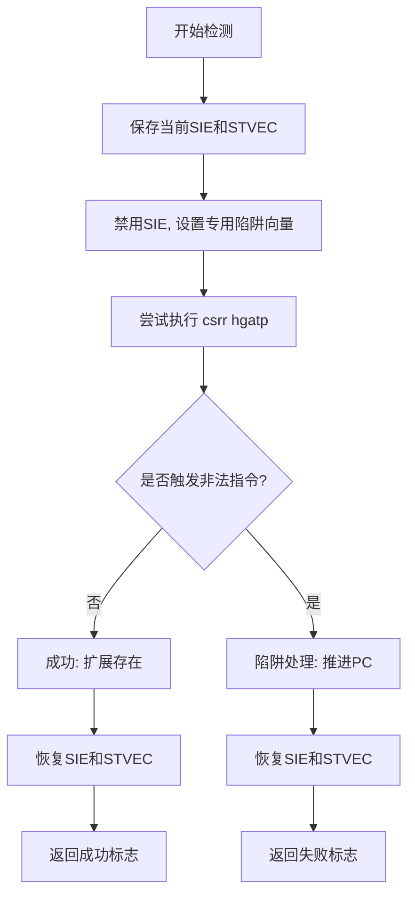

# 全局函数接口

<cite>
**本文档引用的文件**  
- [lib.rs](file://src/lib.rs)
- [detect.rs](file://src/detect.rs)
- [vcpu.rs](file://src/vcpu.rs)
- [README.md](file://README.md)
</cite>

## 目录
1. [简介](#简介)
2. [核心检测机制](#核心检测机制)
3. [硬件支持检测函数](#硬件支持检测函数)
4. [辅助函数与内部实现](#辅助函数与内部实现)
5. [使用模式与调用示例](#使用模式与调用示例)
6. [不支持时的降级策略](#不支持时的降级策略)
7. [线程安全性分析](#线程安全性分析)

## 简介

本项目 `riscv_vcpu` 是一个为 RISC-V 架构设计的虚拟 CPU（vCPU）实现，专用于嵌入式和教育用途的裸机环境。其核心功能之一是通过运行时探测来判断底层硬件是否支持 RISC-V 虚拟化扩展（H 扩展），从而决定能否安全地创建和运行 vCPU 实例。

文档重点阐述公开导出的自由函数 `has_hardware_support()` 的工作原理、行为语义及其在系统初始化流程中的关键作用。该函数作为启动 vCPU 前的必要检查点，确保了虚拟化操作的可行性与稳定性。

**Section sources**
- [README.md](file://README.md#L0-L59)

## 核心检测机制

`has_hardware_support()` 函数的核心依赖于一种“陷阱返回”（trap-and-return）的技术。由于 RISC-V 架构中对不存在或未启用的控制状态寄存器（CSR）进行读写会触发非法指令异常（Illegal Instruction Exception），此机制利用这一特性来探测特定 CSR 指令的存在性。

具体步骤如下：
1. 临时禁用 S 模式的中断，确保后续陷阱仅由异常引起。
2. 尝试执行目标 CSR 的读取指令（如 `csrr`）。
3. 若指令合法且扩展存在，则正常执行；若指令非法，则触发异常并被预设的陷阱处理程序捕获。
4. 处理程序识别出非法指令异常后，将程序计数器（sepc）推进到下一条指令，并设置返回标志。
5. 恢复原有中断状态，根据返回标志判断扩展是否存在。

这种技术无需依赖任何外部信息，完全在运行时动态完成，具有高度的可移植性和准确性。



**Diagram sources**
- [detect.rs](file://src/detect.rs#L1-L237)

**Section sources**
- [detect.rs](file://src/detect.rs#L1-L237)

## 硬件支持检测函数

### `has_hardware_support() -> bool`

这是本模块唯一对外公开的检测接口，其实质是 `detect::detect_h_extension()` 函数的重新导出。

#### 功能说明
该函数用于检测当前 RISC-V 核心是否支持 Hypervisor 扩展（H Extension）。它通过尝试读取 `hgatp` 寄存器（地址 `0x680`）来实现探测。如果读取操作成功（即未触发非法指令异常），则认为 H 扩展可用，返回 `true`；否则返回 `false`。

#### 返回值意义
- `true`: 表示硬件支持 RISC-V 虚拟化扩展，可以安全地创建 `RISCVVCpu` 实例并启用高级虚拟化功能。
- `false`: 表示硬件不支持 H 扩展，任何试图使用虚拟化特性的操作都将导致未定义行为或崩溃。

#### 对 vCPU 创建的影响
在调用 `RISCVVCpu::new()` 之前，必须先通过 `has_hardware_support()` 进行检查。若返回 `false`，则不应继续创建 vCPU，因为 `RISCVVCpu` 的内部状态（如 `hstatus`, `hgatp`）依赖于 H 扩展的支持。强行创建可能导致不可预测的后果。

**Section sources**
- [lib.rs](file://src/lib.rs#L15-L16)
- [detect.rs](file://src/detect.rs#L10-L18)

## 辅助函数与内部实现

尽管没有其他公开导出的辅助函数，但 `detect.rs` 模块内部包含一系列关键的私有函数，共同支撑起整个检测框架。

### `detect_h_extension() -> bool`
实际执行检测逻辑的函数。它调用 `with_detect_trap` 并传入一个尝试读取 `hgatp` 的闭包。根据闭包执行后的返回码判断结果。

### `with_detect_trap(param: usize, f: impl FnOnce()) -> usize`
通用的陷阱检测包装器。它负责设置和恢复陷阱处理环境，是实现无侵入式探测的核心基础设施。

### `init_detect_trap()` 和 `restore_detect_trap()`
分别用于初始化和恢复陷阱检测前的硬件上下文（主要是 `sstatus.sie` 和 `stvec` 寄存器），保证探测过程不会影响系统的正常中断机制。

### `on_detect_trap()` 和 `rust_detect_trap()`
汇编与 Rust 协同实现的专用陷阱处理程序。前者保存完整的寄存器现场，后者解析异常原因并决定是否跳过非法指令。

这些函数虽然未导出，但构成了 `has_hardware_support()` 可靠性的基石。

**Section sources**
- [detect.rs](file://src/detect.rs#L10-L237)

## 使用模式与调用示例

标准的使用模式遵循“检测 → 配置 → 创建 → 运行”的流程。以下是一个典型的调用片段：

```rust
use riscv_vcpu::{RISCVVCpu, RISCVVCpuCreateConfig, has_hardware_support};

// 步骤1: 运行时检测硬件支持
if has_hardware_support() {
    // 步骤2: 创建vCPU配置
    let config = RISCVVCpuCreateConfig::default();
    
    // 步骤3: 创建vCPU实例
    match RISCVVCpu::new(0, 0, config) {
        Ok(mut vcpu) => {
            // 步骤4: 启动vCPU
            if let Err(e) = vcpu.run() {
                error!("vCPU运行失败: {:?}", e);
            }
        }
        Err(e) => {
            error!("无法创建vCPU: {:?}", e);
        }
    }
} else {
    // 硬件不支持，采取降级措施
    warn!("RISC-V H扩展未检测到，无法启用虚拟化");
    // ... 执行替代逻辑 ...
}
```

此模式确保了代码在不具备虚拟化能力的硬件上也能优雅地处理，避免了潜在的崩溃风险。

**Section sources**
- [README.md](file://README.md#L45-L55)
- [vcpu.rs](file://src/vcpu.rs#L50-L570)

## 不支持时的降级策略

当 `has_hardware_support()` 返回 `false` 时，应用程序应采取适当的降级或报错策略：

1. **日志记录**: 输出警告信息，明确告知用户当前平台不支持硬件虚拟化。
2. **功能禁用**: 禁用所有依赖 vCPU 的功能模块，例如虚拟机管理界面或容器运行时。
3. **提供替代方案**: 如果可能，切换到基于软件模拟的轻量级执行环境，而非完全停止服务。
4. **早期退出**: 在系统初始化阶段直接终止启动流程，并返回明确的错误码，防止后续更严重的故障。
5. **用户提示**: 向终端用户或管理员显示友好的提示，建议升级到支持虚拟化的硬件平台。

选择哪种策略取决于应用的具体场景和可靠性要求。

## 线程安全性分析

`has_hardware_support()` 函数本身是**线程安全**的。原因如下：

- **无共享状态修改**: 该函数仅执行一次性的探测操作，不修改任何全局可变状态。
- **原子性探测**: 探测过程在单个 hart（硬件线程）上完成，涉及的 CSR 操作和陷阱处理都是局部的。
- **幂等性**: 多次调用该函数会产生相同的结果，因为硬件支持情况在运行期间不会改变。

然而，需要注意的是，虽然检测函数是线程安全的，但后续基于其结果创建的 `RISCVVCpu` 实例通常不是线程安全的，需要由调用者确保正确的同步访问。

**Section sources**
- [detect.rs](file://src/detect.rs#L10-L237)