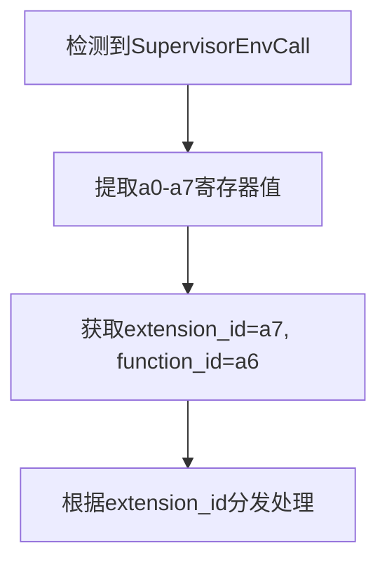
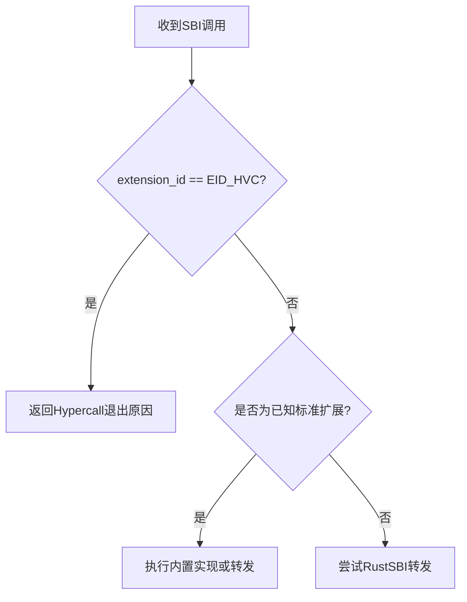
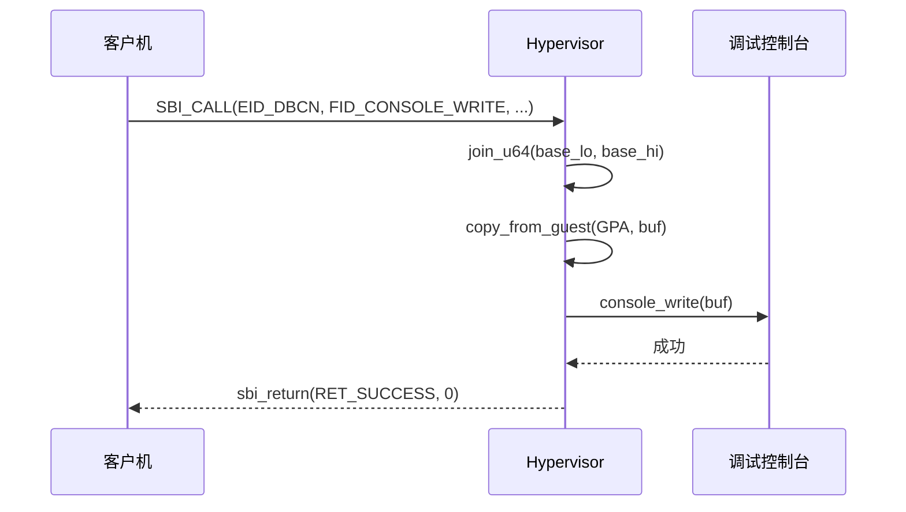

# SBI调用处理机制

<cite>
**Referenced Files in This Document**  
- [vcpu.rs](file://src/vcpu.rs)
- [sbi_console.rs](file://src/sbi_console.rs)
- [regs.rs](file://src/regs.rs)
- [guest_mem.rs](file://src/guest_mem.rs)
</cite>

## 目录
1. [SBI调用处理概述](#sbi调用处理概述)
2. [vmexit_handler中的SupervisorEnvCall拦截逻辑](#vmexit_handler中的supervisorenvcall拦截逻辑)
3. [标准SBI扩展与自定义超调用的处理差异](#标准sbi扩展与自定义超调用的处理差异)
4. [EID_DBCN调试控制台扩展实现细节](#eid_dbcn调试控制台扩展实现细节)
5. [sbi_return辅助函数的作用](#sbi_return辅助函数的作用)
6. [SBI调用处理流程图](#sbi调用处理流程图)
7. [支持的EID/FID组合及其行为语义](#支持的eidfid组合及其行为语义)
8. [扩展新SBI功能的开发指南](#扩展新sbi功能的开发指南)

## SBI调用处理概述

本系统实现了RISC-V架构下的SBI（Supervisor Binary Interface）调用处理机制，通过虚拟化技术拦截并处理来自客户机操作系统的环境调用。当客户机执行ecall指令时，会触发SupervisorEnvCall异常，由hypervisor捕获后进入vmexit_handler进行处理。

该机制的核心在于区分不同类型的SBI扩展请求，并根据其类型采取相应的处理策略：对于标准SBI扩展（如hsm、legacy），采用RustSBI转发或内置实现；对于自定义超调用（EID_HVC），则直接返回Hypercall退出原因交由宿主处理；而对于调试相关的EID_DBCN扩展，则提供完整的读写功能支持。

**Section sources**
- [vcpu.rs](file://src/vcpu.rs#L200-L600)

## vmexit_handler中的SupervisorEnvCall拦截逻辑

`vmexit_handler`是处理所有VM退出事件的核心函数，其中对`SupervisorEnvCall`异常进行了专门的拦截和解析。当检测到此异常时，系统首先从客户机寄存器状态中提取a0-a7寄存器的值作为参数数组。

具体而言，extension_id存储在a7寄存器中，function_id存储在a6寄存器中，其余参数(a0-a5)构成参数数组。这些信息被用于后续的扩展类型判断和功能分发。



**Diagram sources**
- [vcpu.rs](file://src/vcpu.rs#L250-L260)

**Section sources**
- [vcpu.rs](file://src/vcpu.rs#L250-L260)
- [regs.rs](file://src/regs.rs#L100-L120)

## 标准SBI扩展与自定义超调用的处理差异

系统对不同类型的SBI扩展采用了差异化的处理策略：

### 标准SBI扩展处理
对于标准SBI扩展（如hsm、legacy），系统采用两种方式处理：
1. **内置实现**：针对部分legacy扩展（如LEGACY_SET_TIMER、LEGACY_CONSOLE_PUTCHAR等）提供直接的内部实现
2. **RustSBI转发**：通过`RISCVVCpuSbi`结构体中的`forward`字段将其他标准扩展调用转发给RustSBI库处理

### 自定义超调用处理
对于自定义超调用（EID_HVC），系统不进行任何内部处理，而是直接返回`AxVCpuExitReason::Hypercall`退出原因，将控制权交还给宿主操作系统，由宿主决定如何响应。

这种设计实现了清晰的关注点分离：hypervisor专注于虚拟化核心功能，而特定平台的定制化需求则由宿主系统处理。



**Diagram sources**
- [vcpu.rs](file://src/vcpu.rs#L260-L350)

**Section sources**
- [vcpu.rs](file://src/vcpu.rs#L260-L350)
- [vcpu.rs](file://src/vcpu.rs#L150-L180)

## EID_DBCN调试控制台扩展实现细节

EID_DBCN扩展（'DBCN'）提供了调试控制台的字节级读写功能，其实现包含以下关键组件：

### GPA到缓冲区的转换
当处理FID_CONSOLE_WRITE和FID_CONSOLE_READ请求时，需要将客户机提供的64位GPA（Guest Physical Address）转换为可访问的内存区域。这通过`join_u64(base_lo, base_hi)`函数完成，将a1和a2寄存器中的低32位和高32位组合成完整的64位地址。

### 控制台交互实现
#### 写操作 (FID_CONSOLE_WRITE)
1. 分配临时缓冲区
2. 使用`guest_mem::copy_from_guest`从客户机物理地址空间复制数据
3. 调用`sbi_rt::console_write`将数据输出到调试控制台

#### 读操作 (FID_CONSOLE_READ)
1. 分配临时缓冲区
2. 调用`sbi_rt::console_read`从调试控制台读取数据
3. 使用`guest_mem::copy_to_guest`将数据写回客户机物理地址空间

#### 单字节写操作 (FID_CONSOLE_WRITE_BYTE)
直接调用`print_byte`函数将a0寄存器低8位的数据输出到控制台。



**Diagram sources**
- [sbi_console.rs](file://src/sbi_console.rs#L10-L50)
- [vcpu.rs](file://src/vcpu.rs#L350-L400)

**Section sources**
- [sbi_console.rs](file://src/sbi_console.rs#L10-L50)
- [vcpu.rs](file://src/vcpu.rs#L350-L400)
- [guest_mem.rs](file://src/guest_mem.rs#L50-L80)

## sbi_return辅助函数的作用

`sbi_return`是一个内联辅助函数，负责设置SBI调用的返回值并将程序计数器（PC）向前推进一个指令长度。其主要功能包括：

1. **设置返回值**：将指定的错误码（a0）和返回值（a1）写入客户机的a0和a1寄存器
2. **推进PC**：调用`advance_pc(4)`方法将客户机的sepc（Supervisor Exception Program Counter）增加4个字节，指向下一个指令

这个函数确保了SBI调用结束后能够正确返回到客户机代码继续执行，同时保持了RISC-V SBI规范的兼容性。

```mermaid
flowchart TD
A[sbi_return(a0, a1)] --> B[set_gpr(A0, a0)]
B --> C[set_gpr(A1, a1)]
C --> D[advance_pc(4)]
```

**Diagram sources**
- [vcpu.rs](file://src/vcpu.rs#L550-L560)

**Section sources**
- [vcpu.rs](file://src/vcpu.rs#L550-L560)

## SBI调用处理流程图

```mermaid
flowchart TD
A[VM退出] --> B{异常类型}
B --> |SupervisorEnvCall| C[提取a0-a7寄存器]
C --> D[extension_id = a7, function_id = a6]
D --> E{extension_id}
E --> |legacy::*| F[执行内置实现]
E --> |hsm::EID_HSM| G[处理HART生命周期]
E --> |EID_HVC| H[返回Hypercall退出]
E --> |EID_DBCN| I[执行控制台I/O]
E --> |其他| J[RustSBI转发]
F --> K[sbi_return]
G --> L[返回CpuUp/CpuDown]
H --> M[返回Hypercall]
I --> K
J --> N[设置a0/a1结果]
N --> K
K --> O[advance_pc(4)]
O --> P[返回Nothing退出]
L --> Q[返回特定退出原因]
M --> Q
```

**Diagram sources**
- [vcpu.rs](file://src/vcpu.rs#L250-L550)

## 支持的EID/FID组合及其行为语义

| 扩展ID (EID) | 功能ID (FID) | 行为语义 |
|------------|------------|---------|
| legacy::LEGACY_SET_TIMER | 任意 | 设置定时器，清除客户机定时器中断 |
| legacy::LEGACY_CONSOLE_PUTCHAR | 任意 | 输出字符到控制台 |
| legacy::LEGACY_CONSOLE_GETCHAR | 任意 | 从控制台读取字符 |
| legacy::LEGACY_SHUTDOWN | 任意 | 请求系统关机 |
| hsm::EID_HSM | HART_START | 启动指定hart，返回CpuUp退出原因 |
| hsm::EID_HSM | HART_STOP | 停止当前hart，返回CpuDown退出原因 |
| hsm::EID_HSM | HART_SUSPEND | 挂起hart，返回Halt退出原因 |
| EID_HVC | 任意 | 返回Hypercall退出原因，nr=function_id |
| EID_DBCN | FID_CONSOLE_WRITE | 从GPA读取数据并写入调试控制台 |
| EID_DBCN | FID_CONSOLE_READ | 从调试控制台读取数据并写入GPA |
| EID_DBCN | FID_CONSOLE_WRITE_BYTE | 将单字节写入调试控制台 |

**Section sources**
- [vcpu.rs](file://src/vcpu.rs#L260-L500)
- [sbi_console.rs](file://src/sbi_console.rs#L5-L15)

## 扩展新SBI功能的开发指南

要扩展新的SBI功能，开发者应遵循以下步骤：

1. **定义新的EID/FID常量**：在适当的位置（如`sbi_console.rs`）定义新的扩展ID和功能ID常量
2. **实现具体功能**：编写相应的处理函数，注意内存安全性和跨地址空间访问的正确性
3. **添加到vmexit_handler分发逻辑**：在`vmexit_handler`的match表达式中添加新的extension_id分支
4. **使用sbi_return返回结果**：通过`sbi_return`函数设置适当的返回值和错误码
5. **考虑性能影响**：尽量减少在hypervisor上下文中的复杂操作，必要时可通过退出原因交由宿主处理

特别注意事项：
- 处理客户机内存访问时必须使用`guest_mem`模块提供的安全函数
- 避免在hypervisor中执行长时间运行的操作
- 正确管理中断使能状态
- 确保PC推进的准确性

**Section sources**
- [vcpu.rs](file://src/vcpu.rs#L250-L550)
- [guest_mem.rs](file://src/guest_mem.rs#L10-L80)