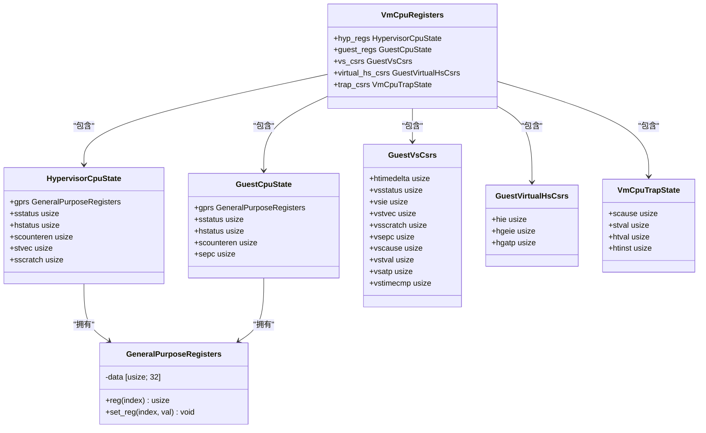
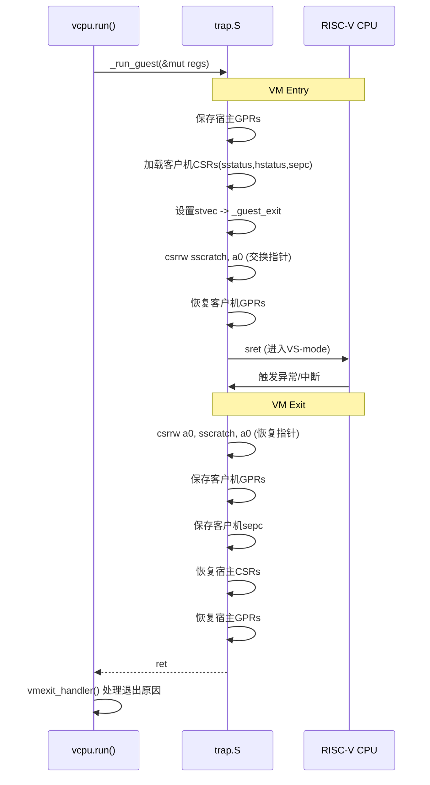
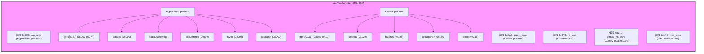

# 上下文切换机制

<cite>
**Referenced Files in This Document **   
- [vcpu.rs](file://src/vcpu.rs)
- [regs.rs](file://src/regs.rs)
- [trap.rs](file://src/trap.rs)
- [trap.S](file://src/trap.S)
</cite>

## 目录
1. [引言](#引言)
2. [核心数据结构分析](#核心数据结构分析)
3. [上下文保存与恢复流程](#上下文保存与恢复流程)
4. [汇编层执行逻辑](#汇编层执行逻辑)
5. [寄存器栈帧布局](#寄存器栈帧布局)
6. [虚拟化相关CSR操作](#虚拟化相关csr操作)
7. [性能优化考量](#性能优化考量)
8. [异常处理安全性](#异常处理安全性)
9. [结论](#结论)

## 引言

本文档详细阐述了 `riscv_vcpu` 项目中实现的上下文切换机制。该机制是虚拟机监控器（Hypervisor）的核心功能，负责在宿主模式（HS-mode）与客户机模式（VS-mode）之间安全、高效地切换CPU状态。文档重点解析了从Rust代码到汇编底层的完整调用链路，特别是 `_run_guest` 汇编函数如何通过 `VmCpuRegisters` 数据结构来保存和恢复通用寄存器及控制状态寄存器（CSR），并结合 `vcpu.run()` 方法说明了整个虚拟机运行周期中的上下文管理。

**Section sources**
- [vcpu.rs](file://src/vcpu.rs#L1-L50)

## 核心数据结构分析

上下文切换机制围绕 `VmCpuRegisters` 这一核心数据结构展开。该结构体定义了在虚拟化环境中需要被显式保存和恢复的所有CPU状态，确保了客户机执行环境的隔离性和一致性。

**Diagram sources **
- [regs.rs](file://src/regs.rs#L100-L250)

**Section sources**
- [regs.rs](file://src/regs.rs#L100-L250)

### VmCpuRegisters 结构详解

`VmCpuRegisters` 是一个标记为 `#[repr(C)]` 的结构体，保证其内存布局与C语言兼容，这对于内联汇编直接访问其字段至关重要。它主要包含五个部分：

1.  **`hyp_regs: HypervisorCpuState`**: 用于保存宿主（Hypervisor）自身的CPU状态，包括其通用寄存器（GPRs）和关键的CSR（如`sstatus`, `hstatus`）。当进入客户机时，这些值会被保存；当客户机退出时，这些值会被恢复。
2.  **`guest_regs: GuestCpuState`**: 用于保存客户机（Guest）的CPU状态，同样包含GPRs和CSR。这是客户机执行现场的“快照”。
3.  **`vs_csrs: GuestVsCsrs`**: 保存仅在虚拟化开启（V=1）时有效的VS级CSR，例如 `vsatp`（虚拟Sv39页表基址寄存器）。这部分状态通常由VM内部管理，并非每次进出都自动保存。
4.  **`virtual_hs_csrs: GuestVirtualHsCsrs`**: 用于模拟对客户机可见的HS级CSR，如 `hgatp`（Hypervisor Guest Address Translation and Protection Register），它是实现嵌套页表（NPT）的关键。
5.  **`trap_csrs: VmCpuTrapState`**: 在VM退出（VM Exit）时，会自动将导致退出的陷阱信息（如`scause`, `stval`）保存到此结构中，供后续的 `vmexit_handler` 处理。

## 上下文保存与恢复流程

上下文切换是一个双向过程：进入客户机（VM Entry）和退出客户机（VM Exit）。整个流程始于Rust代码，最终由汇编代码完成。

### VM Entry (进入客户机)

1.  **Rust 层准备**: 当调用 `RISCVVCpu::run()` 方法时，首先会禁用宿主的外部、软件和定时器中断（通过 `sie` 寄存器），以防止在切换过程中被中断。
2.  **调用汇编入口**: 调用 `unsafe extern "C"` 函数 `_run_guest(state: *mut VmCpuRegisters)`。这个函数的符号在 `trap.S` 中定义，是进入汇编世界的桥梁。
3.  **汇编层保存宿主状态**: `_run_guest` 函数首先将当前宿主模式下的关键通用寄存器（除了`t0-t6`和作为参数传入的`a0`）保存到 `VmCpuRegisters.hyp_regs.gprs` 中。
4.  **加载客户机CSR**: 使用 `csrrw` 等指令，将 `VmCpuRegisters.guest_regs` 中的 `sstatus`, `hstatus`, `scounteren` 和 `sepc` 等CSR值写入硬件寄存器，从而建立客户机的运行环境。
5.  **设置退出向量**: 将 `stvec` 寄存器设置为 `_guest_exit` 的地址。这意味着当下次发生任何异常或中断时，CPU将跳转到 `_guest_exit` 标签处执行，而不是默认的宿主异常处理程序。
6.  **交换栈指针**: 使用 `csrrw sscratch, a0` 指令，将指向 `VmCpuRegisters` 的指针保存到 `sscratch` 寄存器中，同时将旧的 `sscratch` 值（可能是宿主的临时数据）保存起来。
7.  **恢复客户机寄存器**: 将 `VmCpuRegisters.guest_regs.gprs` 中的所有通用寄存器值加载回硬件寄存器。
8.  **执行 sret**: 最后执行 `sret` 指令，这会将CPU特权级从HS-mode降低到VS-mode，并跳转到 `sepc` 指向的地址，即客户机代码开始执行。

### VM Exit (退出客户机)

1.  **触发异常**: 客户机执行过程中，一旦发生任何异常（如系统调用、缺页、外部中断等），CPU会根据 `stvec` 的设置，跳转到 `_guest_exit` 标签处。
2.  **恢复寄存器指针**: 执行 `csrrw a0, sscratch, a0`。这条指令非常巧妙：它将 `sscratch` 中保存的 `VmCpuRegisters` 指针加载到 `a0`，同时将客户机原本的 `a0` 寄存器值放回 `sscratch`，实现了两个寄存器的原子交换。
3.  **保存客户机状态**: 将所有通用寄存器（包括刚刚从 `sscratch` 恢复的 `a0`）的当前值保存回 `VmCpuRegisters.guest_regs.gprs`。
4.  **保存客户机EPC**: 通过 `csrr sepc` 读取当前的异常程序计数器（即客户机中断指令的下一条指令地址），并保存到 `VmCpuRegisters.guest_regs.sepc`。
5.  **恢复宿主CSR**: 将 `VmCpuRegisters.hyp_regs` 中保存的 `sstatus`, `hstatus`, `scounteren`, `stvec` 和 `sscratch` 等CSR值重新写回硬件，恢复宿主的运行环境。
6.  **恢复宿主寄存器**: 将 `VmCpuRegisters.hyp_regs.gprs` 中保存的通用寄存器值加载回硬件。
7.  **返回Rust层**: 执行 `ret` 指令，返回到 `RISCVVCpu::run()` 方法中 `_run_guest` 调用之后的位置。
8.  **Rust 层处理**: `run()` 方法随后会调用 `vmexit_handler()` 来分析 `scause` 和 `stval` 等信息，决定如何处理这次VM退出事件（如模拟SBI调用、处理MMIO、响应中断等）。

**Diagram sources **
- [vcpu.rs](file://src/vcpu.rs#L100-L200)
- [trap.S](file://src/trap.S#L1-L180)

**Section sources**
- [vcpu.rs](file://src/vcpu.rs#L100-L200)
- [trap.S](file://src/trap.S#L1-L180)

## 汇编层执行逻辑

`trap.S` 文件中的汇编代码是上下文切换的真正执行者。它利用了RISC-V架构的几个关键特性：

*   **`csrrw` 指令**: 这条“原子读-写”指令是实现状态交换的核心。它可以在一个指令周期内读取CSR的旧值并写入新值，非常适合于保存和恢复场景。
*   **`sscratch` 寄存器**: 该寄存器被用作一个临时存储空间。在VM Entry时，它用来存放指向 `VmCpuRegisters` 的指针；在VM Exit时，它又用来暂存客户机的 `a0` 寄存器。这种设计避免了额外的栈操作，提高了效率。
*   **`_guest_exit` 标签**: 这个标签的地址被设置为 `stvec`，成为所有VM退出事件的统一入口点。这简化了异常处理逻辑，所有的退出都经过同一条路径进行状态保存和恢复。

值得注意的是，文档目标中提到的 `_trap_handler`、`_hyp_save` 和 `_hyp_restore` 符号在当前代码库中并未找到。实际的汇编入口是 `_run_guest`，而保存和恢复逻辑则直接内联在 `_run_guest` 和 `_guest_exit` 中。

## 寄存器栈帧布局

虽然没有使用传统的栈帧，但 `VmCpuRegisters` 结构体在内存中形成了一个固定的“状态帧”。其布局由 `#[repr(C)]` 保证，各子结构体按声明顺序排列。

**Diagram sources **
- [regs.rs](file://src/regs.rs#L100-L250)

**Section sources**
- [regs.rs](file://src/regs.rs#L100-L250)

汇编代码通过在编译时计算出的固定偏移量（如 `{hyp_ra}`, `{guest_sepc}`）来直接访问这些字段，这比动态寻址更快。

## 虚拟化相关CSR操作

在 `vcpu.rs` 的 `setup` 和 `bind` 方法中，可以看到对虚拟化关键CSR的操作：

*   **`hstatus`**: 在 `setup()` 中，通过设置 `SPV` (Supervisor Previous Virtualization mode) 和 `SPVP` (Supervisor Previous Virtualization Privilege) 位，允许HS-mode代码访问VS-mode的内存，这是实现高效I/O虚拟化的基础。
*   **`hgatp`**: 在 `set_ept_root()` 和 `bind()` 方法中被设置。`hgatp` 指向宿主的页表根节点，用于将客户机的物理地址（GPA）转换为宿主的物理地址（HPA），即实现第二阶段地址转换（Stage 2 Translation）。
*   **`vsatp`**: 虽然在 `VmCpuRegisters.vs_csrs` 中有定义，但其值由客户机操作系统自行管理。当客户机执行 `satp` 写操作时，会陷入Hypervisor，然后由Hypervisor将其值更新到 `vsatp` CSR中，从而实现对第一阶段地址转换（Stage 1 Translation）的虚拟化。

## 性能优化考量

该实现通过多种方式进行了性能优化：

1.  **最小化保存范围**: 并非保存所有32个通用寄存器。`t0-t6` 寄存器在RISC-V调用约定中是临时寄存器，不需要保存。`a0` 作为参数传递，在进入汇编后立即被 `sscratch` 保护，避免了单独的保存/恢复操作。
2.  **避免不必要的内存访问**: 利用 `csrrw` 指令的原子性，减少了对内存的读写次数。例如，在保存 `sstatus` 时，`csrrw t1, sstatus, t1` 既读取了旧值到 `t1`，又将新值（来自 `guest_sstatus`）写入了CSR，然后只需一次 `sd` 指令将 `t1` 保存到内存。
3.  **高效的指针交换**: 使用 `csrrw a0, sscratch, a0` 在VM Exit时一次性完成 `VmCpuRegisters` 指针的恢复和客户机 `a0` 的保存，避免了两次独立的内存操作。
4.  **内联汇编**: 关键的上下文切换逻辑用汇编编写，消除了函数调用开销，并能精确控制每一条指令。

## 异常处理安全性

栈指针（`sp`）的管理是上下文切换安全性的关键：

*   **明确的栈切换**: 在VM Entry和VM Exit过程中，`sp` 寄存器都会被显式地从 `VmCpuRegisters` 结构中加载或保存。这意味着宿主和客户机使用完全独立的栈空间。
*   **防止栈溢出攻击**: 由于栈是隔离的，客户机代码无法通过栈溢出破坏宿主的栈帧，从而保护了宿主的控制流。
*   **`sscratch` 的妙用**: `sscratch` 寄存器充当了一个安全的“信使”，在不依赖共享栈的情况下，可靠地传递了 `VmCpuRegisters` 的地址。这避免了在切换初期因栈未准备好而导致的潜在问题。

## 结论

`riscv_vcpu` 的上下文切换机制是一个精巧且高效的实现。它通过 `VmCpuRegisters` 这一中心化数据结构，结合精心设计的汇编代码，实现了在HS-mode和VS-mode之间的快速、安全的状态切换。该机制充分利用了RISC-V架构的特性，如 `csrrw` 指令和 `sscratch` 寄存器，通过最小化保存范围和优化内存访问，达到了高性能的目标。同时，严格的栈隔离和原子化的状态交换确保了虚拟化环境的安全性。尽管文档目标中提及的部分汇编标签未在代码中出现，但现有的 `_run_guest` 和 `_guest_exit` 实现了同等甚至更优的功能。