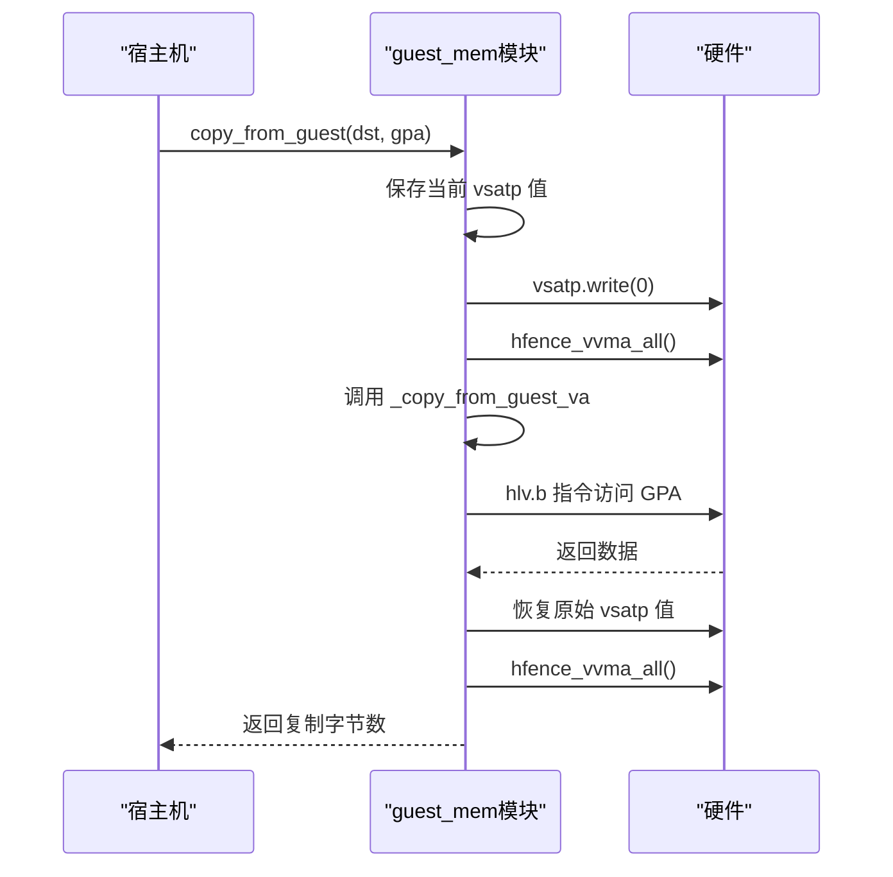
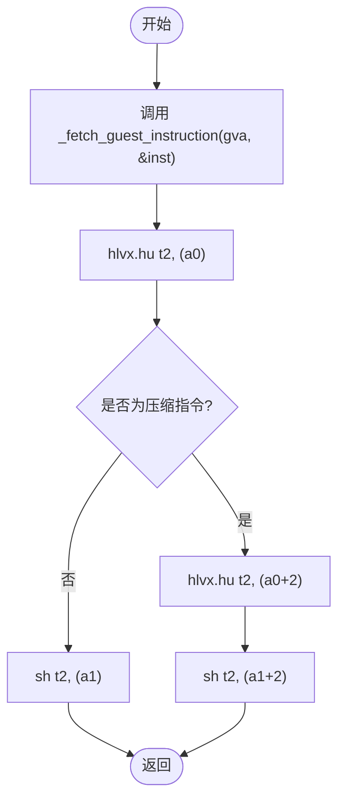
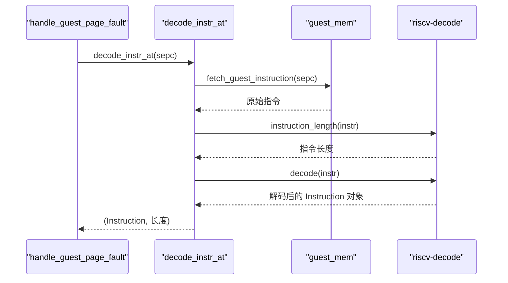
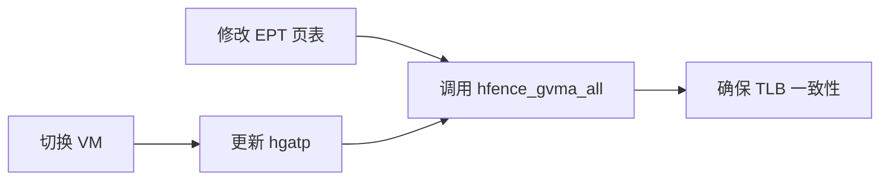
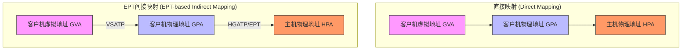

# 内存虚拟化实现

<cite>
**Referenced Files in This Document**   
- [src/guest_mem.rs](file://src/guest_mem.rs)
- [src/vcpu.rs](file://src/vcpu.rs)
- [src/regs.rs](file://src/regs.rs)
- [src/mem_extable.S](file://src/mem_extable.S)
</cite>

## 目录
1. [引言](#引言)
2. [EPT与二级地址转换机制](#ept与二级地址转换机制)
3. [客户机内存访问接口](#客户机内存访问接口)
4. [页错误处理与指令解析](#页错误处理与指令解析)
5. [权限检查与TLB一致性](#权限检查与tlb一致性)
6. [内存访问路径分析](#内存访问路径分析)

## 引言
本文档全面阐述基于扩展页表（EPT）的RISC-V内存虚拟化方案。该方案通过硬件辅助的二级地址转换机制，实现了客户机物理地址（GPA）到主机物理地址（HPA）的安全映射。文档详细说明了核心组件如何协同工作，包括`set_ept_root()`函数对hgatp寄存器的配置、`guest_mem`模块提供的安全内存访问接口、以及在发生页错误时结合riscv-decode库进行指令解析的完整流程。

## EPT与二级地址转换机制

### set_ept_root()函数分析
`set_ept_root()`函数是启用EPT机制的核心入口。它通过配置`hgatp`寄存器来激活二级地址转换。该函数将传入的主机物理地址（HPA）作为EPT根页表的基地址，并设置相应的模式位。

```mermaid
graph TD
A[调用 set_ept_root(ept_root)] --> B[获取 HostPhysAddr]
B --> C[计算 hgatp 寄存器值]
C --> D[hgatp = (8 << 60) | (ept_root >> 12)]
D --> E[写入 VmCpuRegisters 结构体]
E --> F[后续由 bind() 函数刷新到硬件]
```

**Diagram sources**
- [src/vcpu.rs](file://src/vcpu.rs#L179-L184)

**Section sources**
- [src/vcpu.rs](file://src/vcpu.rs#L179-L184)

### HGATP寄存器结构
HGATP（Hypervisor Guest Address Translation and Protection）寄存器用于控制HS级的地址转换。其结构如下：
- **Bits [63:60]**: 模式字段（MODE），设置为8表示启用Sv48x4模式。
- **Bits [59:48]**: 保留。
- **Bits [47:0]**: 根页表的物理页号（PPN），即EPT根页表的起始地址右移12位。

当客户机执行访存操作时，硬件首先使用客户机的VSATP寄存器进行第一级转换（GVA -> GPA），然后使用HGATP指向的EPT进行第二级转换（GPA -> HPA）。

## 客户机内存访问接口

### copy_from_guest 接口机制
`copy_from_guest`函数提供了从客户机物理地址安全读取数据的能力。其实现巧妙地利用了VSATP寄存器的特性：通过临时将其清零来禁用客户机的虚拟地址翻译，从而使得客户机虚拟地址（GVA）直接等同于客户机物理地址（GPA）。



**Diagram sources**
- [src/guest_mem.rs](file://src/guest_mem.rs#L55-L78)

**Section sources**
- [src/guest_mem.rs](file://src/guest_mem.rs#L55-L78)
- [src/mem_extable.S](file://src/mem_extable.S#L35-L48)

### fetch_guest_instruction 接口机制
`fetch_guest_instruction`函数用于从客户机虚拟地址获取指令。它依赖于汇编层的`_fetch_guest_instruction`函数，该函数使用HLVX.HU（Hypervisor Load Reserved eXclusive Half Unsigned）指令直接访问客户机内存。



**Diagram sources**
- [src/guest_mem.rs](file://src/guest_mem.rs#L80-L90)
- [src/mem_extable.S](file://src/mem_extable.S#L65-L90)

**Section sources**
- [src/guest_mem.rs](file://src/guest_mem.rs#L80-L90)

## 页错误处理与指令解析

### decode_instr_at() 函数分析
当发生客户机页错误（Guest Page Fault）时，`decode_instr_at()`函数负责解析导致错误的访存指令。它首先通过`fetch_guest_instruction()`获取位于SEPC（异常程序计数器）处的原始指令，然后使用`riscv-decode`库对其进行解码。



**Diagram sources**
- [src/vcpu.rs](file://src/vcpu.rs#L450-L465)

**Section sources**
- [src/vcpu.rs](file://src/vcpu.rs#L450-L465)

### MmioRead/MmioWrite 退出原因生成
根据解码结果，系统能够精确判断出访存指令的类型和操作数，进而生成相应的VM退出原因。对于加载（Load）指令，生成`MmioRead`；对于存储（Store）指令，生成`MmioWrite`。

```rust
// 伪代码表示逻辑
match decoded_instruction {
    Instruction::Lb(i) => AxVCpuExitReason::MmioRead {
        addr: fault_addr,
        width: AccessWidth::Byte,
        reg: i.rd(),
        signed_ext: true,
    },
    Instruction::Sb(s) => AxVCpuExitReason::MmioWrite {
        addr: fault_addr,
        width: AccessWidth::Byte,
        data: get_gpr(s.rs2()),
    },
    // ... 其他指令类型
    _ => AxVCpuExitReason::NestedPageFault { ... }, // 非访存指令
}
```

**Section sources**
- [src/vcpu.rs](file://src/vcpu.rs#L470-L548)

## 权限检查与TLB一致性

### EPT权限检查与MappingFlags联动
EPT页表项中包含权限位（如读、写、执行），这些权限在硬件层面强制执行。`MappingFlags`枚举定义了内存映射的属性，这些属性在构建EPT页表时被转换为相应的EPT权限位。当客户机尝试违反权限的操作时（例如向只读页面写入），硬件会触发页错误，由VMM捕获并处理。

### hfence_gvma_all 的作用
`hfence_gvma_all`指令用于维护TLB（Translation Lookaside Buffer）的一致性。在以下关键场景中必须调用此指令：
1. **切换EPT根表后**：当通过`bind()`函数将新的`hgatp`值写入硬件后，必须调用`hfence_gvma_all`以使旧的GPA->HPA转换无效，确保后续访问使用新的EPT。
2. **修改EPT页表后**：任何对EPT页表内容的修改（如添加、删除或更改映射）都必须伴随一次`hfence_gvma_all`操作，以清除可能存在的过期缓存条目。



**Section sources**
- [src/vcpu.rs](file://src/vcpu.rs#L194-L198)

## 内存访问路径分析

### 数据流图对比
下图对比了直接映射与EPT间接映射两种模式下的内存访问路径。



**Diagram sources**
- [src/vcpu.rs](file://src/vcpu.rs#L179-L184)
- [src/guest_mem.rs](file://src/guest_mem.rs#L55-L78)

### 性能差异讨论
- **直接映射**：访问延迟最低，仅需一次地址转换（GVA -> GPA）。适用于性能要求极高的场景，但缺乏内存隔离和细粒度权限控制。
- **EPT间接映射**：引入了额外的地址转换开销（GPA -> HPA），可能导致更高的TLB未命中率和更长的内存访问延迟。然而，它提供了强大的内存保护、隔离和按需分页（demand paging）能力，是现代虚拟化系统的标准选择。性能损耗主要体现在首次访问新页面时的双重页表遍历上。