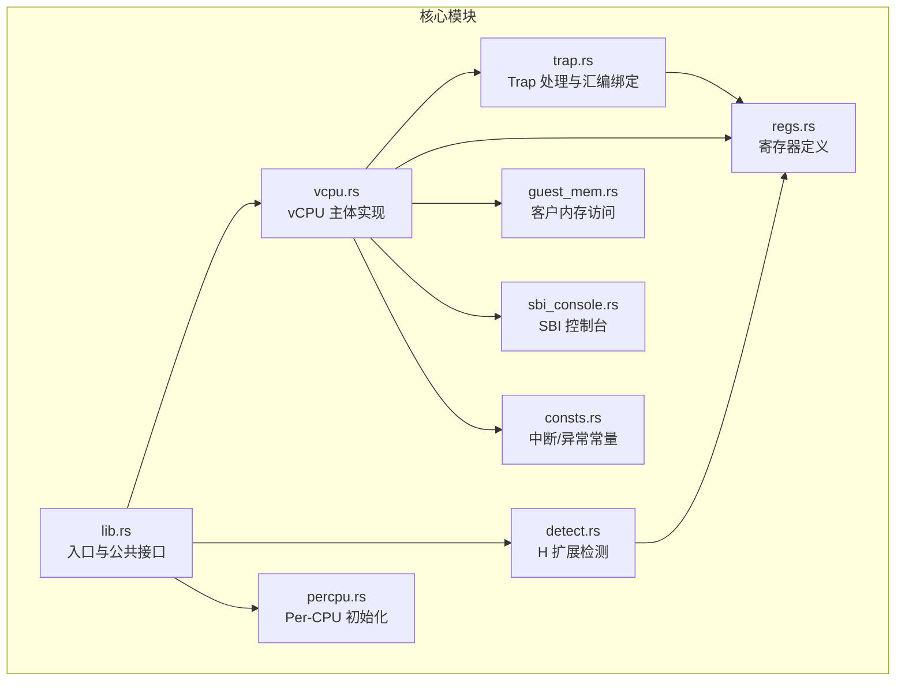
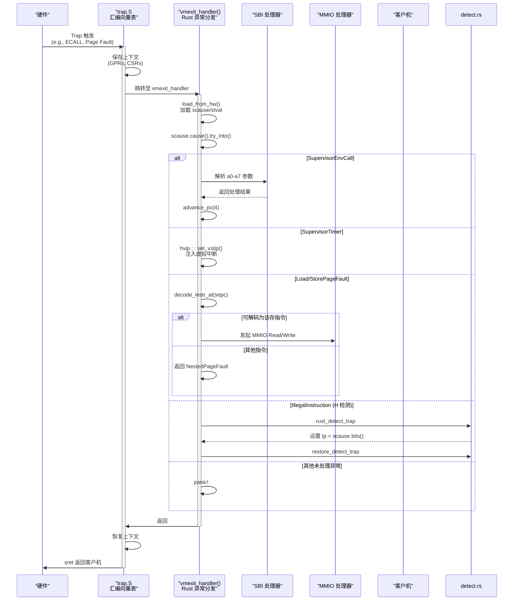
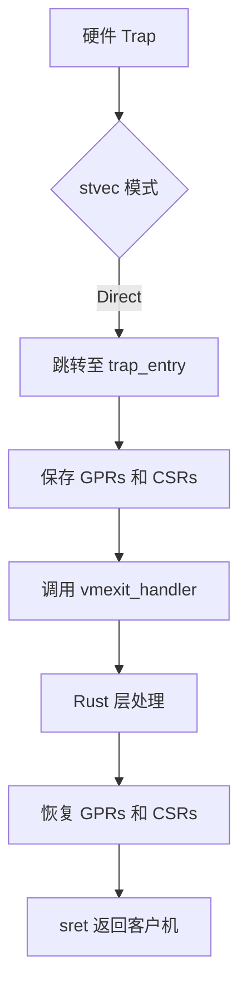
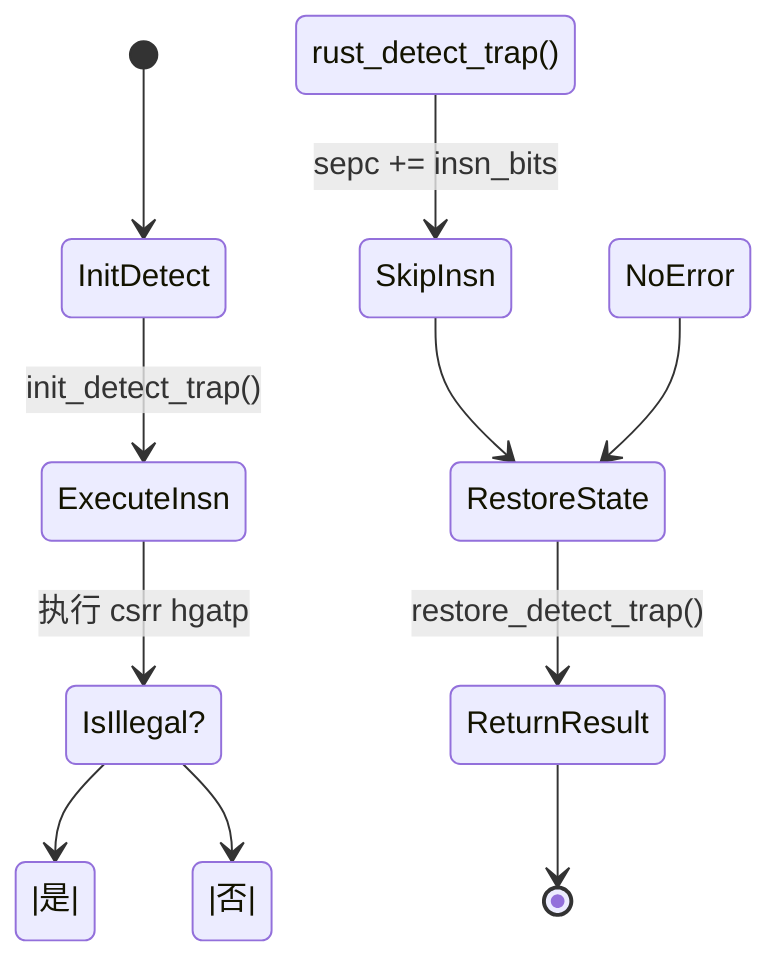
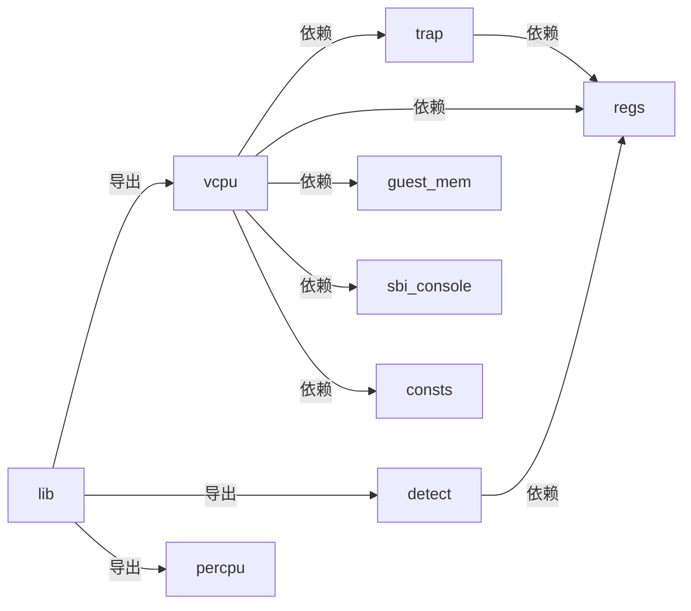

# 异常处理流程

<cite>
**本文档中引用的文件**
- [trap.rs](file://src/trap.rs)
- [detect.rs](file://src/detect.rs)
- [vcpu.rs](file://src/vcpu.rs)
- [consts.rs](file://src/consts.rs)
- [regs.rs](file://src/regs.rs)
- [lib.rs](file://src/lib.rs)
</cite>

## 目录
1. [简介](#简介)
2. [项目结构](#项目结构)
3. [核心组件](#核心组件)
4. [架构概述](#架构概述)
5. [详细组件分析](#详细组件分析)
6. [依赖分析](#依赖分析)
7. [性能考虑](#性能考虑)
8. [故障排除指南](#故障排除指南)
9. [结论](#结论)

## 简介
本文深入解析 `riscv_vcpu` 中 RISC-V 架构虚拟 CPU 的异常处理全流程。从 trap 触发开始，详述硬件如何将控制权转移至汇编层 `trap.S` 中的向量表，再到 Rust 层 `vmexit_handler()` 函数的调度过程。重点分析 `scause` 寄存器的解码逻辑及其映射到 Trap 枚举类型的转换机制，涵盖 SupervisorEnvCall、SupervisorTimer、LoadPageFault 等关键异常类型。描述每种异常的处理路径：例如 SBI 调用转发、定时器中断注入、页错误转化为 MMIO 请求等。结合 `detect.rs` 中的非法指令检测机制，说明其如何用于探测 H 扩展支持。包含异常嵌套处理策略与调试建议，如日志追踪 sepc 和 stval 值定位故障指令。提供状态机图展示不同异常的处理分支决策流程。

## 项目结构
本项目为一个针对 RISC-V 架构的虚拟 CPU (vCPU) 实现，主要服务于超算或嵌入式虚拟化环境。代码组织清晰，模块化程度高，各功能职责分明。



**Diagram sources**
- [lib.rs](file://src/lib.rs#L0-L47)
- [vcpu.rs](file://src/vcpu.rs#L0-L569)
- [trap.rs](file://src/trap.rs#L0-L102)
- [detect.rs](file://src/detect.rs#L0-L237)
- [regs.rs](file://src/regs.rs#L0-L252)
- [consts.rs](file://src/consts.rs#L0-L91)

**Section sources**
- [lib.rs](file://src/lib.rs#L0-L47)
- [project_structure](file://./#L0-L10)

## 核心组件
本节分析异常处理的核心组件，包括 Trap 入口、Rust 处理函数及异常分类机制。

**Section sources**
- [trap.rs](file://src/trap.rs#L0-L102)
- [vcpu.rs](file://src/vcpu.rs#L177-L569)
- [detect.rs](file://src/detect.rs#L0-L237)

## 架构概述
下图展示了从硬件触发 Trap 到 Rust 层完成处理并返回的完整控制流。



**Diagram sources**
- [trap.rs](file://src/trap.rs#L0-L102)
- [vcpu.rs](file://src/vcpu.rs#L177-L569)
- [detect.rs](file://src/detect.rs#L0-L237)

## 详细组件分析
### Trap 入口与上下文切换
当 RISC-V 硬件检测到异常或中断时，会根据 `stvec` 寄存器指向的向量表跳转。在本实现中，`stvec` 指向由 `trap.S` 定义的汇编处理程序。该汇编代码负责保存客户机和宿主机的关键通用寄存器（GPR）和控制状态寄存器（CSR），然后调用 Rust 层的 `vmexit_handler` 函数。



**Diagram sources**
- [trap.rs](file://src/trap.rs#L0-L102)

**Section sources**
- [trap.rs](file://src/trap.rs#L0-L102)

### vmexit_handler 异常分发
`vmexit_handler` 是 Rust 层异常处理的核心函数，位于 `vcpu.rs` 文件中。它首先通过 `load_from_hw` 方法读取 `scause` 和 `stval` 等 CSR 的值，然后利用 `riscv` crate 提供的 `scause.cause().try_into()` 将原始的 `scause` 值安全地转换为标准的 `Trap` 枚举类型。

#### scause 解码与 Trap 映射
`scause` 寄存器的最高位指示是中断（Interrupt）还是异常（Exception）。其余位表示具体原因。`vmexit_handler` 使用模式匹配对不同的 `Trap` 类型进行分发：
- **SupervisorEnvCall**: 表示来自客户机的 SBI（Supervisor Binary Interface）调用。
- **SupervisorTimer**: 表示来自机器模式的定时器中断，需要注入给客户机。
- **LoadPageFault / StorePageFault**: 表示客户机访问了未映射的物理页面，通常用于 MMIO 拦截。
- **IllegalInstruction**: 在 `detect.rs` 中被特殊处理以探测 H 扩展。

```mermaid
classDiagram
class TrapFrame {
+ra : usize
+tp : usize
+a0..a7 : usize
+t0..t6 : usize
+sstatus : usize
+sepc : usize
+scause : Scause
+stval : usize
}
class VmCpuRegisters {
+hyp_regs : HypervisorCpuState
+guest_regs : GuestCpuState
+vs_csrs : GuestVsCsrs
+virtual_hs_csrs : GuestVirtualHsCsrs
+trap_csrs : VmCpuTrapState
}
class VmCpuTrapState {
+scause : usize
+stval : usize
+htval : usize
+htinst : usize
}
VmCpuRegisters --> VmCpuTrapState : 包含
VmCpuRegisters --> HypervisorCpuState : 包含
VmCpuRegisters --> GuestCpuState : 包含
VmCpuTrapState --> "scause" : 映射自
VmCpuTrapState --> "stval" : 映射自
```

**Diagram sources**
- [vcpu.rs](file://src/vcpu.rs#L0-L569)
- [regs.rs](file://src/regs.rs#L0-L252)

**Section sources**
- [vcpu.rs](file://src/vcpu.rs#L177-L569)

### 关键异常类型处理路径
#### SupervisorEnvCall (SBI 调用)
这是最常见的异常之一，代表客户机操作系统发起的系统调用。`vmexit_handler` 从 `a0-a7` 寄存器中提取参数，根据 `a7` (extension_id) 和 `a6` (function_id) 进行分发：
- **Legacy Extensions**: 如 `LEGACY_CONSOLE_PUTCHAR` 直接调用 `sbi_call_legacy_1`。
- **HSM Extension**: 如 `HART_START` 返回 `AxVCpuExitReason::CpuUp` 事件。
- **Hypercall (EID_HVC)**: 返回 `AxVCpuExitReason::Hypercall` 供上层处理。
- **默认情况**: 转发给 `RustSBI` 实现。

#### SupervisorTimer (定时器中断)
当物理定时器到期时，会产生此中断。`vmexit_handler` 通过设置 `hvip` 寄存器中的 `VSTIP` 位，将虚拟定时器中断注入客户机，并重新使能 `sie::STIMER`。

#### Load/StorePageFault (页错误 -> MMIO)
这是实现设备模拟的关键。`handle_guest_page_fault` 函数首先尝试使用 `riscv_decode` 库解码 `sepc` 指向的指令。如果是一条合法的访存指令（如 `lb`, `sw`），则将其转换为 `AxVCpuExitReason::MmioRead` 或 `AxVCpuExitReason::MmioWrite`，交由外部 MMIO 处理器执行。否则，返回 `NestedPageFault`。

### 非法指令检测与 H 扩展探测
`detect.rs` 模块实现了通过陷阱来探测硬件扩展的功能。`detect_h_extension` 函数通过 `with_detect_trap` 辅助函数，在临时禁用中断的环境下执行一条 `csrr` 读取 `hgatp` 寄存器的指令。如果该指令非法，则会产生 `IllegalInstruction` 异常，`rust_detect_trap` 处理程序会捕获该异常，将 `scause` 写入 `tp` 寄存器，并跳过该指令。`restore_detect_trap` 最终从 `tp` 寄存器读取 `scause` 值，若其不等于 2（即非非法指令异常），则说明 H 扩展存在。



**Diagram sources**
- [detect.rs](file://src/detect.rs#L0-L237)

**Section sources**
- [detect.rs](file://src/detect.rs#L0-L237)

## 依赖分析
本模块的依赖关系清晰，体现了良好的分层设计。



**Diagram sources**
- [lib.rs](file://src/lib.rs#L0-L47)
- [vcpu.rs](file://src/vcpu.rs#L0-L569)
- [detect.rs](file://src/detect.rs#L0-L237)

**Section sources**
- [lib.rs](file://src/lib.rs#L0-L47)

## 性能考虑
- **上下文切换开销**: 汇编层保存和恢复所有 GPR 和关键 CSR 是必要的，但也是开销的主要来源。优化可考虑按需保存。
- **指令解码延迟**: `handle_guest_page_fault` 中的 `fetch_guest_instruction` 可能涉及跨地址空间的内存访问，延迟较高。
- **频繁的 SBI 调用**: 控制台 I/O 等操作会导致频繁的 VM Exit，可通过批处理或 virtio 等半虚拟化技术优化。

## 故障排除指南
- **死循环或崩溃**: 检查 `vmexit_handler` 是否正确处理了所有可能的 `Trap` 类型，避免 `panic!`。
- **无法探测 H 扩展**: 确认 `init_detect_trap` 正确清除了 `SIE` 并设置了直接模式的 `stvec`。
- **MMIO 访问失败**: 使用 `trace!` 日志检查 `sepc` 和 `stval` 的值，确认页错误地址和触发指令是否符合预期。
- **定时器不工作**: 检查 `hvip::set_vstip()` 后，客户机是否正确配置了 `sie::STIMER` 并进入休眠。

**Section sources**
- [vcpu.rs](file://src/vcpu.rs#L177-L569)
- [detect.rs](file://src/detect.rs#L0-L237)

## 结论
`riscv_vcpu` 的异常处理机制设计精巧，通过汇编与 Rust 的紧密结合，实现了高效且安全的虚拟化。其核心在于 `vmexit_handler` 对 `scause` 的精准解码和分发，以及利用非法指令陷阱进行硬件特性探测的创新方法。该实现为构建基于 RISC-V 的轻量级虚拟化平台提供了坚实的基础。