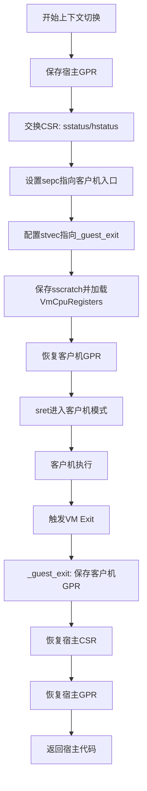
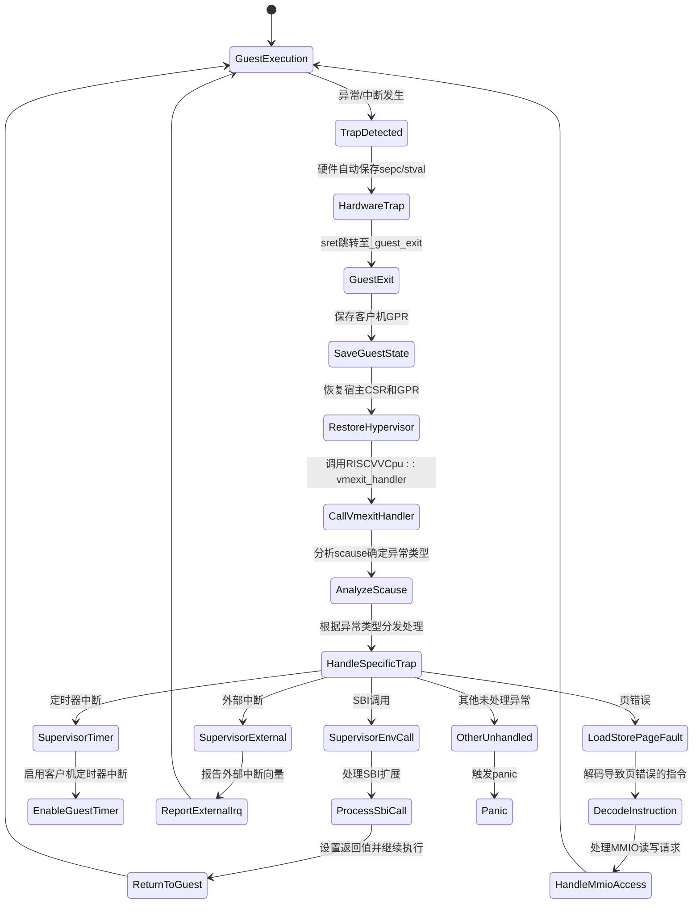
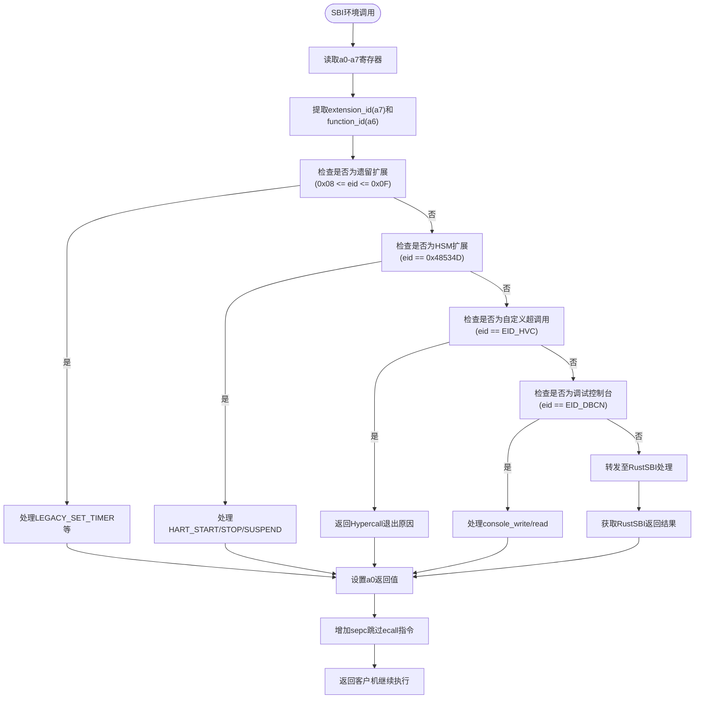
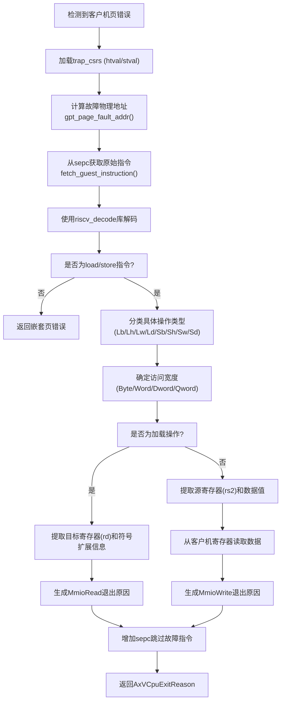

# 技术设计

<cite>
**Referenced Files in This Document**   
- [vcpu.rs](file://src/vcpu.rs)
- [trap.rs](file://src/trap.rs)
- [trap.S](file://src/trap.S)
- [guest_mem.rs](file://src/guest_mem.rs)
- [regs.rs](file://src/regs.rs)
- [sbi_console.rs](file://src/sbi_console.rs)
- [consts.rs](file://src/consts.rs)
</cite>

## 目录
1. [上下文切换机制](#上下文切换机制)
2. [异常处理流程](#异常处理流程)
3. [内存虚拟化实现](#内存虚拟化实现)
4. [SBI调用转发机制](#sbi调用转发机制)
5. [指令解码与页错误处理](#指令解码与页错误处理)
6. [性能与安全性评估](#性能与安全性评估)

## 上下文切换机制

该模块通过内联汇编和CSR（控制状态寄存器）操作实现了高效的上下文切换。核心逻辑位于`_run_guest`函数中，该函数使用RISC-V汇编语言编写，直接操作硬件寄存器以最小化开销。



**Diagram sources**
- [trap.S](file://src/trap.S#L0-L182)

**Section sources**
- [vcpu.rs](file://src/vcpu.rs#L133-L157)
- [trap.rs](file://src/trap.rs#L0-L102)

## 异常处理流程

从trap触发到vmexit_handler响应的全过程涉及硬件、固件和软件三层协作。当客户机发生异常时，硬件首先捕获并跳转至预设的陷阱向量，随后由Rust代码进行详细解析和处理。



**Diagram sources**
- [vcpu.rs](file://src/vcpu.rs#L169-L257)
- [consts.rs](file://src/consts.rs#L0-L91)

**Section sources**
- [vcpu.rs](file://src/vcpu.rs#L169-L257)

## 内存虚拟化实现

基于EPT（扩展页表）的内存虚拟化方案通过hgatp CSR实现两级地址转换。系统利用axaddrspace库管理物理内存映射，并在必要时通过禁用vsatp来直接访问客户机物理地址。

```mermaid
erDiagram
VmCpuRegisters ||--o{ GuestVirtualHsCsrs : "包含"
VmCpuRegisters ||--o{ HypervisorCpuState : "包含"
VmCpuRegisters ||--o{ GuestCpuState : "包含"
VmCpuRegisters ||--o{ VmCpuTrapState : "包含"
GuestVirtualHsCsrs }|--|| HGATP_CSR : "映射"
HGATP_CSR }|--|| EPT_ROOT : "指向"
EPT_ROOT }|--|| PhysicalMemory : "管理"
axaddrspace }|--|| GuestPhysAddr : "提供抽象"
GuestPhysAddr }|--|| PhysicalMemory : "对应"
GuestVirtAddr }|--|| GuestPhysAddr : "通过EPT转换"
RISCVVCpu }|--|| VmCpuRegisters : "拥有"
RISCVVCpu }|--|| guest_mem : "使用"
guest_mem }|--|| axaddrspace : "依赖"
class HGATP_CSR {
+mode: usize
+ppn: usize
}
class EPT_ROOT {
+pointer: HostPhysAddr
}
class PhysicalMemory {
+region: [u8]
}
class GuestPhysAddr {
+address: usize
}
class GuestVirtAddr {
+address: usize
}
```

**Diagram sources**
- [vcpu.rs](file://src/vcpu.rs#L85-L94)
- [guest_mem.rs](file://src/guest_mem.rs#L56-L80)
- [regs.rs](file://src/regs.rs#L191-L234)

**Section sources**
- [vcpu.rs](file://src/vcpu.rs#L85-L94)
- [guest_mem.rs](file://src/guest_mem.rs#L56-L80)

## SBI调用转发机制

SBI调用的转发机制区分了标准SBI扩展与自定义超调用（EID_HVC），通过分析a7寄存器中的扩展ID进行路由。标准调用被转发至RustSBI实现，而特定扩展则由hypervisor直接处理。



**Diagram sources**
- [vcpu.rs](file://src/vcpu.rs#L185-L257)
- [sbi_console.rs](file://src/sbi_console.rs#L0-L61)

**Section sources**
- [vcpu.rs](file://src/vcpu.rs#L185-L257)

## 指令解码与页错误处理

指令解码与页错误处理的联动逻辑允许hypervisor透明地处理客户机对MMIO区域的访问。当发生页错误时，系统会解码导致错误的指令，识别其内存操作类型，并生成相应的MMIO退出事件。



**Diagram sources**
- [vcpu.rs](file://src/vcpu.rs#L259-L358)
- [guest_mem.rs](file://src/guest_mem.rs#L77-L80)
- [regs.rs](file://src/regs.rs#L219-L234)

**Section sources**
- [vcpu.rs](file://src/vcpu.rs#L259-L358)

## 性能与安全性评估

### 性能特征
- **上下文切换开销**: 由于采用纯汇编实现且仅保存必要寄存器，上下文切换非常高效。
- **内存访问延迟**: 使用EPT实现的二级地址转换带来轻微性能损耗，但避免了影子页表的复杂同步。
- **SBI调用路径**: 大部分标准SBI调用直接转发，保持较低延迟；自定义扩展通过退出机制处理，引入额外开销。

### 安全性考量
- **内存隔离**: 通过EPT严格限制客户机只能访问分配给它的物理内存区域。
- **权限控制**: 利用RISC-V特权级机制，确保客户机运行在VS模式，无法直接访问硬件资源。
- **攻击面最小化**: 仅暴露必要的SBI扩展接口，减少潜在的安全漏洞。

### 可扩展性限制
- **架构依赖**: 高度依赖RISC-V H扩展特性，难以移植到其他架构。
- **功能局限**: 当前主要支持基本的虚拟化功能，缺乏高级特性如设备直通、实时调度等。
- **并发模型**: 设计上假设单线程操作，多vCPU场景下的同步机制需额外考虑。

**Section sources**
- [vcpu.rs](file://src/vcpu.rs)
- [Cargo.toml](file://Cargo.toml)