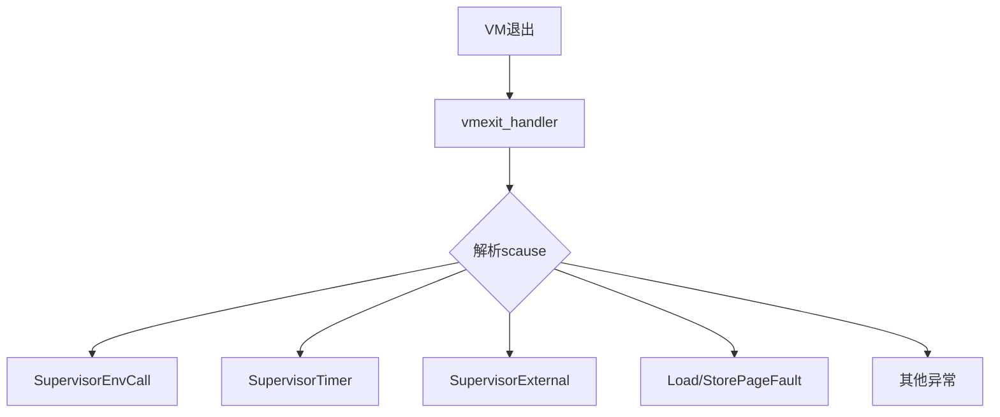
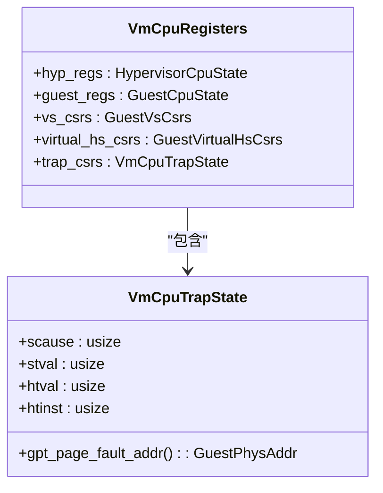
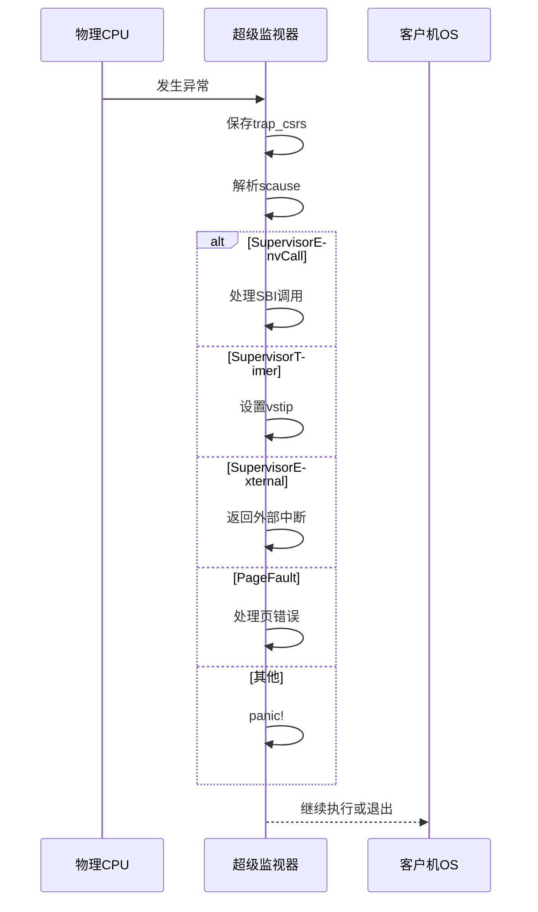
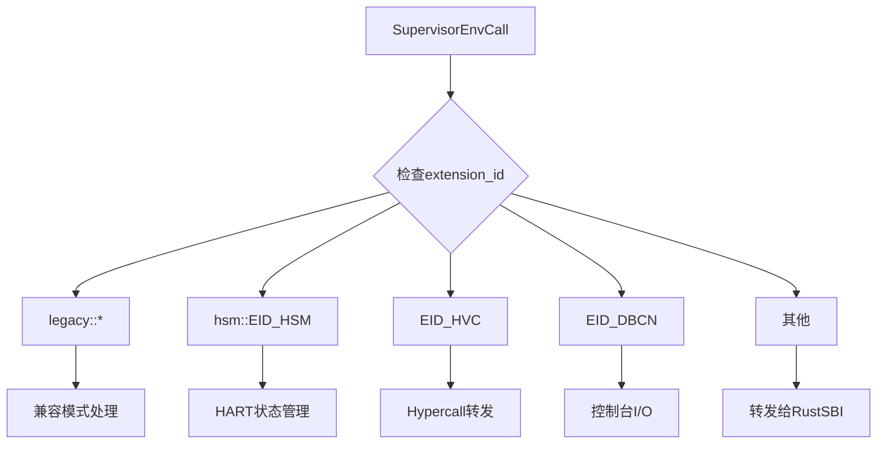
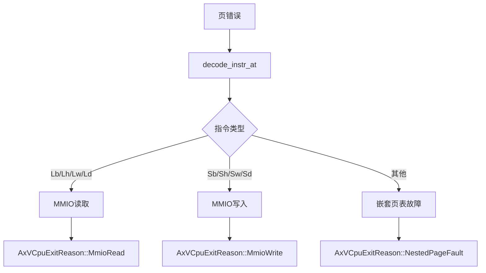

<cite>
**本文档中引用的文件**
- [vcpu.rs](file://src/vcpu.rs)
- [regs.rs](file://src/regs.rs)
- [consts.rs](file://src/consts.rs)
- [trap.rs](file://src/trap.rs)
</cite>

## 目录
1. [VM退出机制](#vm退出机制)
2. [核心组件分析](#核心组件分析)
3. [异常类型分发流程](#异常类型分发流程)
4. [SBI调用处理逻辑](#sbi调用处理逻辑)
5. [页错误处理与MMIO识别](#页错误处理与mmio识别)
6. [调试建议与常见陷阱](#调试建议与常见陷阱)

## VM退出机制

本节全面解析riscv_vcpu中虚拟机（VM）退出的触发条件、处理流程与响应策略。深入剖析`vmexit_handler`函数如何基于`scause`寄存器判断异常类型，并分发至SBI调用、定时器中断、外部中断或页错误等具体处理分支。

**Section sources**
- [vcpu.rs](file://src/vcpu.rs#L100-L570)

## 核心组件分析

### vmexit_handler函数入口

`vmexit_handler`是处理所有VM退出事件的核心函数，作为`RISCVVCpu`结构体的方法实现。该函数在`_run_guest`汇编代码执行后被调用，负责解析硬件产生的异常并作出相应处理。

**Diagram sources**
- [vcpu.rs](file://src/vcpu.rs#L100-L570)

**Section sources**
- [vcpu.rs](file://src/vcpu.rs#L100-L570)

### 寄存器状态管理

`VmCpuRegisters`结构体统一管理虚拟CPU的所有寄存器状态，包括：
- `hyp_regs`: 超级监视角的通用寄存器和CSR
- `guest_regs`: 客户机视角的通用寄存器和CSR
- `trap_csrs`: 用于记录退出原因的特殊CSR（scause, stval等）

当发生VM退出时，`load_from_hw`方法会从物理硬件读取当前的CSR值。

**Diagram sources**
- [regs.rs](file://src/regs.rs#L200-L252)

**Section sources**
- [regs.rs](file://src/regs.rs#L200-L252)

## 异常类型分发流程

`vmexit_handler`通过`scause::read()`获取`scause`寄存器值，并将其转换为标准的RISC-V陷阱类型进行匹配处理。

**Diagram sources**
- [vcpu.rs](file://src/vcpu.rs#L100-L570)

**Section sources**
- [vcpu.rs](file://src/vcpu.rs#L100-L570)

## SBI调用处理逻辑

### SBI扩展ID与功能ID

当`scause`指示为`SupervisorEnvCall`异常时，系统通过a7寄存器获取扩展ID，a6寄存器获取功能ID，形成组合处理逻辑。

| 扩展ID | 功能ID | 处理逻辑 |
|--------|--------|----------|
| LEGACY_SET_TIMER..LEGACY_SHUTDOWN | - | 兼容旧版SBI调用 |
| hsm::EID_HSM | HART_START/HART_STOP | CPU上下线控制 |
| EID_HVC | 任意 | 超级调用(Hypercall) |
| EID_DBCN | FID_CONSOLE_* | 调试控制台操作 |

**Diagram sources**
- [vcpu.rs](file://src/vcpu.rs#L150-L300)

**Section sources**
- [vcpu.rs](file://src/vcpu.rs#L150-L300)

## 页错误处理与MMIO识别

### 指令解码与故障区分

当发生加载或存储页错误时，系统通过`decode_instr_at`方法解码导致故障的指令，以区分普通内存访问与MMIO操作。

**Diagram sources**
- [vcpu.rs](file://src/vcpu.rs#L400-L500)

**Section sources**
- [vcpu.rs](file://src/vcpu.rs#L400-L500)

### 故障地址计算

`gpt_page_fault_addr`方法结合`htval`和`stval`寄存器计算出实际的客户机物理地址（GPA），这是处理嵌套页表故障的关键。

**Section sources**
- [regs.rs](file://src/regs.rs#L240-L250)

## 调试建议与常见陷阱

### 常见问题排查

1. **SBI调用失败**: 检查a7寄存器中的扩展ID是否正确，确保实现了相应的处理逻辑。
2. **无限循环的定时器中断**: 确保在处理完定时器中断后清除了`vstip`位。
3. **MMIO操作未被正确识别**: 验证`decode_instr_at`能否正确解析目标指令。
4. **页错误处理死锁**: 确保在处理页错误时不产生新的页错误。

### 开发者指南

- 使用`trace!`宏输出关键寄存器值以便调试
- 在修改`vmexit_handler`前备份原始逻辑
- 测试新添加的SBI扩展时使用简单的测试用例
- 注意`advance_pc(4)`调用，确保在处理完ecall后正确推进程序计数器

**Section sources**
- [vcpu.rs](file://src/vcpu.rs#L100-L570)
- [regs.rs](file://src/regs.rs#L200-L252)