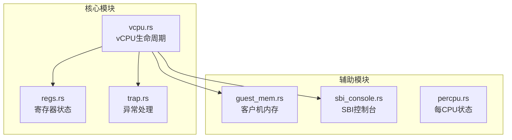
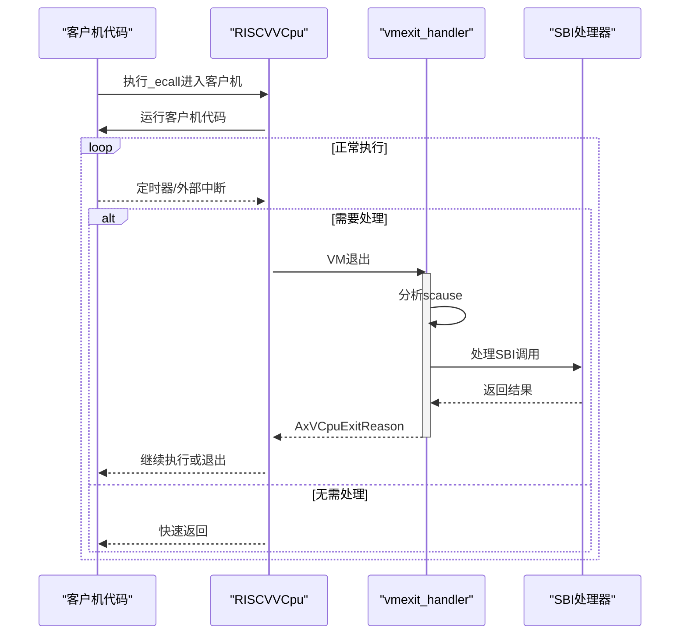
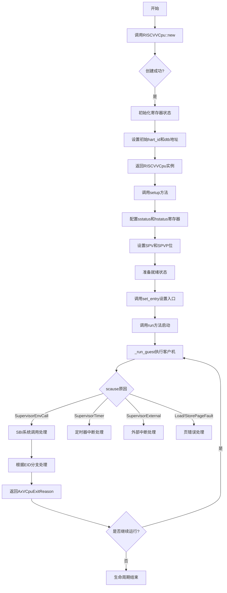
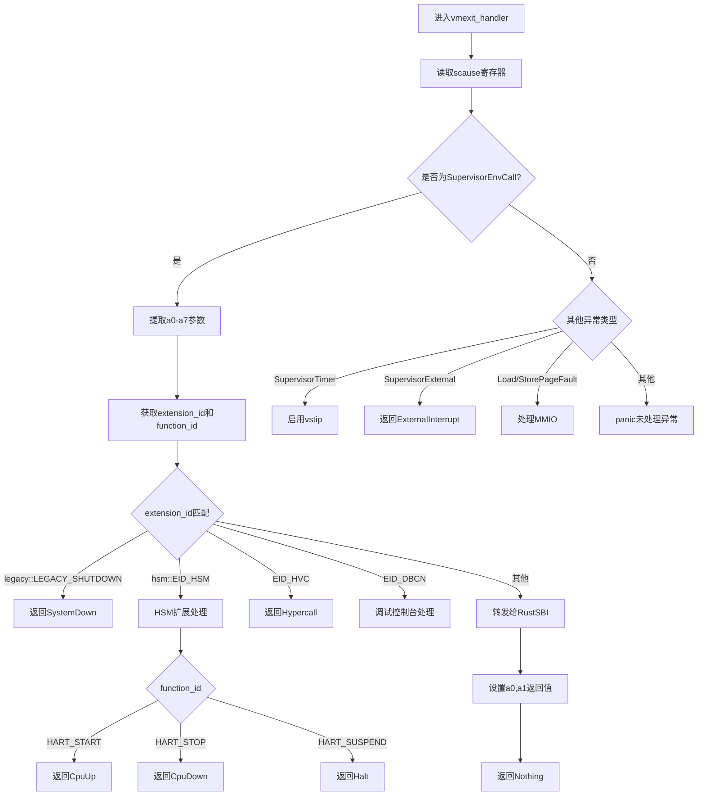
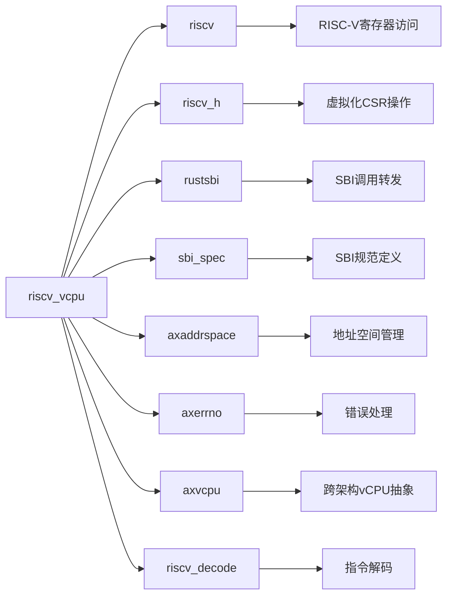

# vCPU生命周期管理

<cite>
**本文档中引用的文件**
- [vcpu.rs](file://src/vcpu.rs)
- [lib.rs](file://src/lib.rs)
- [regs.rs](file://src/regs.rs)
- [trap.rs](file://src/trap.rs)
- [README.md](file://README.md)
</cite>

## 目录
1. [简介](#简介)
2. [项目结构](#项目结构)
3. [核心组件](#核心组件)
4. [架构概述](#架构概述)
5. [详细组件分析](#详细组件分析)
6. [依赖分析](#依赖分析)
7. [性能考虑](#性能考虑)
8. [故障排除指南](#故障排除指南)
9. [结论](#结论)

## 简介
`riscv_vcpu` 是一个为 RISC-V 架构设计的虚拟 CPU（vCPU）实现，专用于嵌入式和教育用途的超管环境。该库提供了完整的 vCPU 抽象层，支持 RISC-V 虚拟化扩展（RVH），可在 `no_std` 环境下运行。本文档深入讲解了 `RISCVVCpu` 结构体的完整生命周期，包括创建、配置、启动、运行时状态维护以及 VM 退出后的处理流程。

## 项目结构
该项目采用模块化设计，主要包含以下源码文件：
- `src/lib.rs`: 库入口点，定义公共接口与配置
- `src/vcpu.rs`: 核心 vCPU 实现，包含生命周期管理逻辑
- `src/regs.rs`: 寄存器状态结构定义
- `src/trap.rs`: 异常处理汇编代码绑定
- `src/guest_mem.rs`: 客户机内存访问支持
- `src/sbi_console.rs`: SBI 控制台扩展实现

**Diagram sources**
- [vcpu.rs](file://src/vcpu.rs#L0-L569)
- [regs.rs](file://src/regs.rs#L0-L252)
- [trap.rs](file://src/trap.rs#L0-L102)

**Section sources**
- [vcpu.rs](file://src/vcpu.rs#L0-L569)
- [lib.rs](file://src/lib.rs#L0-L47)

## 核心组件
`RISCVVCpu` 是整个系统的核心结构体，实现了 `AxArchVCpu` trait，提供标准化的 vCPU 接口。其生命周期由四个关键阶段组成：创建（new）、配置（setup）、启动（run）和运行时处理（vmexit_handler）。通过 `VmCpuRegisters` 结构体保存客户机和宿主机的寄存器状态，并在 VM 进出时进行上下文切换。

**Section sources**
- [vcpu.rs](file://src/vcpu.rs#L46-L88)
- [vcpu.rs](file://src/vcpu.rs#L88-L131)

## 架构概述
系统基于 RISC-V 虚拟化扩展构建，采用分层架构设计。`RISCVVCpu` 封装了底层硬件细节，向上提供统一的 vCPU 操作接口。当客户机触发异常或系统调用时，控制权返回到 hypervisor，由 `vmexit_handler` 处理并决定后续行为。

**Diagram sources**
- [vcpu.rs](file://src/vcpu.rs#L169-L207)
- [vcpu.rs](file://src/vcpu.rs#L361-L392)

## 详细组件分析

### vCPU生命周期状态转换
`RISCVVCpu` 的生命周期遵循严格的顺序状态机模型，从创建到最终退出经历多个明确的状态阶段。

#### 生命周期流程图

**Diagram sources**
- [vcpu.rs](file://src/vcpu.rs#L46-L88)
- [vcpu.rs](file://src/vcpu.rs#L169-L207)
- [vcpu.rs](file://src/vcpu.rs#L361-L392)

**Section sources**
- [vcpu.rs](file://src/vcpu.rs#L0-L569)

### vmexit_handler异常处理机制
`vmexit_handler` 是 vCPU 运行时的核心处理函数，负责解析各种异常原因并返回相应的退出理由。

#### SBI调用处理逻辑

**Diagram sources**
- [vcpu.rs](file://src/vcpu.rs#L169-L207)
- [vcpu.rs](file://src/vcpu.rs#L230-L257)
- [vcpu.rs](file://src/vcpu.rs#L336-L362)

**Section sources**
- [vcpu.rs](file://src/vcpu.rs#L169-L544)

## 依赖分析
`riscv_vcpu` 依赖于多个关键 crate 来实现其功能：

**Diagram sources**
- [vcpu.rs](file://src/vcpu.rs#L0-L49)
- [lib.rs](file://src/lib.rs#L0-L47)

**Section sources**
- [vcpu.rs](file://src/vcpu.rs#L0-L569)

## 性能考虑
- 使用 `no_std` 环境减少运行时开销
- 直接操作 CSR 寄存器提高性能
- 最小化内存拷贝，通过指针直接传递寄存器状态
- 在 `run` 方法中禁用不必要的中断以优化上下文切换
- 利用 RISC-V 硬件虚拟化扩展减少软件模拟开销

## 故障排除指南
常见问题及解决方案：

| 问题现象 | 可能原因 | 解决方案 |
|---------|--------|--------|
| 创建vCPU失败 | 硬件不支持虚拟化扩展 | 调用 `has_hardware_support()` 检查 |
| SBI调用无响应 | extension_id不匹配 | 检查SBI扩展ID定义 |
| 页错误频繁发生 | EPT配置不当 | 验证 `set_ept_root` 调用 |
| 定时器中断丢失 | vstip未正确设置 | 检查 `vmexit_handler` 中的定时器处理逻辑 |
| 寄存器值异常 | 上下文保存/恢复错误 | 验证 `VmCpuRegisters` 结构体使用 |

**Section sources**
- [vcpu.rs](file://src/vcpu.rs#L361-L392)
- [vcpu.rs](file://src/vcpu.rs#L502-L544)

## 结论
`RISCVVCpu` 提供了一个完整且高效的 RISC-V vCPU 实现，通过清晰的状态机模型管理 vCPU 的整个生命周期。开发者可以通过标准接口轻松集成和控制虚拟 CPU 实例，同时利用丰富的退出原因枚举来处理各种运行时事件。该实现特别适合嵌入式 hypervisor 和教育研究场景。