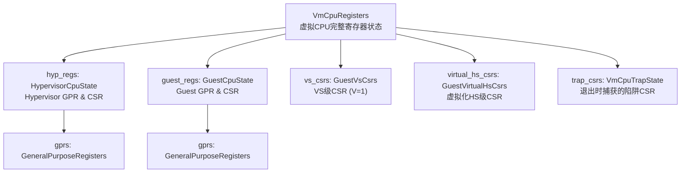
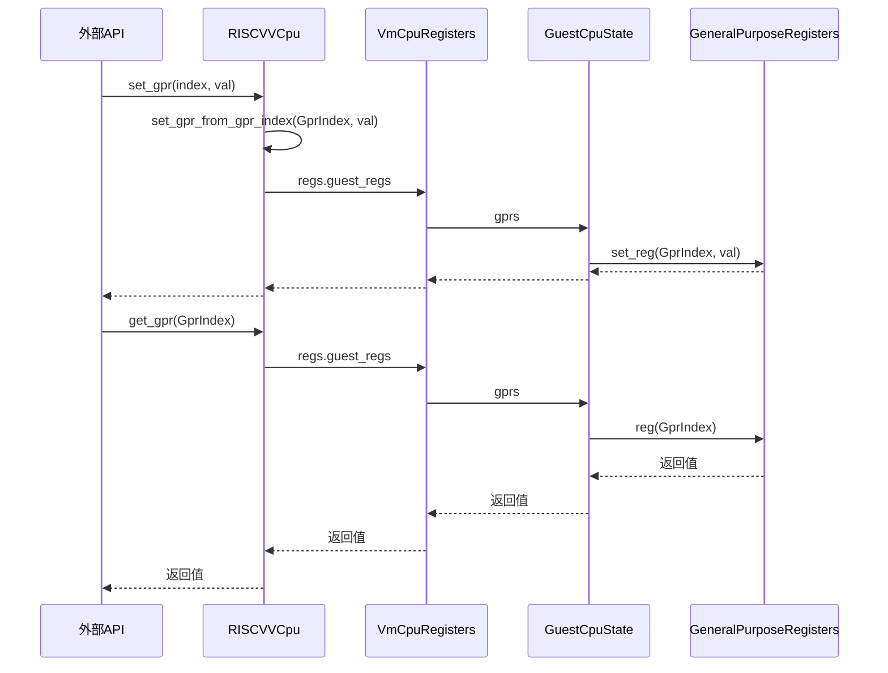

<cite>
**本文档引用的文件**
- [regs.rs](file://src/regs.rs)
- [vcpu.rs](file://src/vcpu.rs)
</cite>

## 目录
1. [引言](#引言)
2. [寄存器体系结构概览](#寄存器体系结构概览)
3. [核心寄存器结构体分析](#核心寄存器结构体分析)
4. [通用寄存器管理机制](#通用寄存器管理机制)
5. [上下文切换与状态同步](#上下文切换与状态同步)
6. [典型使用场景](#典型使用场景)
7. [结论](#结论)

## 引言

本文档旨在系统阐述 `riscv_vcpu` 项目中的寄存器管理体系。重点解析 `VmCpuRegisters` 结构体如何组织 Hypervisor、Guest 及虚拟化扩展相关的 CSR 寄存器组，详细说明 `GeneralPurposeRegisters` 与 `GprIndex` 枚举的设计原理，并结合代码实现展示寄存器读写操作的实际调用路径。

**Section sources**
- [regs.rs](file://src/regs.rs#L1-L20)
- [vcpu.rs](file://src/vcpu.rs#L1-L20)

## 寄存器体系结构概览

`riscv_vcpu` 的寄存器管理体系采用分层设计，将不同特权级和虚拟化状态下的 CPU 状态进行分类管理。该体系的核心是 `VmCpuRegisters` 结构体，它聚合了多个子结构体，分别代表不同的寄存器域。



**Diagram sources**
- [regs.rs](file://src/regs.rs#L100-L150)

**Section sources**
- [regs.rs](file://src/regs.rs#L100-L150)

## 核心寄存器结构体分析

### VmCpuRegisters 结构体

`VmCpuRegisters` 是虚拟 CPU 所有需要保存和恢复的寄存器状态的总容器。它包含了在进入/退出 VM 或切换 VM 时必须处理的所有关键状态。

- **`hyp_regs`**: 存储 Hypervisor 自身的 GPR 和 CSR 状态，在进入/退出 VM 时自动保存/恢复。
- **`guest_regs`**: 存储 Guest 操作系统的 GPR 和 CSR 状态，在退出/进入 VM 时自动保存/恢复。
- **`vs_csrs`**: 存储仅在虚拟化启用（V=1）时有效的 VS 级 CSR，如 `vsstatus`, `vstvec` 等。此字段不会在 VM 进出时自动保存/恢复，需手动管理。
- **`virtual_hs_csrs`**: 存储用于向 Guest 模拟部分 Hypervisor 功能的虚拟化 HS 级 CSR，如 `hgatp`。
- **`trap_csrs`**: 在 VM 退出时自动从硬件读取并保存的陷阱相关 CSR，用于确定陷入原因。

**Section sources**
- [regs.rs](file://src/regs.rs#L100-L150)

### GuestCpuState 与 HypervisorCpuState

这两个结构体分别代表了 Guest 和 Hypervisor 的 CPU 状态快照，它们都包含 `GeneralPurposeRegisters` 和一组关键的 CSR。

- **`GuestCpuState`**: 包含 `sepc`（Guest 的异常程序计数器），这是 Guest 独有的重要状态。
- **`HypervisorCpuState`**: 包含 `sscratch`（Hypervisor 的临时寄存器），这是 Hypervisor 上下文的一部分。

两者共同构成了虚拟化环境的核心状态交换机制。

**Section sources**
- [regs.rs](file://src/regs.rs#L80-L100)

## 通用寄存器管理机制

### GeneralPurposeRegisters 与 GprIndex

`GeneralPurposeRegisters` 使用一个包含 32 个 `usize` 元素的数组来模拟 RISC-V 的 32 个通用寄存器。对寄存器的访问通过 `GprIndex` 枚举进行索引。

#### 零寄存器写保护机制

根据 RISC-V 架构规范，`x0` 寄存器（即 `Zero`）是一个只读的零寄存器。`set_reg` 方法实现了这一保护：

```rust
pub fn set_reg(&mut self, reg_index: GprIndex, val: usize) {
    if reg_index == GprIndex::Zero {
        return; // 写入 x0 的操作被静默忽略
    }
    self.0[reg_index as usize] = val;
}
```

这确保了任何试图修改 `x0` 寄存器值的操作都不会产生实际效果。

#### 参数寄存器批量访问优化

为了提高性能，特别是 SBI 调用等需要同时访问多个参数寄存器的场景，提供了 `a_regs` 和 `a_regs_mut` 方法：

```rust
pub fn a_regs(&self) -> &[usize] {
    &self.0[GprIndex::A0 as usize..=GprIndex::A7 as usize]
}
```

该方法返回一个指向 `a0` 到 `a7` 寄存器的切片，避免了多次独立的寄存器访问调用，显著提升了效率。

**Section sources**
- [regs.rs](file://src/regs.rs#L10-L80)

## 上下文切换与状态同步

### 寄存器读写操作路径

`RISCVVCpu` 结构体提供了 `set_gpr` 和 `get_gpr` 方法作为外部接口，其内部调用路径如下：



**Diagram sources**
- [vcpu.rs](file://src/vcpu.rs#L300-L320)
- [vcpu.rs](file://src/vcpu.rs#L290-L295)

**Section sources**
- [vcpu.rs](file://src/vcpu.rs#L290-L320)

### load_from_hw 系列方法

当 VM 发生退出（VM Exit）时，Hypervisor 需要从物理硬件中同步最新的 CSR 状态。`load_from_hw` 系列方法负责此任务：

- **`VmCpuTrapState.load_from_hw`**: 在 `vmexit_handler` 中被调用，读取 `scause`, `stval`, `htval`, `htinst` 等陷阱相关寄存器，以确定陷入的具体原因。
- **`GuestVsCsrs.load_from_hw`**: 读取所有 VS 级 CSR，如 `vsstatus`, `vsepc` 等。
- **`GuestVirtualHsCsrs.load_from_hw`**: 读取虚拟化的 HS 级 CSR，如 `hie`, `hgatp` 等。

这些方法直接调用 `riscv` 和 `riscv_h` crate 提供的寄存器读取函数，确保了状态的准确同步。

**Section sources**
- [regs.rs](file://src/regs.rs#L159-L220)
- [vcpu.rs](file://src/vcpu.rs#L178-L180)

## 典型使用场景

### SBI 调用前后的寄存器管理

SBI（Supervisor Binary Interface）调用是 Guest OS 与 Hypervisor 交互的主要方式。以下是其完整的寄存器管理流程：

1.  **调用发起**: Guest OS 将 SBI 扩展 ID (`eid`) 放入 `a7`，函数 ID (`fid`) 放入 `a6`，参数放入 `a0-a5`，然后执行 `ecall` 指令。
2.  **VM 退出**: 触发 VM Exit，控制权转移到 Hypervisor 的 `vmexit_handler`。
3.  **状态同步**: `vmexit_handler` 调用 `trap_csrs.load_from_hw()` 同步陷阱状态。
4.  **参数提取**: 通过 `guest_regs.gprs.a_regs()` 批量读取 `a0-a5` 的值作为参数。
5.  **SBI 处理**: 根据 `eid` 和 `fid` 分派到相应的处理逻辑。
6.  **结果写回**: 处理完成后，通过 `set_gpr_from_gpr_index(GprIndex::A0, ret)` 将返回值写入 `a0`。
7.  **PC 推进**: 调用 `advance_pc(4)` 将 `sepc` 增加 4 字节，指向下一条指令。
8.  **VM 继续**: 返回 VM，Guest OS 从 `ecall` 的下一条指令继续执行，`a0` 中已包含 SBI 调用的返回值。

此过程完美展示了 `VmCpuRegisters` 如何在一次完整的上下文切换中保存、分析和恢复寄存器状态。

**Section sources**
- [vcpu.rs](file://src/vcpu.rs#L180-L280)

## 结论

`riscv_vcpu` 的寄存器管理体系设计精巧，通过 `VmCpuRegisters` 结构体及其组件，清晰地分离了 Hypervisor、Guest 和虚拟化扩展的状态。`GeneralPurposeRegisters` 结合 `GprIndex` 枚举，不仅保证了架构合规性（如零寄存器保护），还通过批量访问优化了性能。`load_from_hw` 系列方法为上下文切换提供了可靠的状态同步机制。整个系统为高效、安全的 RISC-V 虚拟化奠定了坚实的底层基础。