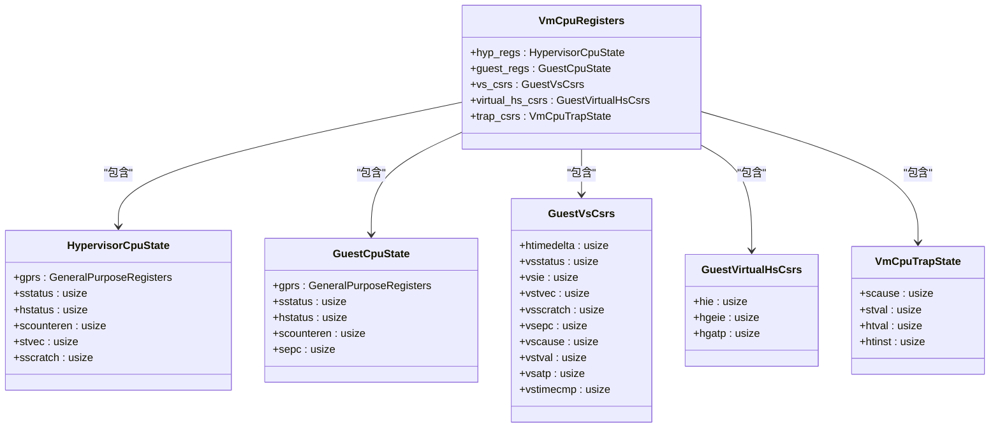
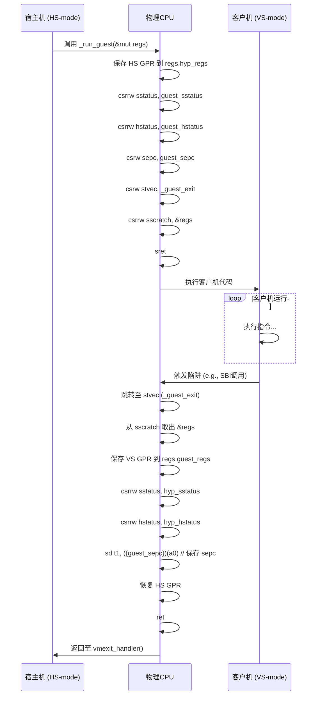

<cite>
**Referenced Files in This Document**
- [regs.rs](file://src/regs.rs)
- [vcpu.rs](file://src/vcpu.rs)
- [trap.rs](file://src/trap.rs)
- [trap.S](file://src/trap.S)
</cite>

# 核心概念

## RISC-V虚拟化基础与vCPU架构

本项目实现了基于RISC-V架构的虚拟CPU（vCPU），其核心是通过硬件虚拟化扩展（Hypervisor Extension）来隔离和管理客户机（Guest）与宿主机（Host）的执行环境。系统利用`_run_guest`汇编函数作为入口，实现从宿主模式（HS-mode）到访客模式（VS-mode）的安全切换，并在发生VM Exit时返回控制权。

**Section sources**
- [vcpu.rs](file://src/vcpu.rs#L1-L570)
- [trap.S](file://src/trap.S#L1-L183)

## vCPU生命周期管理

vCPU的生命周期由`RISCVVCpu`结构体管理，其创建、配置和运行遵循严格的流程。`new()`方法根据`RISCVVCpuCreateConfig`初始化vCPU，设置如hart ID和设备树地址等初始寄存器值。`setup()`方法进一步配置关键的CSR（Control and Status Register），如`sstatus`和`hstatus`，以确保正确的特权级和虚拟化状态。最终，`run()`方法触发底层的`_run_guest`汇编例程，启动客户机代码的执行。

```mermaid
flowchart TD
A[创建vCPU] --> B[调用 new()]
B --> C[初始化 VmCpuRegisters]
C --> D[设置 a0/a1 寄存器]
D --> E[调用 setup()]
E --> F[配置 sstatus/hstatus CSR]
F --> G[调用 run()]
G --> H[进入 _run_guest 汇编]
H --> I[执行客户机代码]
I --> J{是否发生 VM Exit?}
J --> |是| K[调用 vmexit_handler()]
J --> |否| I
K --> L[处理退出原因]
L --> M[返回 AxVCpuExitReason]
```

**Diagram sources**
- [vcpu.rs](file://src/vcpu.rs#L120-L200)

## 寄存器状态保存与恢复机制

### VmCpuRegisters 结构体分析

`VmCpuRegisters`是整个vCPU状态的核心容器，它组织了所有需要在VM Entry和VM Exit时保存与恢复的寄存器信息。该结构体的设计清晰地划分了不同层级的状态：

- **`hyp_regs: HypervisorCpuState`**: 保存宿主机（Hypervisor）自身的GPR和CSR，包括`sstatus`, `hstatus`, `scounteren`, `stvec`, `sscratch`。
- **`guest_regs: GuestCpuState`**: 保存客户机（Guest）的GPR和CSR，包括`sstatus`, `hstatus`, `scounteren`, `sepc`。
- **`vs_csrs: GuestVsCsrs`**: 保存仅在V=1（虚拟化启用）时有效的VS级CSR，如`vsstatus`, `vstvec`, `vsepc`, `vscause`, `vstval`。
- **`virtual_hs_csrs: GuestVirtualHsCsrs`**: 用于模拟给客户机的HS级CSR，如`hie`, `hgatp`。
- **`trap_csrs: VmCpuTrapState`**: 在VM Exit时自动保存的陷阱相关CSR，包括`scause`, `stval`, `htval`, `htinst`。

这种分层设计确保了状态管理的清晰性和安全性。



**Diagram sources**
- [regs.rs](file://src/regs.rs#L140-L252)

### GuestCpuState与HypervisorCpuState的关系

`GuestCpuState`和`HypervisorCpuState`代表了两个独立的执行上下文。当vCPU运行时，`GuestCpuState`中的值被加载到物理CPU的CSR中，使客户机代码得以执行。同时，`HypervisorCpuState`保存了宿主机自身在中断或异常前的状态。两者通过`_run_guest`汇编函数进行原子性的交换：在进入客户机前，宿主机状态被保存，客户机状态被恢复；在VM Exit后，过程逆转，宿主机重新获得控制权。

**Section sources**
- [regs.rs](file://src/regs.rs#L60-L139)
- [trap.S](file://src/trap.S#L1-L183)

## VM退出（VM Exit）的触发与处理流程

### 上下文切换的具体过程

vCPU在host与guest模式间的切换完全由`_run_guest`汇编函数实现。该过程分为两个阶段：

1.  **VM Entry (进入客户机)**:
    *   保存当前宿主机的所有通用寄存器（GPR）到`VmCpuRegisters.hyp_regs.gprs`。
    *   使用`csrrw`指令原子性地交换CSR（如`sstatus`, `hstatus`），将`GuestCpuState`中的值写入物理CSR，同时将旧值（即宿主机状态）保存回`VmCpuRegisters`。
    *   将`guest_regs.sepc`的值加载到`sepc`寄存器，作为客户机下一条要执行的指令地址。
    *   设置`stvec`指向`_guest_exit`标签，确保任何陷阱都能被捕获并返回到宿主机。
    *   将`VmCpuRegisters`的指针存入`sscratch`，作为后续恢复的“手柄”。
    *   执行`sret`指令，跳转到客户机代码开始执行。

2.  **VM Exit (退出客户机)**:
    *   当客户机触发陷阱（如SBI调用、定时器中断、缺页异常）时，CPU会跳转到`_guest_exit`。
    *   从`sscratch`中取出`VmCpuRegisters`的指针，并将其与`a0`交换。
    *   将客户机当前的所有GPR保存回`VmCpuRegisters.guest_regs.gprs`。
    *   再次使用`csrrw`指令交换CSR，将宿主机状态从`VmCpuRegisters`恢复到物理CSR。
    *   将当前的`sepc`（即客户机发生陷阱的指令地址）保存回`VmCpuRegisters.guest_regs.sepc`。
    *   恢复宿主机的GPR。
    *   执行`ret`指令，返回到`RISCVVCpu.run()`方法中的`vmexit_handler()`。



**Diagram sources**
- [trap.S](file://src/trap.S#L1-L183)
- [vcpu.rs](file://src/vcpu.rs#L200-L300)

### 关键寄存器的作用

- **`sepc` (Supervisor Exception Program Counter)**: 这是最关键的寄存器之一。在VM Entry时，它被设置为客户机的入口点地址。在VM Exit时，它的值会被更新为客户机发生陷阱的那条指令的地址，使得宿主机可以准确地知道客户机在何处中断，并在处理完事件后决定如何继续（例如，通过`advance_pc(4)`跳过已处理的SBI指令）。
- **`scause` (Supervisor Cause Register)**: 记录导致VM Exit的陷阱类型（异常或中断）。`vmexit_handler()`通过解析`scause`来确定退出原因，例如`SupervisorEnvCall`表示SBI调用，`SupervisorTimer`表示定时器中断。这是区分不同退出事件的主要依据。
- **`stval` (Supervisor Trap Value Register)**: 提供关于陷阱的附加信息。对于缺页异常（Page Fault），`stval`包含了引发故障的虚拟地址。结合`htval`，`VmCpuTrapState.gpt_page_fault_addr()`方法可以计算出确切的客户机物理地址（GPA），这对于处理MMIO（内存映射I/O）至关重要。

**Section sources**
- [vcpu.rs](file://src/vcpu.rs#L300-L500)
- [regs.rs](file://src/regs.rs#L100-L120)