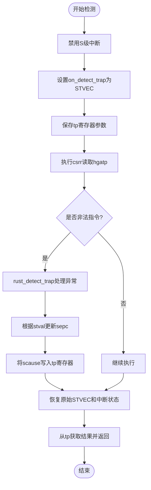
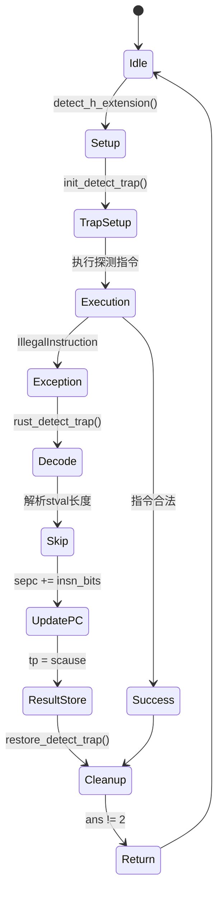

# detect模块

<cite>
**Referenced Files in This Document**
- [detect.rs](file://src/detect.rs)
- [trap.S](file://src/trap.S)
- [trap.rs](file://src/trap.rs)
</cite>

## 目录
1. [简介](#简介)
2. [核心检测机制](#核心检测机制)
3. [Trap处理流程分析](#trap处理流程分析)
4. [状态机图](#状态机图)
5. [ABI兼容性与原子性保障](#abicompatibility-and-atomicity-guarantees)
6. [no_std环境下的可靠性考量](#no_std环境下的可靠性考量)

## 简介

`detect.rs`模块实现了基于陷阱返回（trap-and-return）技术的RISC-V指令集扩展检测机制。该机制主要用于探测硬件虚拟化（H）扩展的存在性，通过执行特定的CSR读取指令并捕获可能产生的非法指令异常来判断目标扩展是否被支持。

本模块在无标准库（no_std）环境下运行，采用底层汇编与Rust混合编程的方式，确保了在最小化依赖条件下对CPU特性的精确探测能力。其设计充分考虑了RISC-V架构的异常处理模型和寄存器保存/恢复语义，为后续的虚拟化功能启用提供了可靠的硬件能力检测基础。

**Section sources**
- [detect.rs](file://src/detect.rs#L1-L20)

## 核心检测机制

### H扩展检测函数

`detect_h_extension`函数是模块的主要入口点，负责探测RISC-V H（Hypervisor）扩展的支持情况。该函数通过尝试读取`hgatp`寄存器（CSR地址0x680）来实现检测目的。如果目标平台不支持H扩展，则此操作将触发非法指令异常，从而被自定义的陷阱处理程序捕获。

检测逻辑封装在`with_detect_trap`辅助函数中，该函数提供了一种通用的异常检测框架：首先调用`init_detect_trap`设置专用的陷阱向量，然后执行传入的闭包函数进行实际的探测操作，最后通过`restore_detect_trap`恢复原始的陷阱处理环境。



**Diagram sources**
- [detect.rs](file://src/detect.rs#L25-L35)
- [detect.rs](file://src/detect.rs#L40-L45)

**Section sources**
- [detect.rs](file://src/detect.rs#L25-L50)

### 陷阱与返回技术

陷阱与返回技术的核心在于临时重定向S模式陷阱向量寄存器（STVEC）到专用的汇编处理程序`on_detect_trap`。`init_detect_trap`函数负责这一关键的环境初始化工作：

1. 保存当前`sstatus.SIE`位的状态以备后续恢复
2. 清除`sstatus.SIE`位，确保只处理异常而不响应中断
3. 保存原始的`stvec`值
4. 将`stvec`设置为指向`on_detect_trap`函数的直接模式向量
5. 使用内联汇编保存当前`tp`寄存器的值，并将输入参数写入`tp`

这种设计确保了检测过程的隔离性和可恢复性，同时利用`tp`寄存器作为参数传递和结果返回的通道，避免了对堆栈的复杂依赖。

**Section sources**
- [detect.rs](file://src/detect.rs#L90-L115)

## Trap处理流程分析

### 汇编层上下文保存

`on_detect_trap`是一个使用`naked_asm!`宏定义的裸函数（naked function），它手动实现了完整的寄存器上下文保存与恢复。该函数直接操作硬件栈指针（sp），将所有通用寄存器（GPRs）、以及`sstatus`、`sepc`、`scause`、`stval`等关键CSR的值压入栈中。

上下文保存遵循RISC-V调用约定，构建了一个与`TrapFrame`结构体布局完全兼容的内存镜像。特别地，它通过`csrr`指令显式读取CSR值并存储，而不是依赖硬件自动保存，这提供了更大的控制灵活性和调试便利性。

```mermaid
sequenceDiagram
participant CPU as "CPU"
participant ASM as "on_detect_trap"
participant Rust as "rust_detect_trap"
CPU->>ASM : 触发异常
ASM->>ASM : addi sp, sp, -8*21
ASM->>ASM : sd ra, tp, a0... (保存GPRs)
ASM->>ASM : csrr sstatus, sepc... (保存CSRs)
ASM->>Rust : mv a0, sp; call rust_detect_trap
Rust->>Rust : 处理异常逻辑
Rust-->>ASM : 返回
ASM->>ASM : ld t0, t1... (恢复CSRs)
ASM->>ASM : ld ra, tp, a0... (恢复GPRs)
ASM->>ASM : addi sp, sp, 8*21
ASM->>CPU : sret
```

**Diagram sources**
- [detect.rs](file://src/detect.rs#L170-L237)
- [detect.rs](file://src/detect.rs#L120-L165)

**Section sources**
- [detect.rs](file://src/detect.rs#L170-L237)

### Rust层异常处理

`rust_detect_trap`是用Rust编写的C语言接口陷阱处理函数，接收一个指向`TrapFrame`的指针作为参数。其主要职责包括：

1. 将`scause`的原始位值存储到`tp`寄存器中，作为最终的返回结果
2. 将`scause`解码为类型安全的`Trap<Interrupt, Exception>`枚举
3. 针对`IllegalInstruction`异常，解析`stval`以确定非法指令的长度
4. 更新`sepc`以跳过非法指令，实现"陷阱即跳过"的行为

对于非法指令长度的推断，`riscv_illegal_insn_bits`函数首先检查`stval[0..16]`的值。若为零则尝试从内存重新读取指令半字；否则根据RISC-V指令编码规则判断：最低两位非11b为16位指令，否则为32位指令。

**Section sources**
- [detect.rs](file://src/detect.rs#L50-L85)

## 状态机图



**Diagram sources**
- [detect.rs](file://src/detect.rs#L25-L237)

## ABI兼容性与原子性保障

### TrapFrame结构体设计

`TrapFrame`结构体采用`#[repr(C)]`属性确保其内存布局与C语言兼容，这对于汇编代码正确访问Rust数据结构至关重要。该结构体精确映射了`on_detect_trap`在栈上构建的上下文帧，包含所有需要保存的通用寄存器和S模式CSR。

字段顺序严格遵循RISC-V调用约定和栈帧布局，使得汇编代码可以通过固定的偏移量安全地访问每个成员。这种设计消除了潜在的ABI不匹配风险，保证了跨语言调用的稳定性。

**Section sources**
- [detect.rs](file://src/detect.rs#L150-L165)

### 原子性保障措施

整个检测流程通过多项措施确保操作的原子性：

1. **中断屏蔽**：通过清除`sstatus.SIE`位，在检测期间完全禁用S级中断，防止外部干扰
2. **单次执行语义**：`with_detect_trap`框架确保探测代码只执行一次，无论是否发生异常
3. **状态完整保存**：所有被修改的关键寄存器（`stvec`、`sstatus.SIE`、`tp`）都在进入前保存并在退出后恢复
4. **无堆栈依赖**：使用固定大小的栈空间分配，避免动态内存分配带来的不确定性

这些措施共同保证了检测过程不会对外部系统状态造成持久性影响，且能在任何情况下安全地恢复执行环境。

**Section sources**
- [detect.rs](file://src/detect.rs#L90-L115)
- [detect.rs](file://src/detect.rs#L120-L145)

## no_std环境下的可靠性考量

该检测方案针对no_std环境进行了专门优化，具备以下可靠性特征：

1. **零堆分配**：全程不使用堆内存，仅依赖栈和寄存器，适合资源受限环境
2. **最小化依赖**：仅依赖`core`库和`riscv`crate的基础功能，无外部I/O或系统调用
3. **确定性行为**：所有操作具有确定的时间和空间复杂度，避免不可预测的延迟
4. **错误快速失败**：遇到未知陷阱原因时立即panic，防止静默错误传播
5. **硬件抽象适配**：通过`riscv`crate提供的稳定API访问CSR，屏蔽底层差异

此外，代码中多处使用`unsafe`块均配有明确的不变式说明和安全边界检查，确保在追求性能的同时不牺牲安全性。整体设计体现了嵌入式和系统级编程的最佳实践。

**Section sources**
- [detect.rs](file://src/detect.rs#L1-L237)