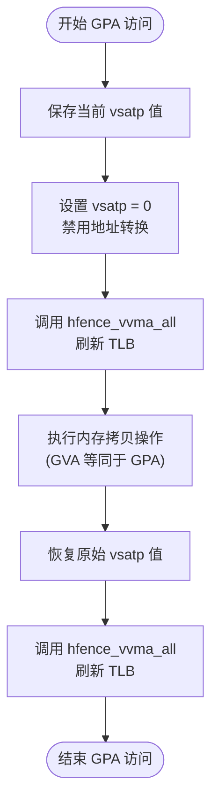
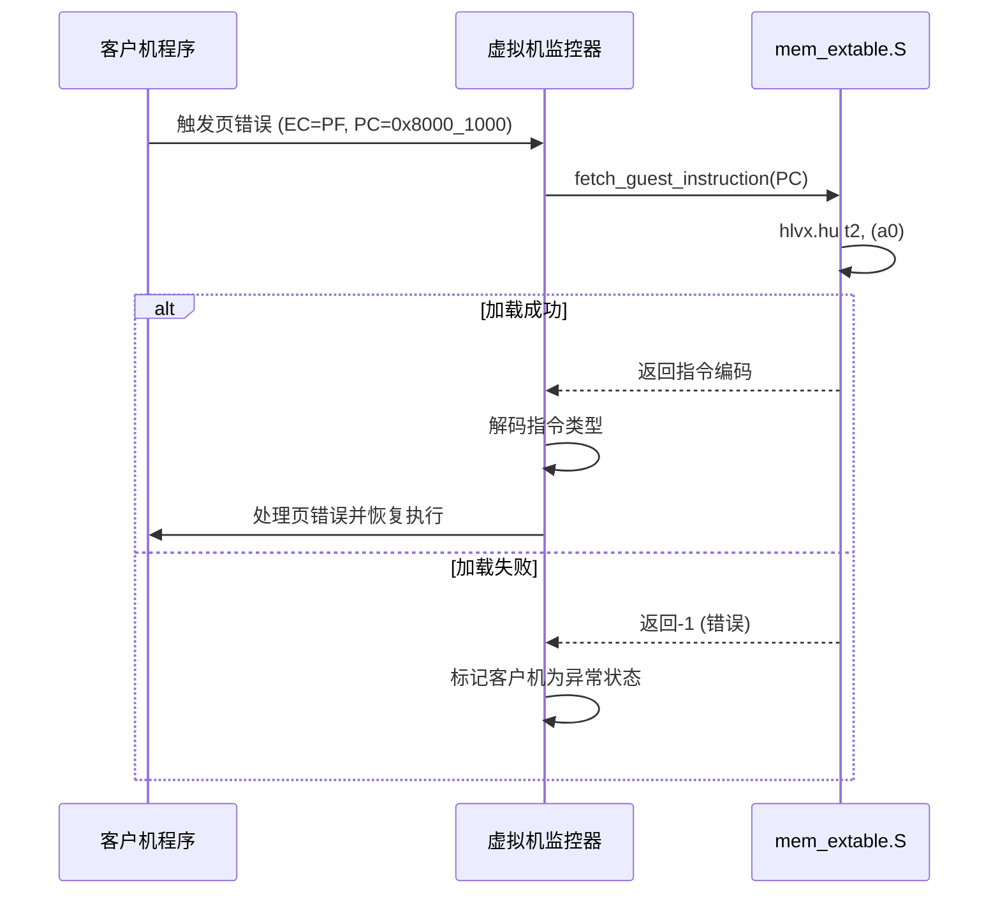
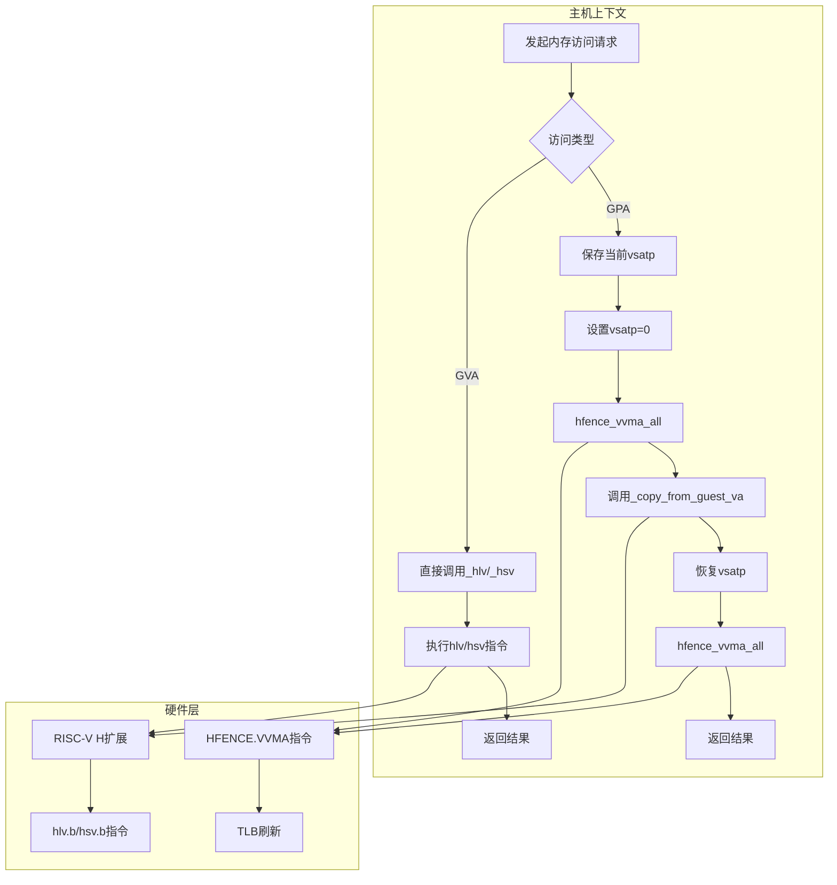

# guest_mem模块

<cite>
**Referenced Files in This Document**   
- [guest_mem.rs](file://src/guest_mem.rs)
- [mem_extable.S](file://src/mem_extable.S)
</cite>

## 目录
1. [引言](#引言)
2. [客户机内存访问机制概述](#客户机内存访问机制概述)
3. [物理地址访问实现原理](#物理地址访问实现原理)
4. [虚拟地址与物理地址访问路径对比](#虚拟地址与物理地址访问路径对比)
5. [内联汇编指令提取函数分析](#内联汇编指令提取函数分析)
6. [内存访问流程图](#内存访问流程图)
7. [使用模式与潜在陷阱](#使用模式与潜在陷阱)
8. [性能影响分析](#性能影响分析)
9. [结论](#结论)

## 引言

本文件详细解析RISC-V虚拟化环境中`guest_mem`模块的客户机内存访问机制。该模块提供了从主机视角安全、高效地访问客户机内存的核心功能，是虚拟CPU（vCPU）执行过程中不可或缺的基础设施。

## 客户机内存访问机制概述

`guest_mem`模块通过结合Rust高级抽象与RISC-V H扩展指令集，实现了对客户机内存的安全访问。其核心设计基于两个关键层次：高层Rust接口封装和底层内联汇编实现。

模块主要提供三类接口：
- `copy_from_guest`/`copy_to_guest`：用于客户机物理地址（GPA）访问
- `copy_from_guest_va`/`copy_to_guest_va`：用于客户机虚拟地址（GVA）访问
- `fetch_guest_instruction`：用于从客户机虚拟地址提取指令

这些接口通过调用由`mem_extable.S`提供的底层汇编函数来完成实际的内存操作，并利用H扩展的`hlv`/`hsv`指令在硬件层面实现跨地址空间的安全数据传输。

**Section sources**
- [guest_mem.rs](file://src/guest_mem.rs#L1-L82)

## 物理地址访问实现原理

### 临时禁用VSATP地址转换

`copy_from_guest`和`copy_to_guest`函数通过临时修改`vsatp`寄存器来实现对客户机物理地址的直接访问。具体步骤如下：

1. **保存原VSATP值**：首先读取并保存当前`vsatp`寄存器的原始值。
2. **禁用地址转换**：将`vsatp`寄存器写入0，从而关闭客户机虚拟地址到物理地址的转换。
3. **刷新TLB**：调用`hfence_vvma_all`全局刷新所有TLB条目，确保新的地址转换设置立即生效。
4. **执行内存操作**：在此状态下，客户机虚拟地址（GVA）等同于客户机物理地址（GPA），因此可以复用`copy_from_guest_va`/`copy_to_guest_va`接口进行数据拷贝。
5. **恢复环境**：操作完成后，恢复原始的`vsatp`值，并再次调用`hfence_vvma_all`刷新TLB以重建正常的地址转换。

这种设计巧妙地利用了RISC-V虚拟化架构的特性，在不牺牲安全性的情况下实现了对客户机物理内存的直接访问。

### hfence_vvma_all的关键作用

`hfence_vvma_all`函数在客户机内存访问中扮演着至关重要的角色。它对应于RISC-V的`HFENCE.VVMA`指令，用于刷新虚拟机虚拟内存地址（VVMA）的TLB条目。

当`vsatp`被修改后，原有的TLB缓存可能包含基于旧页表的无效映射。如果不及时清除，会导致后续内存访问出现错误或安全漏洞。`hfence_vvma_all`确保了：
- 所有基于旧`vsatp`的TLB条目被立即失效
- 后续内存访问强制重新查询页表，获得正确的地址映射
- 在恢复`vsatp`后，避免使用已过期的TLB条目

这一操作保证了地址转换状态的一致性和内存访问的正确性。

**Diagram sources**
- [guest_mem.rs](file://src/guest_mem.rs#L40-L70)

**Section sources**
- [guest_mem.rs](file://src/guest_mem.rs#L40-L70)

## 虚拟地址与物理地址访问路径对比

### 接口区别与联系

| 特性 | 基于GVA的访问 (_copy_from_guest_va等) | 基于GPA的封装层 (copy_from_guest等) |
|------|-----------------------------------|----------------------------------|
| **地址类型** | 客户机虚拟地址 (GVA) | 客户机物理地址 (GPA) |
| **VSATP状态** | 保持启用，使用客户机页表 | 临时禁用，GVA=GPA |
| **TLB刷新** | 不需要 | 需要两次 hfence_vvma_all |
| **性能开销** | 较低 | 较高（因TLB刷新） |
| **适用场景** | 访问客户机用户态内存 | 访问客户机物理内存、设备内存 |

两者之间的联系体现在：GPA访问层实际上是在临时改变地址转换模式后，复用了GVA访问的底层实现。这体现了代码复用的设计思想。

### 设计动机

区分GVA和GPA访问路径的设计主要出于以下考虑：

1. **语义清晰性**：明确区分两种不同的访问意图，避免混淆。
2. **安全性保障**：GPA访问绕过客户机页表，可直接访问任何物理内存区域，包括那些未映射到虚拟地址空间的特殊区域。
3. **功能完整性**：某些虚拟化操作（如处理客户机缺页异常）需要直接操作物理内存，而非经过客户机页表转换后的地址。

**Section sources**
- [guest_mem.rs](file://src/guest_mem.rs#L15-L70)

## 内联汇编指令提取函数分析

### _fetch_guest_instruction工作原理

`_fetch_guest_instruction`是一个用汇编语言实现的函数，专门用于从客户机虚拟地址提取指令。其工作原理如下：

1. 使用`hlvx.hu`指令从指定的客户机虚拟地址加载半字（16位）。
2. 检查加载的指令是否为标准32位指令（通过判断最低两位是否为'b11'）。
3. 如果是压缩指令（最低两位非'b11'），则已完成提取；否则继续加载下一个半字以组成完整的32位指令。
4. 将提取的指令写入输出缓冲区并返回成功。

该函数特别之处在于包含了异常处理机制（通过`.add_extable`宏），理论上可以在发生页面错误时捕获异常并返回错误码，尽管当前实现尚未完全启用此功能。

### 在页错误处理中的应用场景

此函数在客户机页错误（Page Fault）处理中具有重要应用价值：

- 当客户机程序访问非法内存地址触发页错误时，虚拟机监控器（VMM）需要知道是哪条指令导致了错误。
- 通过调用`fetch_guest_instruction`，VMM可以从客户机的程序计数器（PC）指向的地址提取出触发异常的原始指令。
- 这对于实现按需分页、写时复制（COW）等高级内存管理功能至关重要，因为VMM需要根据指令类型（读/写/执行）来决定如何处理该页错误。

**Diagram sources**
- [mem_extable.S](file://src/mem_extable.S#L70-L100)
- [guest_mem.rs](file://src/guest_mem.rs#L75-L82)

**Section sources**
- [mem_extable.S](file://src/mem_extable.S#L70-L100)
- [guest_mem.rs](file://src/guest_mem.rs#L75-L82)

## 内存访问流程图

**Diagram sources**
- [guest_mem.rs](file://src/guest_mem.rs#L1-L82)
- [mem_extable.S](file://src/mem_extable.S#L1-L134)

## 使用模式与潜在陷阱

### 常见使用模式

1. **客户机内存初始化**：在创建客户机时，使用`copy_to_guest`将初始代码和数据写入客户机物理内存。
2. **系统调用参数传递**：当客户机执行系统调用时，使用`copy_from_guest_va`读取用户态缓冲区内容。
3. **异常诊断**：在处理客户机异常时，使用`fetch_guest_instruction`获取故障指令进行分析。
4. **设备模拟**：在模拟I/O设备时，直接访问客户机的设备内存区域（MMIO）。

### 潜在陷阱

1. **性能敏感场景滥用GPA访问**：频繁调用`copy_from_guest`会导致大量TLB刷新，严重影响性能。应优先使用GVA接口。
2. **并发访问冲突**：多个vCPU同时访问同一客户机内存区域时，需额外同步机制，本模块不提供内置锁。
3. **异常处理缺失**：当前`_fetch_guest_instruction`的异常处理框架虽存在但未完全实现，可能导致不可预测行为。
4. **地址溢出风险**：长指令序列跨越页面边界时，单次`hlv`操作可能失败，需分段处理。

**Section sources**
- [guest_mem.rs](file://src/guest_mem.rs#L1-L82)
- [mem_extable.S](file://src/mem_extable.S#L1-L134)

## 性能影响分析

区分GVA和GPA访问路径的设计对性能有显著影响：

- **GVA访问路径**：性能最优，仅涉及一次`hlv`/`hsv`指令和可能的TLB命中，适用于大多数常规内存操作。
- **GPA访问路径**：性能较差，每次访问至少引入两次`HFENCE.VVMA`指令，这不仅消耗CPU周期，还会导致后续所有内存访问的TLB未命中，产生连锁性能惩罚。

因此，建议遵循以下性能优化原则：
1. 优先使用GVA接口访问客户机用户内存。
2. 仅在必须绕过客户机页表时才使用GPA接口。
3. 对连续内存块的操作尽量合并为单次大尺寸拷贝，减少函数调用和TLB刷新次数。

**Section sources**
- [guest_mem.rs](file://src/guest_mem.rs#L40-L70)

## 结论

`guest_mem`模块通过精巧的设计实现了RISC-V虚拟化环境下安全高效的客户机内存访问。其核心机制——临时禁用VSATP并配合`hfence_vvma_all`刷新TLB——确保了物理地址访问的正确性与安全性。同时，通过区分GVA和GPA访问路径，既满足了不同场景的功能需求，又保持了接口的清晰性。尽管GPA访问存在性能开销，但合理使用该模块仍能为高性能虚拟化系统提供坚实的内存访问基础。