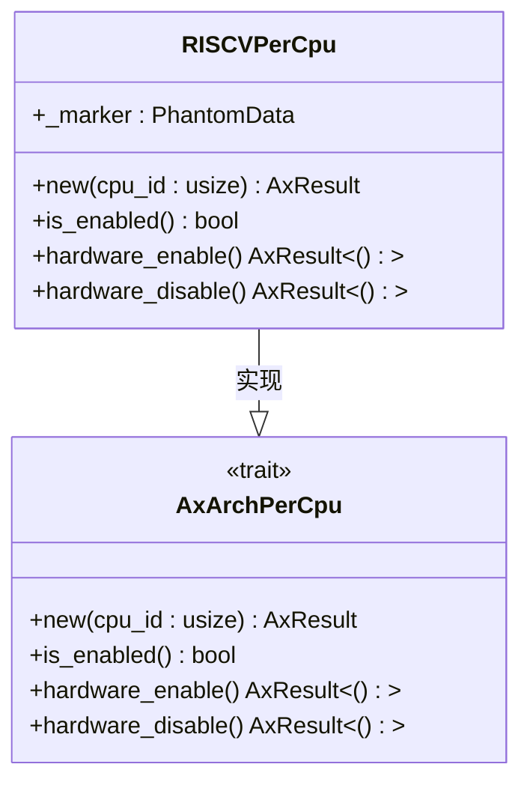
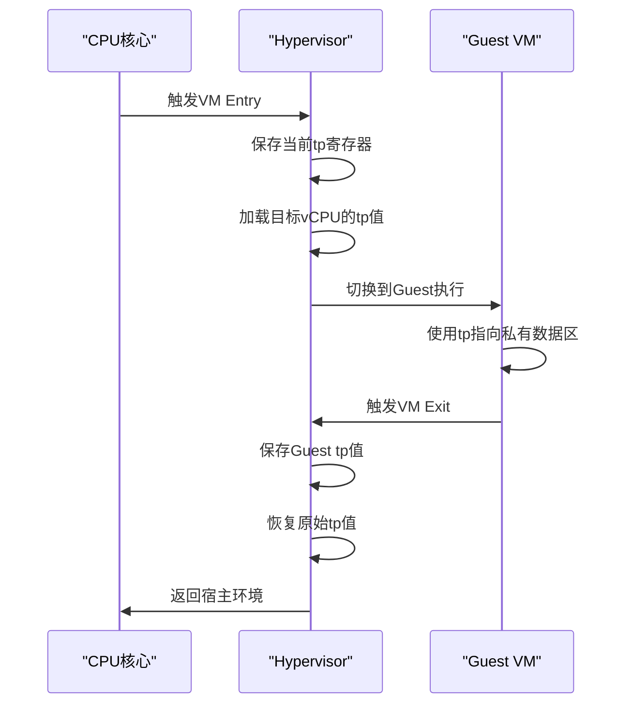
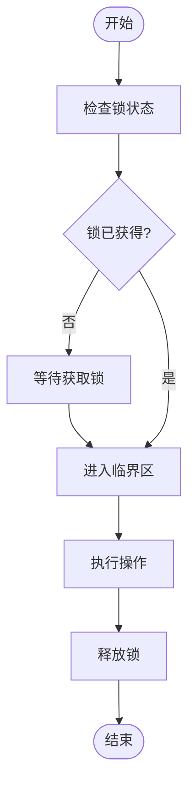

<cite>
**Referenced Files in This Document**
- [percpu.rs](file://src/percpu.rs)
- [trap.S](file://src/trap.S)
- [regs.rs](file://src/regs.rs)
- [trap.rs](file://src/trap.rs)
</cite>

## 目录
1. [引言](#引言)
2. [PerCpu结构体设计模式](#percpu结构体设计模式)
3. [线程指针寄存器与核心本地存储](#线程指针寄存器与核心本地存储)
4. [多核环境下的内存布局](#多核环境下的内存布局)
5. [vCPU调度与状态隔离](#vcPU调度与状态隔离)
6. [同步原语应用场景](#同步原语应用场景)

## 引言

`percpu`模块是RISC-V架构下虚拟化系统的核心组件，负责管理每个CPU核心的私有数据结构。该模块通过利用RISC-V架构特定机制实现高效的核心本地存储访问，为多核虚拟化环境提供了基础支持。本文档将深入解析`percpu.rs`中每CPU数据结构的管理实现，详细说明其设计模式、底层访问机制以及在虚拟化环境中的应用。

**Section sources**
- [percpu.rs](file://src/percpu.rs#L1-L83)

## PerCpu结构体设计模式

`RISCVPerCpu`结构体采用泛型设计模式，通过`AxVCpuHal` trait约束确保硬件抽象层的兼容性。该结构体包含一个`PhantomData`标记字段，用于在编译时携带类型信息而不占用运行时空间。

初始化过程通过`new`方法完成，接收CPU ID作为参数并调用`setup_csrs`函数配置控制状态寄存器。激活接口由`hardware_enable`和`hardware_disable`方法提供，其中`hardware_enable`检查硬件支持情况后返回相应结果。

**Diagram sources**
- [percpu.rs](file://src/percpu.rs#L10-L45)

**Section sources**
- [percpu.rs](file://src/percpu.rs#L10-L45)

## 线程指针寄存器与核心本地存储

虽然`percpu.rs`文件中未直接实现`__get_per_cpu_ptr`函数，但系统通过RISC-V架构的`tp`（thread pointer）寄存器实现核心本地存储访问。在`trap.S`汇编代码中，`tp`寄存器被用于保存和恢复每个vCPU的私有状态。

当进入或退出虚拟机时，系统执行以下操作：
1. 保存当前`tp`寄存器值到`VmCpuRegisters`结构体的`guest_tp`字段
2. 恢复目标vCPU的`tp`寄存器值
3. 通过`tp`寄存器快速定位当前CPU的私有数据区域

这种机制允许每个CPU核心拥有独立的数据视图，同时保持高效的上下文切换性能。

**Diagram sources**
- [trap.S](file://src/trap.S#L1-L182)
- [regs.rs](file://src/regs.rs#L231-L251)

**Section sources**
- [trap.S](file://src/trap.S#L1-L182)
- [regs.rs](file://src/regs.rs#L231-L251)
- [trap.rs](file://src/trap.rs#L1-L102)

## 多核环境下的内存布局

在多核虚拟化环境中，各CPU的私有数据按照连续内存块的方式组织。每个CPU对应一个`VmCpuRegisters`结构体实例，其中包含完整的寄存器状态和控制信息。

```mermaid
graph TD
subgraph "CPU 0"
A0[通用寄存器] --> B0[CSR寄存器]
B0 --> C0[VS级CSRs]
C0 --> D0[虚拟HS级CSRs]
D0 --> E0[陷阱相关CSRs]
end
subgraph "CPU 1"
A1[通用寄存器] --> B1[CSR寄存器]
B1 --> C1[VS级CSRs]
C1 --> D1[虚拟HS级CSRs]
D1 --> E1[陷阱相关CSRs]
end
subgraph "CPU N"
AN[通用寄存器] --> BN[CSR寄存器]
BN --> CN[VS级CSRs]
CN --> DN[虚拟HS级CSRs]
DN --> EN[陷阱相关CSRs]
end
style A0 fill:#f9f,stroke:#333
style A1 fill:#f9f,stroke:#333
style AN fill:#f9f,stroke:#333
```

每个`VmCpuRegisters`结构体的大小固定，便于通过CPU ID进行索引计算。`tp`寄存器指向当前CPU对应的结构体起始地址，实现O(1)时间复杂度的数据访问。

**Diagram sources**
- [regs.rs](file://src/regs.rs#L231-L251)

**Section sources**
- [regs.rs](file://src/regs.rs#L231-L251)

## vCPU调度与状态隔离

`percpu`模块为vCPU调度提供了关键支持。每次vCPU切换时，系统通过保存和恢复`VmCpuRegisters`结构体来实现完全的状态隔离。这包括：

- 通用寄存器状态（GPRs）
- 控制状态寄存器（CSRs）
- VS级专用寄存器
- 虚拟HS级寄存器
- 陷阱处理相关寄存器

状态隔离确保了不同vCPU之间的执行环境相互独立，防止数据泄露和干扰。同时，通过`tp`寄存器的快速切换，最大限度地减少了上下文切换开销。

**Section sources**
- [trap.S](file://src/trap.S#L1-L182)
- [vcpu.rs](file://src/vcpu.rs#L1-L570)

## 同步原语应用场景

尽管`percpu.rs`本身不直接涉及同步原语，但在多核环境下使用每CPU数据时需要考虑同步问题。主要应用场景包括：

1. **跨CPU通信**：当需要在不同CPU之间共享信息时，必须使用适当的锁机制保护共享数据。
2. **全局状态更新**：某些统计信息可能需要从多个CPU收集，这时需要原子操作保证数据一致性。
3. **资源分配**：CPU间资源竞争需要互斥锁或其他同步机制协调。

典型的同步模式是在访问共享资源前获取锁，操作完成后释放锁，确保临界区的独占访问。

**Diagram sources**
- [vcpu.rs](file://src/vcpu.rs#L1-L570)

**Section sources**
- [vcpu.rs](file://src/vcpu.rs#L1-L570)