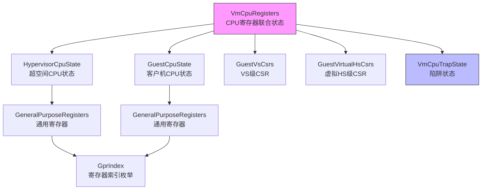

# regs模块

<cite>
**Referenced Files in This Document**  
- [regs.rs](file://src/regs.rs)
- [trap.rs](file://src/trap.rs)
</cite>

## 目录
1. [引言](#引言)
2. [通用寄存器体系](#通用寄存器体系)
3. [CPU状态联合结构体](#cpu状态联合结构体)
4. [虚拟化相关CSR分析](#虚拟化相关csr分析)
5. [陷阱状态与页错误地址重建](#陷阱状态与页错误地址重建)
6. [汇编层偏移访问机制](#汇编层偏移访问机制)
7. [结构关系图](#结构关系图)
8. [上下文切换数据流示例](#上下文切换数据流示例)

## 引言

本文档全面解析RISC-V虚拟CPU中`regs.rs`模块定义的CPU状态数据结构体系。该模块构建了完整的虚拟机CPU寄存器状态模型，支持虚拟化环境下的上下文保存与恢复。核心组件包括通用寄存器、超空间（hypervisor）状态、客户机状态以及虚拟化扩展相关的控制状态寄存器（CSR）。这些结构体通过精确的内存布局设计，实现了从Rust代码到汇编层的无缝对接，为高效虚拟化提供了底层支持。

## 通用寄存器体系

### GeneralPurposeRegisters结构体

`GeneralPurposeRegisters`结构体封装了RISC-V架构的32个通用寄存器，采用`[usize; 32]`数组形式存储，确保与硬件寄存器映射一致。该结构体通过`#[repr(C)]`属性保证内存布局兼容C语言约定，便于跨语言交互和直接内存访问。

**Section sources**
- [regs.rs](file://src/regs.rs#L5-L10)

### GprIndex枚举设计

`GprIndex`枚举为32个通用寄存器提供类型安全的索引访问。每个变体对应一个寄存器名称（如`Zero`, `RA`, `SP`等），并赋予其在数组中的固定位置。这种设计避免了魔法数字的使用，提高了代码可读性和安全性。

#### 零寄存器写保护机制

当调用`set_reg`方法设置寄存器值时，系统会检查目标寄存器是否为`Zero`。如果是，则直接返回而不执行写操作。这符合RISC-V架构规范——零寄存器始终返回0，任何写入操作均被忽略。

```rust
pub fn set_reg(&mut self, reg_index: GprIndex, val: usize) {
    if reg_index == GprIndex::Zero {
        return;
    }
    self.0[reg_index as usize] = val;
}
```

**Section sources**
- [regs.rs](file://src/regs.rs#L59-L66)

#### 参数寄存器批量访问优化

为提高SBI（Supervisor Binary Interface）处理效率，`a_regs`和`a_regs_mut`方法提供了对参数寄存器A0-A7的连续切片访问。这一设计避免了多次单独调用，显著提升了需要批量读取或修改参数寄存器场景下的性能。

```rust
pub fn a_regs(&self) -> &[usize] {
    &self.0[GprIndex::A0 as usize..=GprIndex::A7 as usize]
}
```

**Section sources**
- [regs.rs](file://src/regs.rs#L70-L78)

## CPU状态联合结构体

`VmCpuRegisters`是整个模块的核心联合结构体，整合了虚拟化环境中所需的所有CPU状态信息。它采用分层设计，明确划分不同执行模式下的状态边界。

### hyp_regs：超空间CPU状态

`hyp_regs`字段包含超空间（Hypervisor）自身的通用寄存器和CSR状态，包括`sstatus`, `hstatus`, `scounteren`, `stvec`, `sscratch`等。这些状态在进入/退出虚拟机时必须保存和恢复，以维护超空间的执行环境完整性。

**Section sources**
- [regs.rs](file://src/regs.rs#L108-L116)

### guest_regs：客户机CPU状态

`guest_regs`字段保存客户机操作系统运行所需的GPR和CSR状态，包括`sstatus`, `hstatus`, `scounteren`, `sepc`等。这些状态代表了客户机当前的执行上下文，在VM切换时进行保存和恢复。

**Section sources**
- [regs.rs](file://src/regs.rs#L124-L131)

### vs_csrs：VS级控制状态寄存器

`vs_csrs`结构体管理仅在虚拟化启用（V=1）时有效的CSR，如`htimedelta`, `vsstatus`, `vsie`, `vstvec`, `vsepc`, `vscause`, `vstval`, `vsatp`等。这些状态在激活vCPU时手动保存和恢复，不随VM进出自动操作。

**Section sources**
- [regs.rs](file://src/regs.rs#L139-L154)

### virtual_hs_csrs：虚拟化HS级CSR

`virtual_hs_csrs`用于模拟部分超空间扩展功能给客户机使用，包含`hie`, `hgeie`, `hgatp`三个寄存器。这些状态同样需要手动管理，体现了虚拟化抽象层的设计灵活性。

**Section sources**
- [regs.rs](file://src/regs.rs#L171-L181)

### trap_csrs：陷阱相关CSR

`trap_csrs`字段自动在VM进出时保存和恢复陷阱相关CSR，包括`scause`, `stval`, `htval`, `htinst`。这些寄存器记录了导致陷入（trap）的原因和附加信息，是实现虚拟化异常处理的关键。

**Section sources**
- [regs.rs](file://src/regs.rs#L197-L204)

## 虚拟化相关CSR分析

### GuestVsCsrs读写逻辑

`GuestVsCsrs`结构体通过`load_from_hw`方法从硬件读取VS级CSR值。该方法利用`riscv_h`库提供的寄存器访问接口，依次读取`htimedelta`, `vsstatus`, `vsie`, `vstvec`, `vsscratch`, `vsepc`, `vscause`, `vstval`, `vsatp`等寄存器，并将其位域值存入结构体字段。

值得注意的是，`vstimecmp`虽列为VS级CSR，但实际为内存映射寄存器，因此未在此方法中处理。

**Section sources**
- [regs.rs](file://src/regs.rs#L156-L170)

### GuestVirtualHsCsrs读写逻辑

`GuestVirtualHsCsrs`的`load_from_hw`方法类似地读取虚拟化HS级CSR，包括`hie`, `hgeie`, `hgatp`。这些寄存器的状态反映了客户机视角下的中断使能和地址转换配置，是实现虚拟中断控制器的基础。

**Section sources**
- [regs.rs](file://src/regs.rs#L183-L191)

## 陷阱状态与页错误地址重建

### gpt_page_fault_addr方法原理

`VmCpuTrapState`结构体的`gpt_page_fault_addr`方法负责从`htval`和`stval`重建引发客户机页错误的物理地址。根据RISC-V虚拟化规范，`htval`提供高34位地址信息，而`stval`的低2位提供页表项权限错误的具体原因。

重建算法如下：
1. 将`htval`左移2位，形成高34位地址
2. 与`stval`的低2位进行按位或操作
3. 得到完整的36位客户机物理地址

```rust
pub fn gpt_page_fault_addr(&self) -> GuestPhysAddr {
    let pfa = (self.htval << 2) | (self.stval & 0b11);
    pfa.into()
}
```

此方法要求先调用`load_from_hw`确保寄存器状态已更新。

**Section sources**
- [regs.rs](file://src/regs.rs#L217-L225)

## 汇编层偏移访问机制

### memoffset宏的应用

`trap.rs`文件中使用`memoffset`库的`offset_of!`宏计算各寄存器在`VmCpuRegisters`结构体中的字节偏移量。这些常量函数（如`hyp_gpr_offset`, `guest_gpr_offset`）在编译期生成精确偏移值，供汇编代码直接引用。

```rust
const fn hyp_gpr_offset(index: GprIndex) -> usize {
    offset_of!(VmCpuRegisters, hyp_regs)
        + offset_of!(HypervisorCpuState, gprs)
        + (index as usize) * size_of::<u64>()
}
```

**Section sources**
- [trap.rs](file://src/trap.rs#L5-L13)

### 全局汇编符号绑定

通过`core::arch::global_asm!`宏，Rust常量被绑定为汇编符号（如`hyp_ra`, `guest_a0`），使得汇编代码可以直接使用这些预计算的偏移量访问寄存器。这种方式避免了硬编码偏移值，增强了代码可维护性。

```asm
global_asm!(
    include_str!("trap.S"),
    hyp_ra = const hyp_gpr_offset(GprIndex::RA),
    guest_a0 = const guest_gpr_offset(GprIndex::A0),
    ...
);
```

**Section sources**
- [trap.rs](file://src/trap.rs#L28-L102)

## 结构关系图



**Diagram sources**
- [regs.rs](file://src/regs.rs#L197-L252)

**Section sources**
- [regs.rs](file://src/regs.rs#L197-L252)

## 上下文切换数据流示例

以下流程演示一次完整的VM进出上下文切换过程：

1. **VM退出前**：调用`VmCpuTrapState::load_from_hw()`保存`scause`, `stval`, `htval`, `htinst`
2. **保存超空间状态**：将`hyp_regs`中GPR和CSR压栈
3. **保存客户机状态**：将`guest_regs`中GPR和CSR压栈
4. **保存VS级状态**：手动调用`vs_csrs.load_from_hw()`保存VS CSR
5. **切换至新VM**：加载目标VM的`VmCpuRegisters`完整状态
6. **恢复VS级状态**：手动恢复`vs_csrs`到硬件
7. **恢复客户机状态**：恢复`guest_regs`到硬件
8. **恢复超空间状态**：恢复`hyp_regs`到硬件
9. **VM进入后**：继续执行客户机代码

此流程确保了虚拟化环境间的状态隔离与正确切换。

**Section sources**
- [regs.rs](file://src/regs.rs#L197-L252)