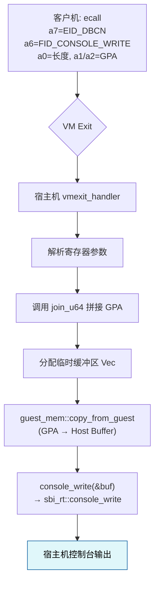

# sbi_console模块

<cite>
**本文档引用的文件**  
- [sbi_console.rs](file://src/sbi_console.rs)
- [vcpu.rs](file://src/vcpu.rs)
- [guest_mem.rs](file://src/guest_mem.rs)
</cite>

## 目录
1. [简介](#简介)
2. [核心功能与协议规范](#核心功能与协议规范)
3. [主机侧接口行为分析](#主机侧接口行为分析)
4. [vmexit_handler中EID_DBCN扩展处理逻辑](#vmexit_handler中eid_dbcn扩展处理逻辑)
5. [单字节输出效率与缓冲策略](#单字节输出效率与缓冲策略)
6. [错误码映射规则](#错误码映射规则)
7. [实际应用价值与对比分析](#实际应用价值与对比分析)
8. [数据流图：从客户机SBI调用到主机控制台输出](#数据流图从客户机sbi调用到主机控制台输出)

## 简介
`sbi_console`模块实现了RISC-V虚拟化环境中用于调试和日志输出的SBI（Supervisor Binary Interface）控制台扩展功能。该模块通过定义特定的扩展ID（EID）和功能ID（FID），支持客户机操作系统向宿主机发送调试信息或从宿主机读取输入，从而实现跨地址空间的I/O通信。

本模块在虚拟机监控器（Hypervisor）中扮演关键角色，特别是在系统启动、故障排查和运行时诊断等场景下具有重要价值。其设计兼顾了性能优化与安全性，利用底层内存拷贝机制确保数据在不同地址空间之间安全传输。

**Section sources**
- [sbi_console.rs](file://src/sbi_console.rs#L1-L61)
- [vcpu.rs](file://src/vcpu.rs#L177-L250)

## 核心功能与协议规范
该模块基于SBI标准定义了调试控制台扩展，使用唯一的扩展标识符 `EID_DBCN`（值为 `0x4442434e`，对应ASCII字符串"DBCN"）。在此扩展下，提供了多个功能ID（Function ID, FID）以支持不同的控制台操作：

- **FID_CONSOLE_WRITE** (`0`)：将指定长度的数据块写入宿主机控制台。
- **FID_CONSOLE_READ** (`1`)：从宿主机控制台读取数据并写入客户机内存。
- **FID_CONSOLE_WRITE_BYTE** (`2`)：高效地向控制台输出单个字节。

这些功能ID遵循SBI调用约定，由客户机通过ECALL指令触发，参数通过通用寄存器传递。其中：
- `a7` 寄存器传入扩展ID（`EID_DBCN`）
- `a6` 寄存器传入功能ID（如 `FID_CONSOLE_WRITE`）
- 其他寄存器根据具体功能传递参数（如数据长度、地址等）

此协议设计简洁且易于扩展，符合RISC-V SBI规范对可扩展性和兼容性的要求。

**Section sources**
- [sbi_console.rs](file://src/sbi_console.rs#L3-L9)
- [vcpu.rs](file://src/vcpu.rs#L200-L250)

## 主机侧接口行为分析
模块提供了一系列主机侧接口函数，用于响应来自客户机的SBI调用请求。主要接口包括：

- `console_write(buf: &[u8]) -> SbiRet`：将字节切片写入宿主机控制台。内部通过 `sbi_rt::console_write` 调用底层运行时服务，并将客户机虚拟地址转换为物理地址后传递。
- `console_read(buf: &mut [u8]) -> SbiRet`：从宿主机控制台读取数据填充至缓冲区。
- `print_str(s: &str)` 和 `println_str(s: &str)`：分别用于输出字符串及带换行的字符串，底层调用 `console_write` 实现。
- `print_byte(byte: u8)`：直接调用 `sbi_rt::console_write_byte` 输出单字节，专为高频小数据量输出优化。

所有接口均采用内联（`#[inline(always)]`）方式编译，减少函数调用开销，提升执行效率。

**Section sources**
- [sbi_console.rs](file://src/sbi_console.rs#L11-L45)

## vmexit_handler中EID_DBCN扩展处理逻辑
当客户机发起SBI调用时，会触发VM Exit，控制权交由宿主机的 `vmexit_handler` 处理。对于 `EID_DBCN` 扩展，其处理流程如下：

1. **解析参数**：从客户机寄存器中提取功能ID（`a6`）和参数数组（`a0-a5`）。
2. **分发处理**：
   - 若为 `FID_CONSOLE_WRITE`，则获取待写入字节数（`param[0]`）和客户机物理地址（由 `param[1]` 和 `param[2]` 拼接而成）。
   - 使用 `guest_mem::copy_from_guest` 将客户机内存中的数据复制到宿主机临时缓冲区。
   - 调用 `console_write(&buf)` 完成实际输出。
3. **内存拷贝机制**：依赖 `guest_mem` 模块提供的 `copy_from_guest` 和 `copy_to_guest` 函数，通过临时禁用VSATP页表映射的方式，将客户机物理地址直接映射为宿主机可访问的线性地址，完成跨地址空间的数据搬运。
4. **返回结果**：根据操作成败设置 `a0` 和 `a1` 寄存器，指示错误码和返回值，并推进客户机PC指针。

整个过程保证了客户机与宿主机之间的隔离性，同时实现了高效的I/O交互。

**Section sources**
- [vcpu.rs](file://src/vcpu.rs#L200-L250)
- [guest_mem.rs](file://src/guest_mem.rs#L30-L81)

## 单字节输出效率与缓冲策略
针对频繁的日志输出场景，模块特别优化了单字节输出路径：

- `print_byte(byte: u8)` 函数被标记为 `#[inline(always)]`，确保编译器将其完全内联，避免函数调用栈开销。
- 直接调用底层 `sbi_rt::console_write_byte` 接口，绕过缓冲区分配与管理，适用于逐字符打印（如内核日志、调试跟踪）。
- 对于大块数据传输（如 `console_write`），则采用动态分配的堆缓冲区（`Vec<u8>`），先完整拷贝客户机数据再批量输出，减少上下文切换次数，提高吞吐量。

这种双模式设计平衡了实时性与吞吐率：小数据量追求低延迟，大数据量追求高效率。

**Section sources**
- [sbi_console.rs](file://src/sbi_console.rs#L47-L55)
- [vcpu.rs](file://src/vcpu.rs#L220-L230)

## 错误码映射规则
模块定义了一套标准化的SBI返回码，用于向客户机反馈调用结果：

- `RET_SUCCESS` (`0`)：操作成功。
- `RET_ERR_FAILED` (`-1`)：操作失败，原因未知。
- `RET_ERR_NOT_SUPPORTED` (`-2`)：请求的功能不支持。

在 `vmexit_handler` 中，根据实际执行结果选择合适的返回码写入客户机 `a0` 寄存器（错误码），`a1` 寄存器可携带附加信息（如实际读写字节数）。例如：
- 数据拷贝不完整时返回 `RET_ERR_FAILED`
- 请求未知FID时返回 `RET_ERR_NOT_SUPPORTED`
- 成功写入N字节时返回 `RET_SUCCESS` 并将 `a1` 设为N

这一机制使客户机能够准确判断SBI调用状态并作出相应处理。

**Section sources**
- [sbi_console.rs](file://src/sbi_console.rs#L11-L16)
- [vcpu.rs](file://src/vcpu.rs#L210-L250)

## 实际应用价值与对比分析
### 应用价值
- **虚拟机调试**：允许客户机内核或固件输出调试信息，便于定位启动失败、驱动异常等问题。
- **日志收集**：作为轻量级日志通道，无需网络或文件系统即可将关键事件上报至宿主机。
- **交互式调试**：结合 `console_read` 支持用户输入，可用于实现简易shell或调试命令行。

### 与标准SBI控制台扩展对比
| 特性 | 本实现（EID_DBCN） | 标准SBI Console Extension |
|------|-------------------|----------------------------|
| 扩展ID | 自定义 `0x4442434e` | 标准 `0x434F4E53` (CONS) |
| 字节写入 | 支持 `FID_CONSOLE_WRITE_BYTE` | 通常仅支持批量写入 |
| 内存模型 | 基于客户机物理地址（GPA） | 可能基于虚拟地址 |
| 缓冲策略 | 动态堆缓冲 + 单字节直通 | 一般统一使用缓冲区 |
| 性能优化 | 高频单字节输出专门优化 | 通用设计，无特殊优化 |

本实现更侧重于虚拟化环境下的调试实用性与性能敏感场景，而标准扩展更注重通用性和兼容性。

**Section sources**
- [sbi_console.rs](file://src/sbi_console.rs#L1-L61)
- [vcpu.rs](file://src/vcpu.rs#L200-L250)

## 数据流图：从客户机SBI调用到主机控制台输出

**Diagram sources**
- [sbi_console.rs](file://src/sbi_console.rs#L11-L19)
- [vcpu.rs](file://src/vcpu.rs#L200-L230)
- [guest_mem.rs](file://src/guest_mem.rs#L30-L50)