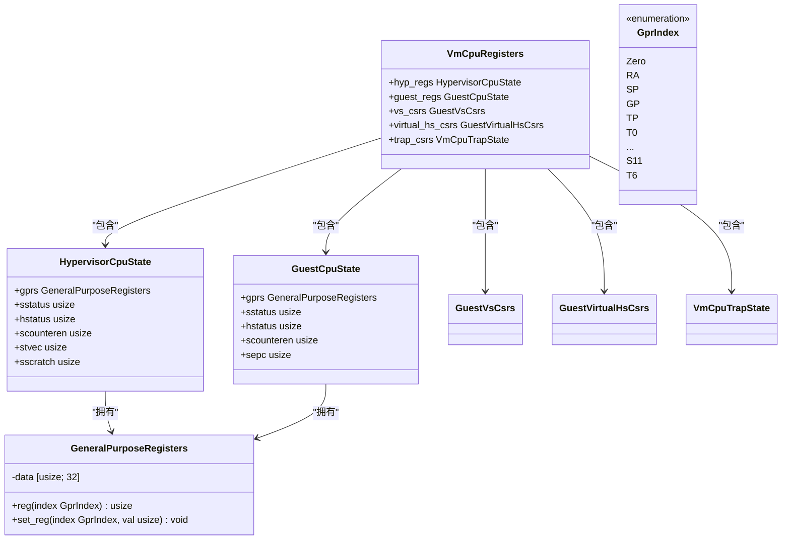
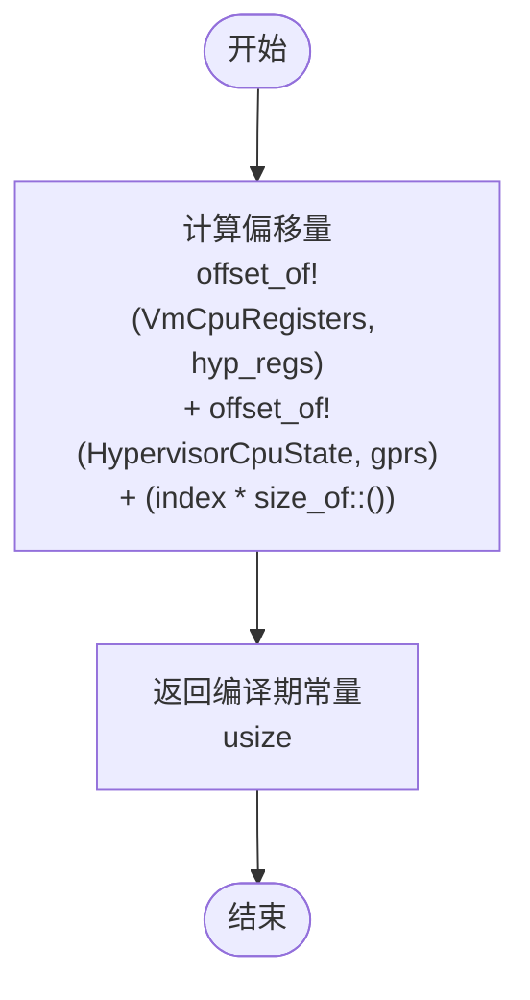
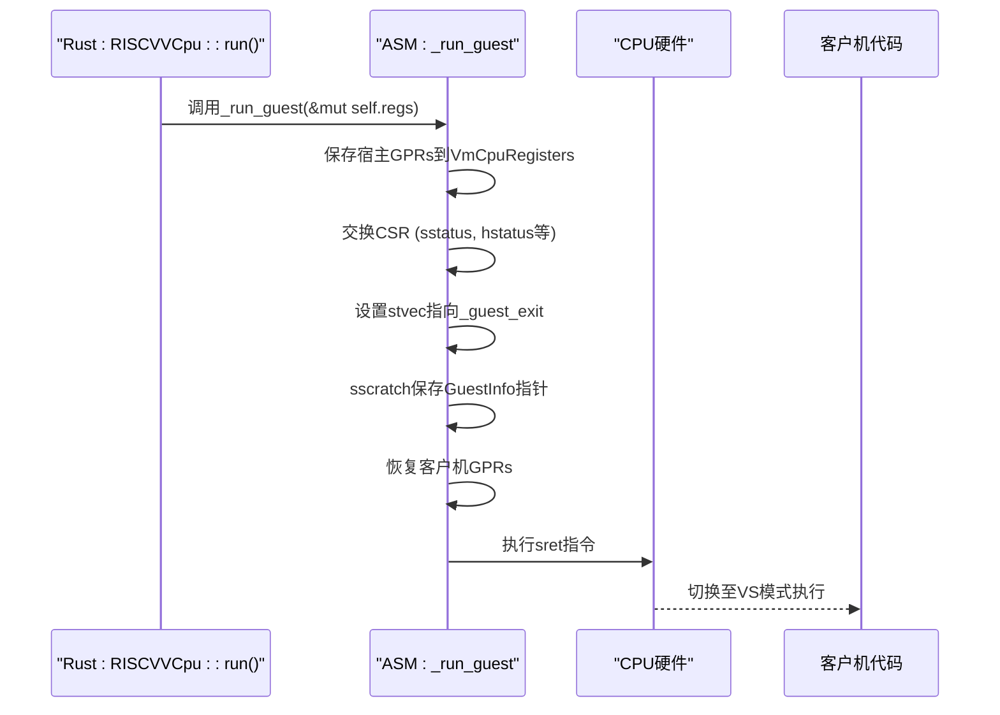
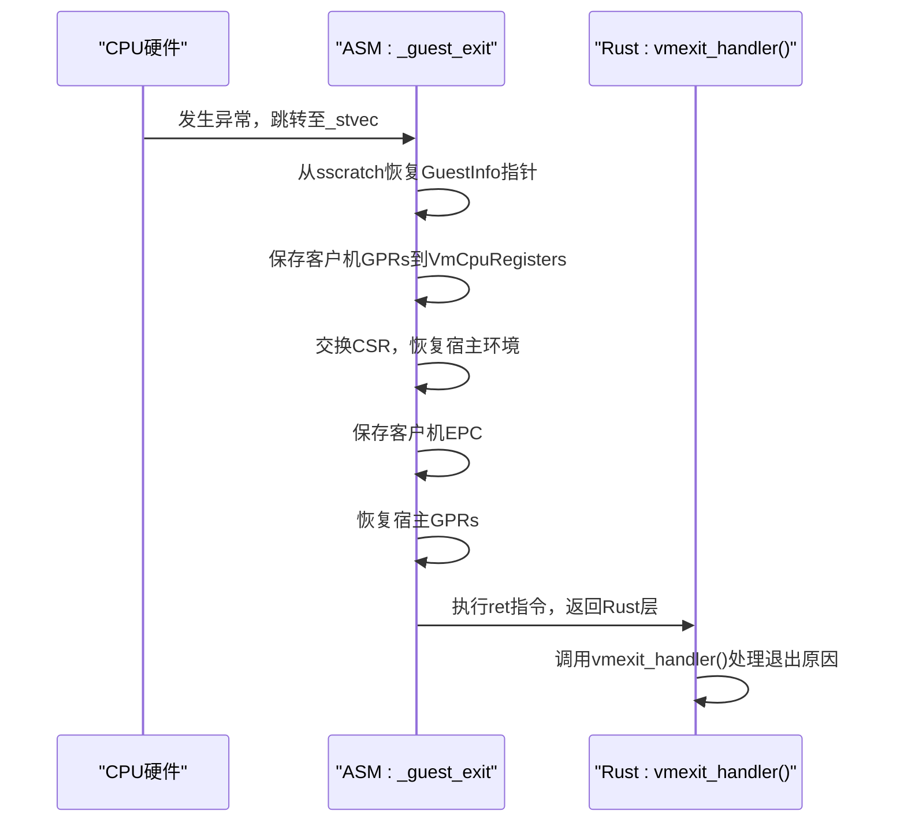
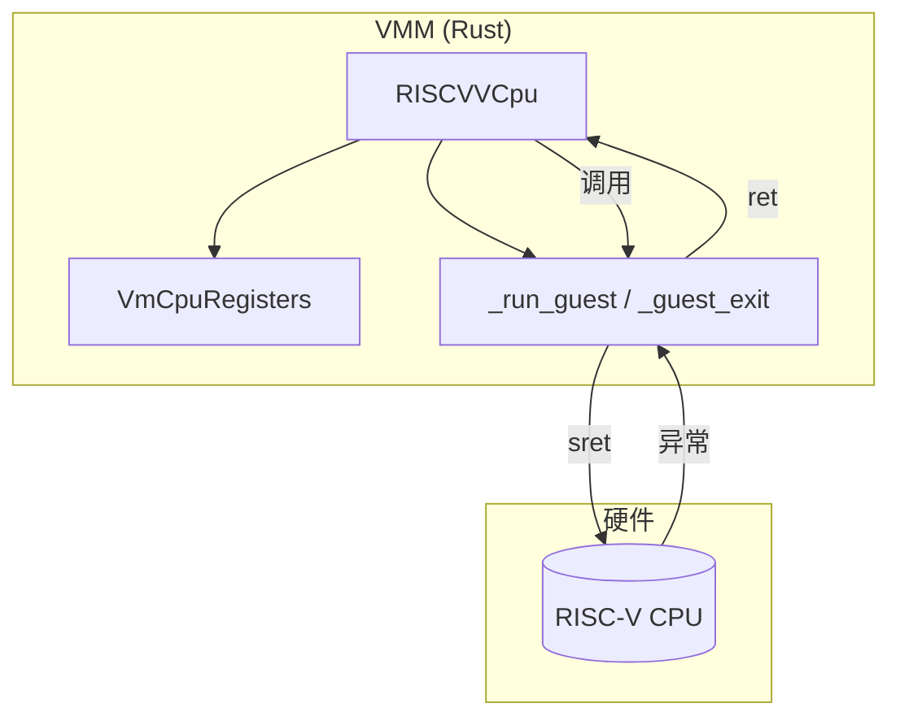
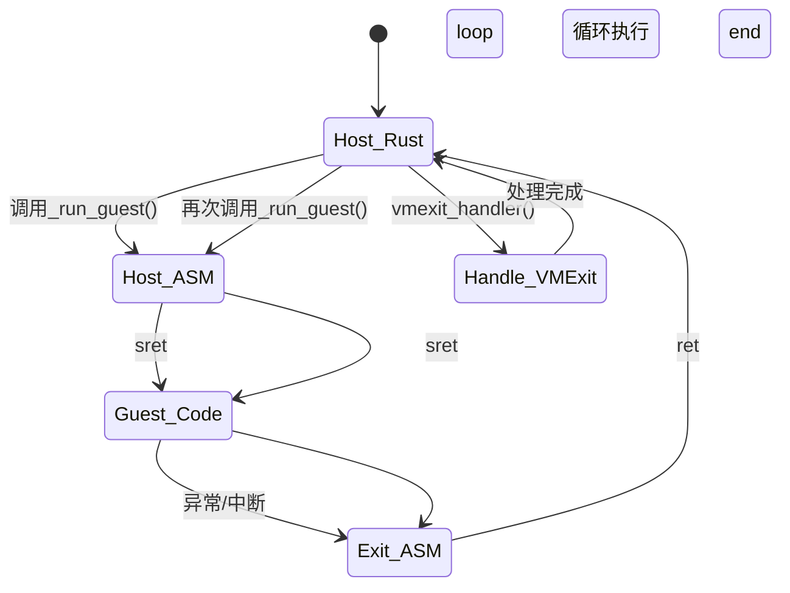

<cite>
**Referenced Files in This Document**
- [trap.rs](file://src/trap.rs)
- [vcpu.rs](file://src/vcpu.rs)
- [regs.rs](file://src/regs.rs)
- [trap.S](file://src/trap.S)
</cite>

## 目录
1. [引言](#引言)
2. [核心数据结构分析](#核心数据结构分析)
3. [编译期偏移量计算机制](#编译期偏移量计算机制)
4. [汇编层上下文切换实现](#汇编层上下文切换实现)
5. [Rust与汇编的交互衔接](#rust与汇编的交互衔接)
6. [模块间协作关系](#模块间协作关系)
7. [调用栈与性能分析](#调用栈与性能分析)

## 引言

本文档深入解析`trap.rs`模块中实现的底层异常处理基础设施。该模块通过精巧的设计，实现了RISC-V虚拟化环境中高效、安全的上下文保存与恢复机制。文档将详细阐述如何利用`memoffset::offset_of`宏在编译期精确计算`VmCpuRegisters`结构体内各字段的字节偏移量，并通过`core::arch::global_asm!`宏将这些偏移量作为常量符号注入汇编代码`trap.S`中。重点分析从`_sret`指令后跳转到Rust层`vmexit_handler`的完整衔接流程，以及`hyp_gpr_offset`和`guest_gpr_offset`等const函数如何确保编译期计算的正确性。

**Section sources**
- [trap.rs](file://src/trap.rs#L1-L102)
- [vcpu.rs](file://src/vcpu.rs#L1-L569)

## 核心数据结构分析

本模块的核心是`VmCpuRegisters`结构体，它统一管理了虚拟机CPU的所有寄存器状态，包括宿主（Hypervisor）和客户机（Guest）两套独立的寄存器环境。该结构体的设计体现了清晰的分层思想，将不同层级的CPU状态进行隔离存储。



**Diagram sources**
- [regs.rs](file://src/regs.rs#L100-L252)

**Section sources**
- [regs.rs](file://src/regs.rs#L100-L252)

## 编译期偏移量计算机制

为了在汇编代码中直接访问`VmCpuRegisters`结构体内的特定字段，系统采用了一种高效的编译期计算方案。`hyp_gpr_offset`和`guest_gpr_offset`两个const函数利用`memoffset::offset_of`宏，在编译时精确计算出每个通用寄存器（GPR）相对于`VmCpuRegisters`起始地址的字节偏移量。



这种设计的关键优势在于：
1. **零运行时开销**：所有偏移量计算都在编译期完成，生成的汇编代码直接使用立即数。
2. **类型安全**：依赖Rust编译器保证结构体布局的正确性，避免了手动维护偏移量的错误风险。
3. **可维护性强**：当`VmCpuRegisters`或其子结构体的定义发生变化时，偏移量会自动重新计算，无需修改汇编代码。

此外，`hyp_csr_offset!`和`guest_csr_offset!`宏进一步抽象了控制状态寄存器（CSR）的偏移量计算，提供了更简洁的接口，增强了代码的可读性和复用性。

**Section sources**
- [trap.rs](file://src/trap.rs#L8-L45)

## 汇编层上下文切换实现

`trap.S`汇编文件是整个上下文切换机制的核心执行者。它通过`core::arch::global_asm!`宏被内联到Rust代码中，并接收由`hyp_gpr_offset`和`guest_gpr_offset`等函数计算出的偏移量作为常量参数。

### 进入客户机 (_run_guest)



`_run_guest`函数首先保存当前宿主环境的通用寄存器和关键CSR，然后加载客户机的`sstatus`、`hstatus`和`sepc`等寄存器。特别地，它将`stvec`设置为`_guest_exit`标签的地址，这意味着当下次发生异常或中断时，CPU将跳转到`_guest_exit`处执行，从而触发VM退出流程。

### 退出客户机 (_guest_exit)

当客户机因异常或中断而退出时，CPU根据`stvec`的设置跳转到`_guest_exit`标签处。此段代码负责保存客户机的当前状态，并恢复宿主环境。



**Diagram sources**
- [trap.S](file://src/trap.S#L1-L182)

**Section sources**
- [trap.S](file://src/trap.S#L1-L182)

## Rust与汇编的交互衔接

Rust与汇编代码之间的衔接是通过一个精心设计的调用栈来实现的。`RISCVVCpu::run()`方法在禁用中断后，通过`unsafe`块调用`_run_guest`汇编函数。`_run_guest`执行完上下文切换并最终通过`sret`进入客户机后，其“返回”地址实际上是`_guest_exit`。

当客户机退出时，控制流经过`_guest_exit`的处理，最终通过`ret`指令返回到`RISCVVCpu::run()`中`_run_guest`调用点之后的代码。此时，Rust代码立即调用`vmexit_handler()`方法，进入Rust层面的异常处理逻辑。

```mermaid
flowchart LR
A[RISCVVCpu::run()] --> B[_run_guest(asm)]
B --> C[客户机代码]
C --> D[_guest_exit(asm)]
D --> E[RISCVVCpu::run()]
E --> F[vmexit_handler(Rust)]
```

这种设计确保了：
- **安全边界**：`_run_guest`和`_guest_exit`是唯一的汇编/Rust边界，限制了不安全代码的范围。
- **原子性**：从进入客户机到处理退出的整个过程在逻辑上是连续的，中间不会被其他Rust代码打断。
- **清晰的职责划分**：汇编层负责低延迟的上下文切换，Rust层负责复杂的逻辑判断和业务处理。

**Section sources**
- [vcpu.rs](file://src/vcpu.rs#L100-L150)
- [trap.S](file://src/trap.S#L1-L182)

## 模块间协作关系

`trap`模块与`vcpu`模块紧密协作，共同构成了虚拟CPU的执行引擎。`vcpu`模块中的`RISCVVCpu`结构体持有`VmCpuRegisters`实例，并通过`run()`方法启动虚拟机。`trap`模块提供的汇编例程则负责实际的硬件级切换。



`vmexit_handler()`方法位于`vcpu.rs`中，它分析`scause`等寄存器以确定退出原因（如系统调用、定时器中断、外部中断或页错误），并据此做出相应处理。这种分层设计使得`trap`模块可以保持极简和高效，而复杂的业务逻辑则交由`vcpu`模块处理。

**Section sources**
- [vcpu.rs](file://src/vcpu.rs#L150-L500)
- [trap.rs](file://src/trap.rs#L1-L102)

## 调用栈与性能分析

完整的调用栈和状态转换如下所示：



这种分层设计对性能至关重要：
1. **最小化汇编代码**：只有最核心、对性能要求最高的上下文切换逻辑在汇编中实现，减少了易错且难以维护的代码量。
2. **最大化Rust优势**：利用Rust的内存安全、类型安全和丰富的库生态来处理复杂的逻辑，提高了开发效率和系统可靠性。
3. **低延迟切换**：`_run_guest`和`_guest_exit`的汇编代码经过高度优化，确保了上下文切换的延迟尽可能低。
4. **编译期优化**：所有偏移量在编译期确定，消除了运行时查找的开销。

综上所述，`trap`模块通过Rust的编译期元编程能力与汇编语言的底层控制能力相结合，构建了一个高效、安全且易于维护的虚拟化异常处理基础设施。