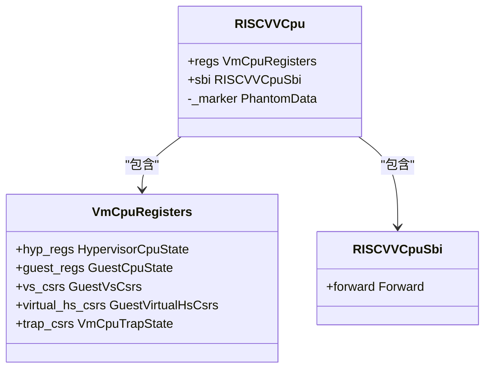
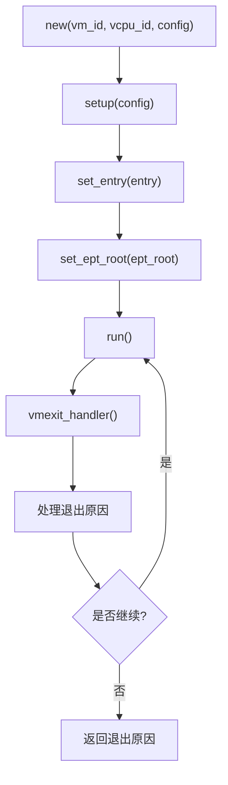
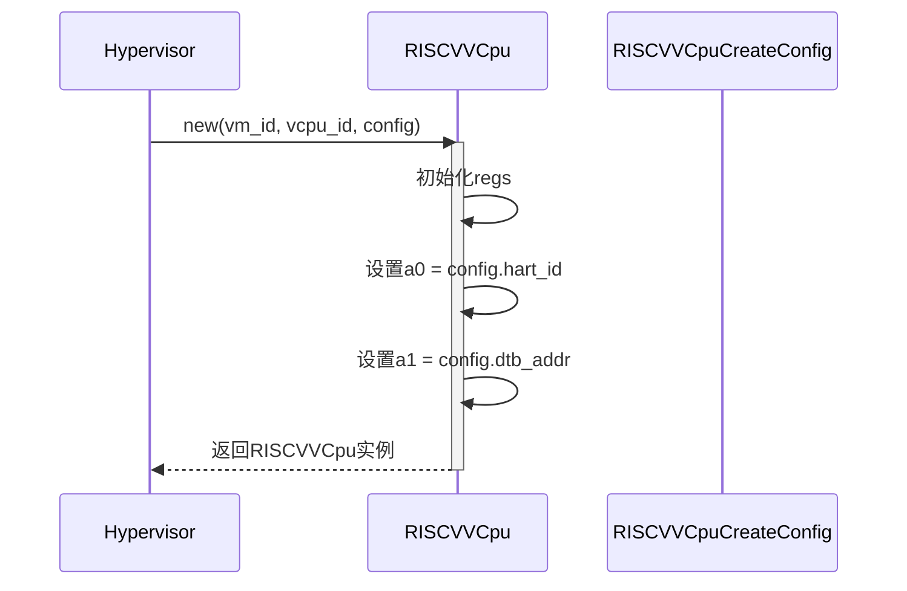
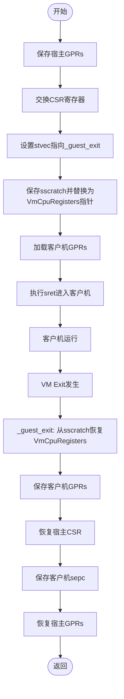
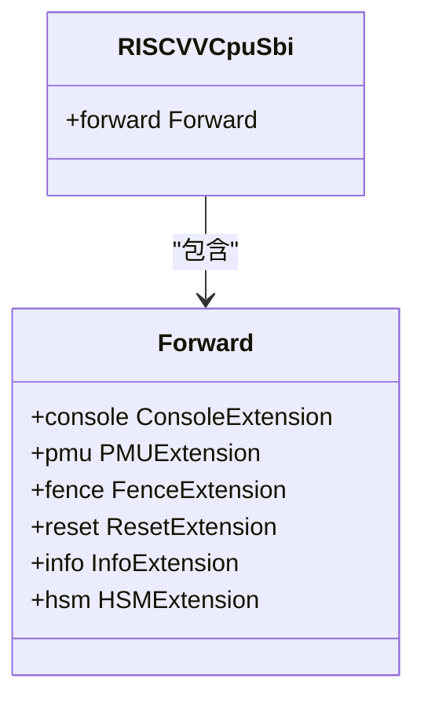
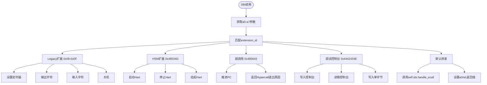
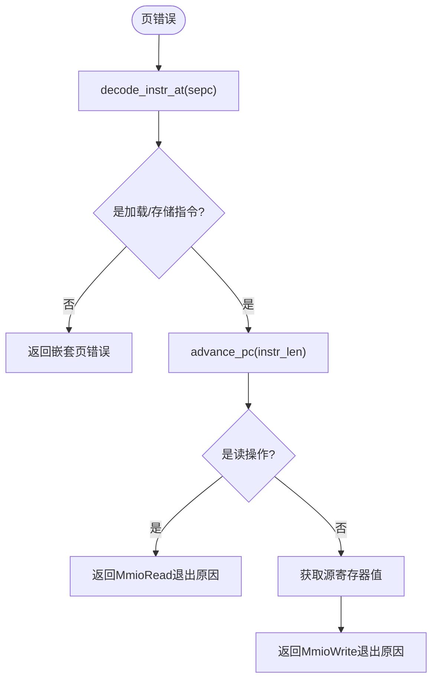
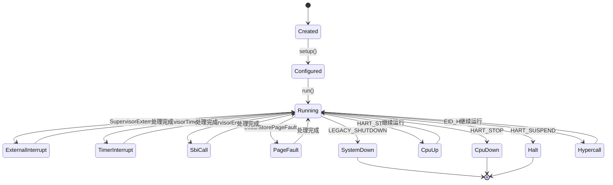

<cite>
**本文档中引用的文件**
- [vcpu.rs](file://src/vcpu.rs)
- [regs.rs](file://src/regs.rs)
- [sbi_console.rs](file://src/sbi_console.rs)
- [trap.S](file://src/trap.S)
- [lib.rs](file://src/lib.rs)
</cite>

## 目录
1. [引言](#引言)
2. [核心组件分析](#核心组件分析)
3. [虚拟CPU生命周期管理](#虚拟cpu生命周期管理)
4. [运行与退出处理机制](#运行与退出处理机制)
5. [寄存器操作实现细节](#寄存器操作实现细节)
6. [SBI调用处理逻辑](#sbi调用处理逻辑)
7. [页错误处理流程](#页错误处理流程)
8. [状态转换图](#状态转换图)
9. [典型使用场景](#典型使用场景)

## 引言

`vcpu`模块是riscv_vcpu库的核心组件，负责提供RISC-V架构下虚拟CPU（vCPU）的完整生命周期管理功能。该模块通过实现`AxArchVCpu` trait，为虚拟机监控器（Hypervisor）提供了创建、配置、运行和退出处理等关键能力。本文档将深入解析`RISCVVCpu`结构体的实现机制，重点分析其如何通过底层汇编代码与硬件交互，并处理各类虚拟机退出（VM Exit）事件。

**Section sources**
- [vcpu.rs](file://src/vcpu.rs#L1-L50)
- [lib.rs](file://src/lib.rs#L1-L10)

## 核心组件分析

### RISCVVCpu结构体

`RISCVVCpu`是RISC-V虚拟CPU的主要数据结构，封装了虚拟CPU的所有状态信息。该结构体包含三个核心字段：`regs`用于存储虚拟CPU的寄存器状态，`sbi`用于处理标准SBI扩展调用，以及一个标记类型的`_marker`以满足泛型约束。



**Diagram sources**
- [vcpu.rs](file://src/vcpu.rs#L30-L45)
- [regs.rs](file://src/regs.rs#L150-L250)

### AxArchVCpu Trait实现

`RISCVVCpu`通过实现`AxArchVCpu` trait来提供虚拟CPU的标准接口。该trait定义了虚拟CPU的创建、配置、运行等生命周期方法，使得上层Hypervisor可以以统一的方式管理不同架构的虚拟CPU。



**Diagram sources**
- [vcpu.rs](file://src/vcpu.rs#L50-L100)

**Section sources**
- [vcpu.rs](file://src/vcpu.rs#L50-L150)

## 虚拟CPU生命周期管理

### 创建与初始化

`RISCVVCpu`的创建过程由`new`方法完成，接收虚拟机ID、vCPU ID和创建配置作为参数。在初始化过程中，会根据提供的配置设置a0（hartid）和a1（设备树blob地址）寄存器的初始值。



**Diagram sources**
- [vcpu.rs](file://src/vcpu.rs#L65-L85)

### 配置阶段

`setup`方法负责配置虚拟CPU的特权级状态寄存器。它会设置`sstatus`寄存器的SPP位为Supervisor模式，并配置`hstatus`寄存器以启用HS模式对VS模式内存的访问权限。

**Section sources**
- [vcpu.rs](file://src/vcpu.rs#L90-L105)

### 入口点与页表根设置

`set_entry`方法用于设置虚拟CPU的启动入口地址，即sepc寄存器的值。`set_ept_root`方法则负责设置嵌套页表的根地址，通过hgatp寄存器进行配置，其中高4位为VMID，低44位为页表物理地址右移12位的结果。

**Section sources**
- [vcpu.rs](file://src/vcpu.rs#L110-L125)

## 运行与退出处理机制

### _run_guest汇编函数分析

`_run_guest`是一个用汇编语言实现的关键函数，负责在硬件层面切换到虚拟CPU的执行环境。该函数通过保存宿主（Hypervisor）状态、加载客户机（Guest）状态、执行`sret`指令进入客户机模式，并在客户机退出后恢复宿主状态。



**Diagram sources**
- [trap.S](file://src/trap.S#L1-L180)

**Section sources**
- [vcpu.rs](file://src/vcpu.rs#L130-L150)
- [trap.S](file://src/trap.S#L1-L180)

### vmexit_handler异常分发逻辑

当虚拟机退出时，控制权会返回到`run`方法，随后调用`vmexit_handler`进行异常分发。该方法首先从硬件读取陷阱相关的CSR寄存器，然后根据`scause`寄存器的内容判断退出原因，并进行相应的处理。

**Section sources**
- [vcpu.rs](file://src/vcpu.rs#L180-L200)

## 寄存器操作实现细节

### set_gpr方法

`set_gpr`方法允许外部设置虚拟CPU的通用寄存器。该方法仅支持索引0-7的寄存器（对应a0-a7），并将其映射到`GprIndex`枚举中的相应值。

```mermaid
flowchart LR
A[set_gpr(index, val)] --> B{index < 8?}
B --> |是| C["计算GprIndex::A0 + index"]
C --> D["调用set_gpr_from_gpr_index"]
B --> |否| E["打印警告日志"]
```

**Diagram sources**
- [vcpu.rs](file://src/vcpu.rs#L160-L175)

### advance_pc方法

`advance_pc`方法用于手动推进客户机程序计数器（sepc）。这在处理某些SBI调用或模拟指令时非常有用，可以避免客户机重新执行已处理的ecall指令。

**Section sources**
- [vcpu.rs](file://src/vcpu.rs#L178-L185)

### VmCpuRegisters数据结构

`VmCpuRegisters`结构体是虚拟CPU状态的核心容器，包含了五个主要部分：
- `hyp_regs`: 宿主CPU状态
- `guest_regs`: 客户机CPU状态
- `vs_csrs`: VS级CSR
- `virtual_hs_csrs`: 虚拟化HS级CSR
- `trap_csrs`: 陷阱相关CSR

这些状态在进入和退出虚拟机时被自动保存和恢复。

**Section sources**
- [regs.rs](file://src/regs.rs#L150-L250)

## SBI调用处理逻辑

### RISCVVCpuSbi集成

`RISCVVCpuSbi`结构体通过`#[rustsbi]`宏集成了rustsbi框架，能够转发多种标准SBI扩展调用，包括控制台、性能监控、内存屏障、系统重置等。



**Diagram sources**
- [vcpu.rs](file://src/vcpu.rs#L40-L50)

### SBI调用分发流程

`vmexit_handler`中的SBI调用处理逻辑采用多层匹配策略：



**Diagram sources**
- [vcpu.rs](file://src/vcpu.rs#L200-L350)

**Section sources**
- [vcpu.rs](file://src/vcpu.rs#L200-L350)
- [sbi_console.rs](file://src/sbi_console.rs#L1-L30)

## 页错误处理流程

当发生页面错误时，`vmexit_handler`会调用`handle_guest_page_fault`方法进行处理。该方法首先解码导致页错误的指令，然后根据指令类型判断是MMIO读还是写操作。



**Diagram sources**
- [vcpu.rs](file://src/vcpu.rs#L350-L450)

**Section sources**
- [vcpu.rs](file://src/vcpu.rs#L350-L450)

## 状态转换图



**Diagram sources**
- [vcpu.rs](file://src/vcpu.rs#L180-L450)

## 典型使用场景

### 启动客户机操作系统

```mermaid
sequenceDiagram
participant Host as 主机
participant Hypervisor as Hypervisor
participant VCpu as RISCVVCpu
Host->>Hypervisor : 创建虚拟机
Hypervisor->>VCpu : new(vm_id, vcpu_id, config)
Hypervisor->>VCpu : setup(())
Hypervisor->>VCpu : set_entry(kernel_entry)
Hypervisor->>VCpu : set_ept_root(root_page_table)
loop 运行循环
Hypervisor->>VCpu : run()
alt 正常运行
VCpu-->>Hypervisor : AxVCpuExitReason : : Nothing
else SBI调用
VCpu-->>Hypervisor : AxVCpuExitReason : : Hypercall
Hypervisor->>VCpu : 处理超调用
else 页错误
VCpu-->>Hypervisor : AxVCpuExitReason : : MmioRead/Write
Hypervisor->>VCpu : 模拟MMIO
else 系统关闭
VCpu-->>Hypervisor : AxVCpuExitReason : : SystemDown
break 循环结束
end
end
```

**Diagram sources**
- [vcpu.rs](file://src/vcpu.rs#L130-L200)