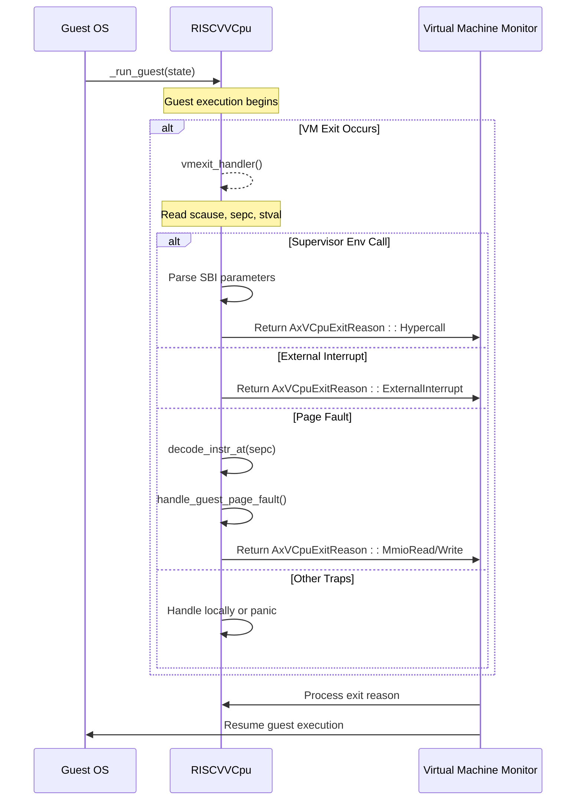
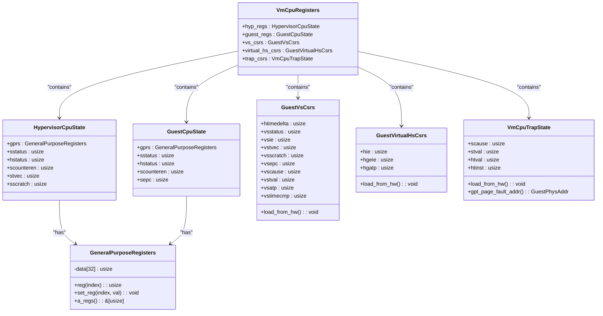
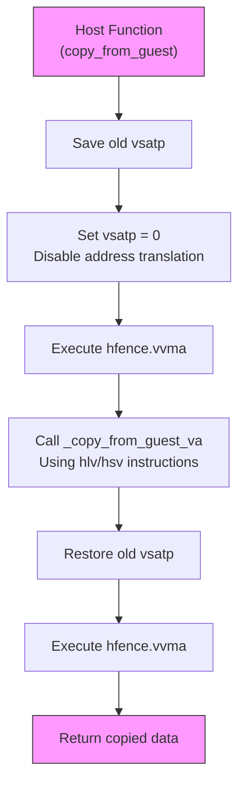
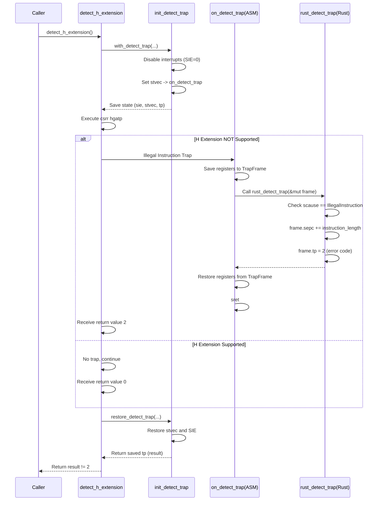

# 模块详解

<cite>
**Referenced Files in This Document**   
- [vcpu.rs](file://src/vcpu.rs)
- [regs.rs](file://src/regs.rs)
- [guest_mem.rs](file://src/guest_mem.rs)
- [trap.rs](file://src/trap.rs)
- [detect.rs](file://src/detect.rs)
- [percpu.rs](file://src/percpu.rs)
- [sbi_console.rs](file://src/sbi_console.rs)
- [consts.rs](file://src/consts.rs)
- [lib.rs](file://src/lib.rs)
</cite>

## Table of Contents
1. [vcpu模块解析](#vcpu模块解析)
2. [regs模块解析](#regs模块解析)
3. [guest_mem模块解析](#guest_mem模块解析)
4. [trap模块解析](#trap模块解析)
5. [detect模块解析](#detect模块解析)
6. [percpu模块解析](#percpu模块解析)
7. [sbi_console模块解析](#sbi_console模块解析)
8. [consts模块解析](#consts模块解析)

## vcpu模块解析

`vcpu.rs` 是 RISC-V 虚拟 CPU 的核心实现模块，定义了 `RISCVVCpu` 结构体，该结构体实现了 `axvcpu::AxArchVCpu` trait，负责协调虚拟机的运行、退出处理和系统调用（SBI）转发。

当虚拟机因异常或中断而退出时，控制权会转移到 `RISCVVCpu` 实例。其 `run` 方法在执行 `_run_guest` 汇编函数后返回，并立即调用私有的 `vmexit_handler` 方法来处理 VM 退出事件。该方法是整个虚拟化逻辑的核心，它根据 `scause` 寄存器的值来判断退出原因，并进行相应的处理。

对于不同类型的退出，处理器如下：
- **环境调用 (SupervisorEnvCall)**：这是最常见的 SBI 系统调用。处理器会读取 a0-a7 寄存器中的参数，根据扩展 ID (`a7`) 和功能 ID (`a6`) 分发到不同的处理逻辑。这包括对遗留 SBI 扩展（如定时器设置、控制台 I/O）、HSM（硬件状态管理）扩展（如启动/停止虚拟 CPU）以及自定义超调用（EID_HVC）的支持。
- **外部中断 (SupervisorExternal)**：直接将中断向量号（9）上报给上层 VMM，由其进行进一步分发。
- **页面错误 (Load/StorePageFault)**：通过 `handle_guest_page_fault` 方法处理。该方法首先使用 `decode_instr_at` 解码导致故障的指令，然后根据指令类型（加载或存储）生成 `AxVCpuExitReason::MmioRead` 或 `AxVCpuExitReason::MmioWrite` 退出原因，将 MMIO 访问请求传递给 VMM 进行模拟。



**Diagram sources**
- [vcpu.rs](file://src/vcpu.rs#L1-L570)

**Section sources**
- [vcpu.rs](file://src/vcpu.rs#L1-L570)

## regs模块解析

`regs.rs` 模块定义了用于保存和恢复虚拟 CPU 状态的关键数据结构，这些结构体的设计直接影响上下文切换的效率和正确性。

核心结构体 `VmCpuRegisters` 是一个聚合体，包含了所有需要在 VM 进入/退出时保存和恢复的寄存器状态。它被设计为 C 兼容的（`#[repr(C)]`），以确保与汇编代码交互时的内存布局一致性。

该模块的主要组件包括：
- **GeneralPurposeRegisters**: 封装了 32 个通用寄存器（GPRs）。它提供了安全的访问接口 `reg()` 和 `set_reg()`，其中 `set_reg` 特别处理了 x0 寄存器（硬连线为零），任何写入操作都会被忽略，符合 RISC-V 架构规范。
- **GuestCpuState 和 HypervisorCpuState**: 分别代表客户机和宿主机（hypervisor）的 CPU 状态，包含各自的 GPRs 和关键 CSR（如 `sstatus`, `sepc`, `hstatus`）。这种分离使得在虚拟化边界切换时可以清晰地管理两套独立的状态。
- **GuestVsCsrs 和 GuestVirtualHsCsrs**: 用于保存和恢复 VS 模式和虚拟 HS 模式的 CSR。值得注意的是，`load_from_hw` 方法显式地从硬件 CSR 中读取当前值并填充到结构体中，这是上下文切换前的关键步骤。
- **VmCpuTrapState**: 专门用于保存导致 VM 退出的陷阱相关 CSR（`scause`, `stval`, `htval`, `htinst`）。`gpt_page_fault_addr` 方法利用 `htval` 和 `stval` 的组合计算出发生页错误的真实客户机物理地址（GPA），这对于处理嵌套页表（NPT）至关重要。



**Diagram sources**
- [regs.rs](file://src/regs.rs#L1-L253)

**Section sources**
- [regs.rs](file://src/regs.rs#L1-L253)

## guest_mem模块解析

`guest_mem.rs` 模块提供了安全访问客户机内存的接口，是实现设备模拟和内存管理的基础。其实现巧妙地结合了 Rust 安全抽象和底层汇编代码。

该模块的核心是四个内联函数：`copy_from_guest`, `copy_to_guest`, `copy_from_guest_va`, `copy_to_guest_va`。它们都依赖于用 `global_asm!` 嵌入的汇编文件 `mem_extable.S` 中定义的 `_copy_from_guest`, `_copy_to_guest` 和 `_fetch_guest_instruction` 函数。

为了实现对客户机物理地址（GPA）的访问，模块采用了临时禁用地址转换的策略。`copy_from_guest` 和 `copy_to_guest` 函数首先读取并保存当前的 `vsatp` 寄存器值，然后将其设置为 0 来关闭 VS 模式的地址翻译。此时，客户机虚拟地址（GVA）等同于 GPA。接着，它们调用 `copy_from_guest_va` / `copy_to_guest_va`，后者直接使用 `hlv` / `hsv` 指令（半虚拟化加载/存储）在宿主机模式下访问客户机的虚拟地址空间。操作完成后，原始的 `vsatp` 值会被恢复，并执行 `hfence.vvma` 刷新 TLB，确保内存视图的一致性。

`fetch_guest_instruction` 函数则用于在处理页错误时获取导致故障的原始指令，这对于解码和模拟 MMIO 操作至关重要。



**Diagram sources**
- [guest_mem.rs](file://src/guest_mem.rs#L1-L82)

**Section sources**
- [guest_mem.rs](file://src/guest_mem.rs#L1-L82)

## trap模块解析

`trap.rs` 模块是连接 Rust 高级代码与底层汇编代码的桥梁，其主要职责是计算 `VmCpuRegisters` 结构体内各个字段在内存中的偏移量，并将这些偏移量作为常量传递给汇编代码 `trap.S`。

该模块大量使用了 `memoffset` crate 提供的 `offset_of!` 宏。例如，`hyp_gpr_offset(GprIndex::RA)` 会计算出 `VmCpuRegisters.hyp_regs.gprs[0]` 相对于 `VmCpuRegisters` 起始地址的字节偏移量。类似的宏 `hyp_csr_offset!` 和 `guest_csr_offset!` 用于计算 CSR 字段的偏移量。

这些计算出的偏移量通过 `core::arch::global_asm!` 传递给 `trap.S` 文件。在汇编层面，当发生 VM 退出时，`_run_guest` 函数会使用这些预计算的偏移量，直接通过 `sd` (store doubleword) 和 `ld` (load doubleword) 指令将硬件上的实际寄存器值保存到 `VmCpuRegisters` 结构体的对应位置，或者在 VM 进入时将结构体中的值恢复到硬件寄存器。这种方式避免了在汇编代码中手动维护复杂的结构体布局，极大地提高了代码的可维护性和正确性。

```mermaid
graph LR
subgraph Rust Code
A[offset_of!(VmCpuRegisters, hyp_regs)]
B[offset_of!(HypervisorCpuState, gprs)]
C[size_of::<u64>()]
D[hyp_gpr_offset(GprIndex::RA)]
E["const hyp_ra = ..."]
F[trap.S]
A --> D
B --> D
C --> D
D --> E
E --> F
end
subgraph Assembly Code
F --> G["_run_guest(state)"]
G --> H["sd ra, hyp_ra(state)"]
H --> I["... save other registers ..."]
end
style F fill:#ccf,stroke:#333
style G fill:#ffcc00,stroke:#333
```

**Diagram sources**
- [trap.rs](file://src/trap.rs#L1-L103)

**Section sources**
- [trap.rs](file://src/trap.rs#L1-L103)

## detect模块解析

`detect.rs` 模块实现了硬件虚拟化扩展（H 扩展）的检测逻辑，其核心思想是“捕获并返回”（trap-and-return）。

`detect_h_extension` 函数是入口点。它通过调用 `with_detect_trap` 辅助函数来创建一个受控的异常环境。`with_detect_trap` 的工作流程如下：
1.  **初始化检测环境**：`init_detect_trap` 函数会暂时禁用所有 S 级别的中断（通过清除 `sstatus.SIE`），并将 `stvec` 寄存器指向一个专用的汇编陷阱处理程序 `on_detect_trap`。这确保了接下来发生的任何异常都能被捕获，而不会被正常的中断处理流程干扰。
2.  **执行探测指令**：在 `with_detect_trap` 的闭包中，尝试执行一条读取 `hgatp` CSR 的指令（`csrr`）。如果目标平台不支持 H 扩展，这条指令会触发一个“非法指令”（Illegal Instruction）异常。
3.  **处理异常**：控制权转移到 `on_detect_trap` 汇编代码。这段代码会保存当前的寄存器状态到一个 `TrapFrame` 结构体中，然后调用 Rust 函数 `rust_detect_trap`。
4.  **分析结果**：`rust_detect_trap` 函数检查 `scause` 寄存器。如果是“非法指令”异常，则说明 H 扩展不存在，函数会修改 `TrapFrame.sepc` 使其跳过这条非法指令，然后返回一个特定的错误码（2）。如果是其他异常，则可能是硬件问题。
5.  **恢复并返回**：`on_detect_trap` 汇编代码将修改后的 `TrapFrame` 状态恢复到硬件寄存器，并执行 `sret` 返回到 `with_detect_trap`。`restore_detect_trap` 函数随后恢复之前保存的 `stvec` 和中断使能状态，并返回 `rust_detect_trap` 设置的结果。

最终，`detect_h_extension` 根据返回值是否为 2 来判断 H 扩展是否存在。



**Diagram sources**
- [detect.rs](file://src/detect.rs#L1-L238)

**Section sources**
- [detect.rs](file://src/detect.rs#L1-L238)

## percpu模块解析

`percpu.rs` 模块负责管理每个 CPU 核心的特定状态，实现了 `AxArchPerCpu` trait。`RISCVPerCpu` 结构体本身非常轻量，主要是一个占位符，真正的初始化工作在 `new` 方法中通过调用 `setup_csrs` 完成。

`setup_csrs` 函数是此模块的核心，它在每个 CPU 启动时配置一系列关键的控制和状态寄存器（CSRs），为虚拟化环境奠定基础：
- **异常委托 (hedeleg)**：通过设置 `hedeleg` 寄存器，将一部分同步异常（如断点、环境调用、各类页错误）从 HS 模式委托给 VS 模式处理。这意味着当客户机操作系统触发这些异常时，硬件会直接跳转到客户机的异常处理程序，而不是先陷入到我们的 hypervisor。
- **中断委托 (hideleg)**：通过设置 `hideleg` 寄存器，将所有虚拟化的中断（虚拟 S 定时器、虚拟 S 外部中断、虚拟 S 软件中断）委托给 VS 模式。这允许客户机操作系统直接管理和响应这些虚拟中断。
- **中断屏蔽与使能**：函数会清除所有待处理的虚拟中断标志（`hvip`），并启用 S 级别的外部、软件和定时器中断（`sie`），确保 hypervisor 自身能够接收必要的中断。

这种委托机制是高效虚拟化的核心，它减少了不必要的 VM 退出次数，让客户机操作系统能够像在真实硬件上一样运行，从而显著提升了性能。

```mermaid
flowchart TD
Start([percpu::new]) --> Setup[setup_csrs()]
Setup --> DelegateEx["Delegate Exceptions\n(hedeleg)"]
Setup --> DelegateInt["Delegate Interrupts\n(hideleg)"]
Setup --> ClearVIP["Clear hvip flags"]
Setup --> EnableSIE["Enable sie"]
DelegateEx --> |Delegates| ExList["- Inst Addr Misalign\n- Breakpoint\n- Env Call (U/VU)\n- Page Faults\n- Illegal Inst"]
DelegateInt --> |Delegates| IntList["- Virtual S Timer\n- Virtual S External\n- Virtual S Soft"]
style Setup fill:#f96,stroke:#333
```

**Diagram sources**
- [percpu.rs](file://src/percpu.rs#L1-L84)

**Section sources**
- [percpu.rs](file://src/percpu.rs#L1-L84)

## sbi_console模块解析

`sbi_console.rs` 模块为 SBI 控制台功能提供了高层封装，定义了用于调试和 I/O 的常量和函数。

该模块定义了以下关键元素：
- **扩展和功能 ID**：`EID_DBCN` (0x4442434e) 是调试控制台扩展的 ID，`FID_CONSOLE_WRITE`、`FID_CONSOLE_READ` 和 `FID_CONSOLE_WRITE_BYTE` 分别对应写、读和单字节写的功能 ID。
- **返回值常量**：`RET_SUCCESS`、`RET_ERR_FAILED` 和 `RET_ERR_NOT_SUPPORTED` 定义了 SBI 调用的标准返回码。
- **I/O 函数**：`console_write` 和 `console_read` 函数将缓冲区操作包装成 `Physical` 结构体，并调用底层的 `sbi_rt` 运行时库函数。`print_byte` 函数则直接调用 `sbi_rt::console_write_byte` 来输出单个字符。
- **辅助函数**：`join_u64` 函数用于将两个 32 位的 `usize` 值（通常来自 SBI 调用的 a0 和 a1 寄存器）合并成一个 64 位的客户机物理地址（GPA），这在处理大地址时非常有用。

这些函数在 `vcpu.rs` 的 `vmexit_handler` 中被直接调用，以处理来自客户机的 SBI 控制台请求，实现了基本的串行通信能力。

**Section sources**
- [sbi_console.rs](file://src/sbi_console.rs#L1-L62)

## consts模块解析

`consts.rs` 模块集中定义了项目中使用的各种常量，特别是与陷阱（traps）相关的位掩码，为代码的可读性和维护性提供了便利。

该模块通过嵌套的模块组织常量：
- **interrupt**: 定义了中断类型的位掩码。例如，`SUPERVISOR_EXTERNAL` (1 << 9) 对应 `scause` 寄存器中表示外部中断的位。
- **exception**: 定义了异常类型的位掩码。例如，`ENV_CALL_FROM_U_OR_VU` (1 << 8) 表示用户态或虚拟用户态发起的环境调用，`LOAD_PAGE_FAULT` (1 << 13) 表示加载操作的页错误。
- **irq**: 定义了与 IRQ 处理相关的常量，其中 `INTC_IRQ_BASE` 是一个关键常量，它等于 `(1 << 31)`，即 `scause` 寄存器的最高位。当该位被置位时，表示这是一个中断而非异常。`S_EXT` 常量的值为 `INTC_IRQ_BASE + 9`，这正是 `scause` 中表示外部中断的完整编码。

这些常量在 `detect.rs` 的 `hedeleg` 和 `hideleg` 配置以及 `vcpu.rs` 的 `vmexit_handler` 中被广泛使用，使得代码意图更加清晰。

**Section sources**
- [consts.rs](file://src/consts.rs#L1-L92)