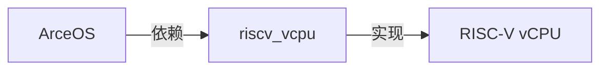
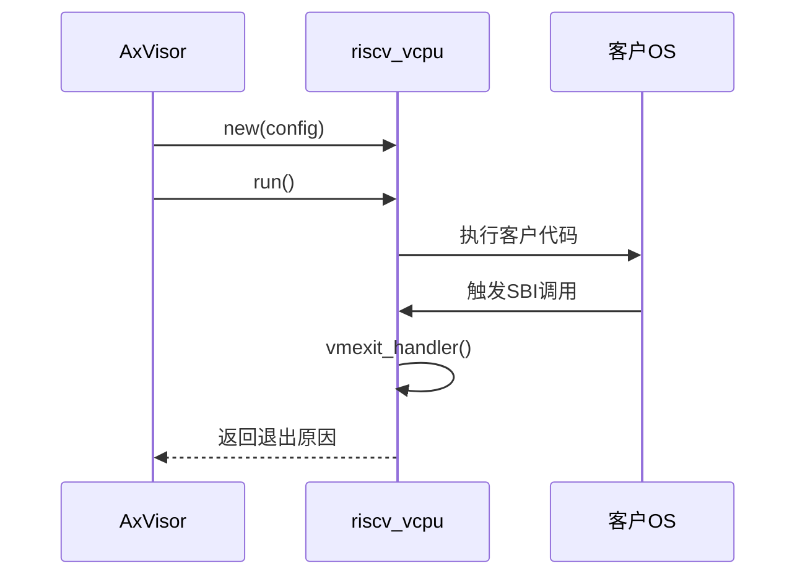
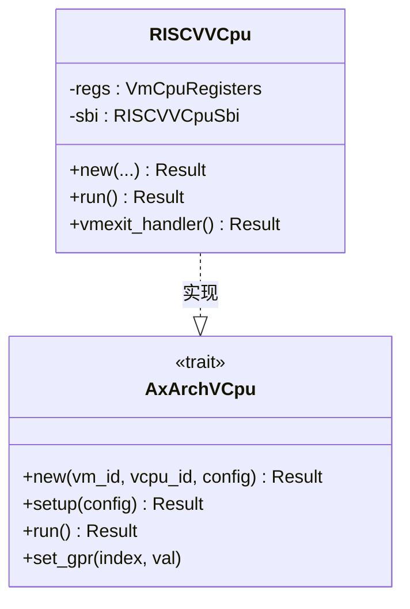

<cite>
**本文档中引用的文件**
- [riscv_vcpu](file://)
- [README.md](file://README.md)
- [Cargo.toml](file://Cargo.toml)
- [src/lib.rs](file://src\lib.rs)
- [src/vcpu.rs](file://src\vcpu.rs)
- [src/percpu.rs](file://src\percpu.rs)
- [src/regs.rs](file://src\regs.rs)
</cite>

# 相关项目

## 目录
1. [引言](#引言)
2. [上游项目：ArceOS 操作系统框架](#上游项目arceos-操作系统框架)
3. [下游项目：AxVisor Hypervisor 实现](#下游项目axvisor-hypervisor-实现)
4. [riscv_vcpu 在 ArceOS-Hypervisor 中的角色](#riscv_vcpu-在-arceos-hypervisor-中的角色)
5. [axvcpu Trait 的跨架构抽象作用](#axvcpu-trait-的跨架构抽象作用)
6. [axaddrspace 与内存虚拟化协同](#axaddrspace-与内存虚拟化协同)
7. [未来集成方向](#未来集成方向)
8. [官方资源链接](#官方资源链接)

## 引言

`riscv_vcpu` 是一个为 RISC-V 架构设计的虚拟 CPU (vCPU) 实现，专为嵌入式和教育用途的超轻量级管理程序（Hypervisor）而构建。它作为 **ArceOS-Hypervisor** 项目的一部分，提供对 RISC-V 虚拟化扩展 (RVH) 的支持。本文档旨在阐明 `riscv_vcpu` 如何与上游的 ArceOS 操作系统框架和下游的 AxVisor 管理程序紧密协作，共同构建一个完整的虚拟化系统。我们将深入探讨其核心组件 `axvcpu` trait 和 `axaddrspace` crate 在实现跨架构抽象和内存虚拟化中的关键作用。

**Section sources**
- [README.md](file://README.md#L0-L59)
- [Cargo.toml](file://Cargo.toml#L0-L43)

## 上游项目：ArceOS 操作系统框架

ArceOS 是一个实验性的、模块化的操作系统或单体内核（Unikernel），其设计理念是高度可组合和可定制。`riscv_vcpu` 通过提供底层硬件抽象，直接服务于 ArceOS 的虚拟化需求。当 ArceOS 需要在 RISC-V 平台上运行多个隔离的实例或服务时，`riscv_vcpu` 提供了执行这些实例所需的 vCPU 核心功能。

`riscv_vcpu` 本身的设计哲学与 ArceOS 保持一致，即“无标准库”(no_std)，使其能够在没有完整操作系统支持的裸机环境中运行。这种设计确保了 `riscv_vcpu` 可以无缝集成到 ArceOS 这样的精简内核中，成为其虚拟化能力的基础构件。



**Diagram sources**
- [README.md](file://README.md#L50-L55)

## 下游项目：AxVisor Hypervisor 实现

AxVisor 是 `riscv_vcpu` 的直接使用者，它是一个具体的 Hypervisor 实现。`riscv_vcpu` 并非一个独立运行的完整管理程序，而是一个专注于 RISC-V vCPU 功能的库。AxVisor 利用这个库来构建其针对 RISC-V 架构的虚拟化层。

在 AxVisor 的架构中，`riscv_vcpu` 扮演着“设备驱动”或“硬件抽象层”的角色。AxVisor 负责更高层次的管理任务，如虚拟机 (VM) 生命周期管理、调度、I/O 虚拟化等，而将 RISC-V 特定的 CPU 虚拟化细节（如寄存器状态保存、陷入处理、SBI 调用转发）委托给 `riscv_vcpu` 处理。这种职责分离使得 AxVisor 的代码更加清晰，并且可以更容易地支持其他架构。


**Diagram sources**
- [README.md](file://README.md#L56-L59)

## riscv_vcpu 在 ArceOS-Hypervisor 中的角色

`riscv_vcpu` 是连接 ArceOS 框架与 AxVisor 实现的关键桥梁，构成了 **ArceOS-Hypervisor** 生态系统的核心部分。它的主要角色是作为一个**RISC-V 架构特定的 vCPU 模块**。

从代码结构上看，`riscv_vcpu` crate 通过实现 `axvcpu` trait 来定义其行为。其核心是 `RISCVVCpu` 结构体，该结构体封装了虚拟 CPU 的所有状态，包括通用寄存器 (`gprs`)、控制与状态寄存器 (CSRs) 以及用于内存虚拟化的页表根指针 (`hgatp`)。

当 AxVisor 创建一个新的虚拟机时，它会调用 `RISCVVCpu::new` 方法来初始化一个 `RISCVVCpu` 实例。随后，通过 `run` 方法启动虚拟 CPU 的执行。在执行过程中，任何来自客户操作系统的异常或中断都会导致“陷入”(vmexit)，此时控制权会返回到 AxVisor。`riscv_vcpu` 的 `vmexit_handler` 函数负责解析陷入的原因（例如 SBI 调用、页面错误、外部中断），并将其转换为 AxVisor 能够理解的标准化退出原因。



**Diagram sources**
- [src/vcpu.rs](file://src\vcpu.rs#L46-L88)
- [src/vcpu.rs](file://src\vcpu.rs#L131-L175)
- [src/vcpu.rs](file://src\vcpu.rs#L85-L133)

**Section sources**
- [src/vcpu.rs](file://src\vcpu.rs#L0-L569)
- [src/lib.rs](file://src\lib.rs#L0-L47)

## axvcpu Trait 的跨架构抽象作用

`axvcpu` 是一个定义在外部 crate 中的 trait，它是实现跨架构虚拟化支持的核心。`riscv_vcpu` 通过让 `RISCVVCpu` 结构体实现 `axvcpu::AxArchVCpu` trait，从而融入到一个统一的、与架构无关的虚拟化框架中。

这个 trait 定义了一组标准化的方法，如 `new`, `setup`, `run`, `set_gpr` 等。无论后端是 RISC-V、x86 还是 ARM，上层的 Hypervisor（如 AxVisor）都可以通过调用这些相同名称的方法来管理 vCPU，而无需关心底层的具体实现细节。

对于 `riscv_vcpu` 而言，实现 `axvcpu` trait 意味着它必须将 RISC-V 特有的指令集、寄存器和异常处理机制，映射到这个通用接口上。例如，`RISCVVCpu::run` 方法内部调用了汇编函数 `_run_guest` 来实际切换到客户模式执行，但对 AxVisor 来说，它只需要知道调用 `run()` 即可。这种抽象极大地简化了多架构 Hypervisor 的开发和维护。



**Diagram sources**
- [src/vcpu.rs](file://src\vcpu.rs#L46-L88)
- [Cargo.toml](file://Cargo.toml#L40-L41)

## axaddrspace 与内存虚拟化协同

内存虚拟化是虚拟化技术的基石，`riscv_vcpu` 与 `axaddrspace` crate 紧密协作来完成这一任务。`axaddrspace` 负责管理物理内存的分配和虚拟地址空间的布局，而 `riscv_vcpu` 则负责在 CPU 层面启用和配置内存虚拟化。

具体来说，`axaddrspace` 会为每个虚拟机构建一个扩展页表 (EPT) 或多级页表。当虚拟机被创建和配置时，AxVisor 会调用 `riscv_vcpu` 提供的 `set_ept_root` 方法，将这个页表的根物理地址传递给 `riscv_vcpu`。`riscv_vcpu` 随后会将此地址写入 RISC-V 架构特有的 `hgatp` 寄存器中。

`hgatp` 寄存器是 RISC-V 虚拟化扩展的关键，它告诉硬件使用哪个页表来进行地址转换。一旦设置完成，客户操作系统发出的所有内存访问请求都会由硬件自动通过这个页表进行翻译，从而实现了内存的隔离和保护。

此外，在发生页面错误 (Page Fault) 时，`riscv_vcpu` 的 `handle_guest_page_fault` 函数会分析错误原因，并可能触发 MMIO (内存映射 I/O) 事件，这需要 `axaddrspace` 提供的地址空间信息来确定错误地址是否对应于某个虚拟设备。

```mermaid
flowchart TD
A[AxVisor] --> B[创建虚拟机]
B --> C[axaddrspace: 分配内存<br/>构建页表]
C --> D[riscv_vcpu: set_ept_root()]
D --> E[写入 hgatp 寄存器]
E --> F[硬件启用地址转换]
F --> G[客户OS执行]
G --> H{内存访问?}
H --> |是| I[硬件通过页表翻译]
H --> |否| J[继续执行]
```

**Diagram sources**
- [src/vcpu.rs](file://src\vcpu.rs#L131-L175)
- [src/vcpu.rs](file://src\vcpu.rs#L85-L133)
- [Cargo.toml](file://Cargo.toml#L40-L41)

**Section sources**
- [src/vcpu.rs](file://src\vcpu.rs#L169-L207)
- [src/regs.rs](file://src\regs.rs#L0-L252)

## 未来集成方向

`riscv_vcpu` 作为一个活跃的开源项目，其未来发展潜力巨大。以下是一些可能的集成方向：

1.  **支持更多 SBI 扩展**：当前实现已经支持了 HSM (Hart State Management) 和 Legacy 扩展。未来可以集成更多的 SBI 扩展，如 PMP (Physical Memory Protection)、Timer、IPM (Instruction Profiling Module) 等，以提供更丰富的虚拟化功能和性能监控能力。
2.  **增强虚拟设备模拟能力**：目前的 MMIO 支持是基础的。未来可以与更复杂的虚拟设备模型（如 VirtIO）集成，通过高效的前端-后端通信机制，为虚拟机提供高性能的网络、存储和块设备。
3.  **性能优化**：可以通过减少陷入次数、优化上下文切换路径、利用硬件特性（如 NAPOT 内存区域）等方式进一步提升虚拟化性能。
4.  **安全增强**：引入更严格的验证机制，防止恶意客户机攻击，探索与可信执行环境 (TEE) 的结合。

## 官方资源链接

*   **riscv_vcpu 仓库**: [https://github.com/arceos-hypervisor/riscv_vcpu](https://github.com/arceos-hypervisor/riscv_vcpu)
*   **ArceOS 仓库**: [https://github.com/arceos-org/arceos](https://github.com/arceos-org/arceos)
*   **AxVisor 仓库**: [https://github.com/arceos-hypervisor/axvisor](https://github.com/arceos-hypervisor/axvisor)