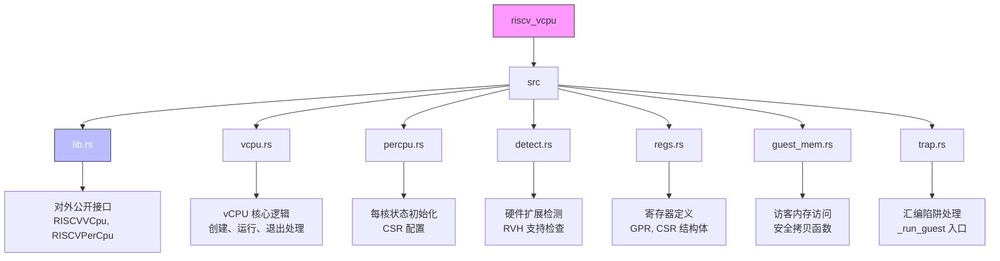
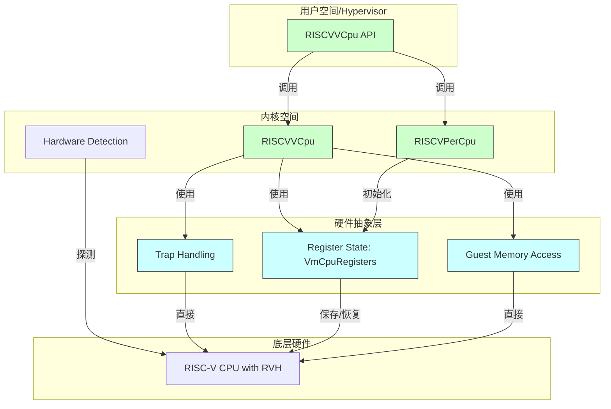
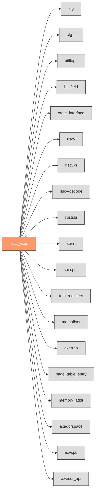

<cite>
**Referenced Files in This Document**
- [README.md](file://README.md)
- [Cargo.toml](file://Cargo.toml)
- [rust-toolchain.toml](file://rust-toolchain.toml)
- [src/lib.rs](file://src/lib.rs)
- [src/vcpu.rs](file://src/vcpu.rs)
- [src/percpu.rs](file://src/percpu.rs)
- [src/detect.rs](file://src/detect.rs)
- [src/regs.rs](file://src/regs.rs)
- [src/guest_mem.rs](file://src/guest_mem.rs)
- [src/trap.rs](file://src/trap.rs)
</cite>

# 贡献指南

本贡献指南旨在为外部开发者提供清晰的指引，以参与 `riscv_vcpu` 项目的改进。文档详细说明了代码风格、测试要求、提交流程、特殊环境注意事项以及依赖管理策略。

## 项目结构

`riscv_vcpu` 项目是一个专为 RISC-V 架构设计的虚拟 CPU (vCPU) 实现，其核心功能围绕硬件虚拟化支持构建。项目采用典型的 Rust crate 结构，源码位于 `src` 目录下，通过模块化设计组织不同功能。

**Diagram sources**
- [src/lib.rs](file://src/lib.rs#L1-L47)
- [src/vcpu.rs](file://src/vcpu.rs#L1-L569)
- [src/percpu.rs](file://src/percpu.rs#L1-L83)

**Section sources**
- [src/lib.rs](file://src/lib.rs#L1-L47)
- [src/vcpu.rs](file://src/vcpu.rs#L1-L569)
- [src/percpu.rs](file://src/percpu.rs#L1-L83)

## 核心组件

`riscv_vcpu` 的核心由几个关键模块构成，它们协同工作以实现一个完整的 vCPU 抽象层。

### RISCVVCpu 模块

`RISCVVCpu` 是项目的核心数据结构，实现了 `axvcpu::AxArchVCpu` trait，负责管理单个虚拟 CPU 的生命周期和执行。它封装了虚拟机的寄存器状态 (`VmCpuRegisters`)，并提供了创建、配置、运行和处理 VM 退出事件的方法。该模块是与 hypervisor 上层交互的主要入口点。

**Section sources**
- [src/vcpu.rs](file://src/vcpu.rs#L1-L569)
- [src/lib.rs](file://src/lib.rs#L20-L47)

### RISCVPerCpu 模块

`RISCVPerCpu` 模块代表每个物理 CPU 核心的架构特定状态。它实现了 `axvcpu::AxArchPerCpu` trait，主要职责是在系统启动时为每个核心进行必要的初始化，特别是设置控制和状态寄存器 (CSRs)，如异常委托 (`hedeleg`) 和中断委托 (`hideleg`)，以确保虚拟化环境的正确建立。

**Section sources**
- [src/percpu.rs](file://src/percpu.rs#L1-L83)

### 硬件检测模块

`detect.rs` 文件中的 `detect_h_extension` 函数用于在运行时检测当前 RISC-V 环境是否支持 Hypervisor 扩展 (RVH)。其实现采用了“陷阱返回”(trap-and-return) 的技术：尝试执行一条仅在 RVH 存在时才有效的指令（读取 `hgatp` 寄存器），如果触发非法指令异常，则表明不支持。这是确保软件兼容性的关键步骤。

**Section sources**
- [src/detect.rs](file://src/detect.rs#L1-L237)
- [src/lib.rs](file://src/lib.rs#L21-L22)

## 架构概述

`riscv_vcpu` 的架构设计遵循分层原则，将复杂的虚拟化操作分解为可管理的组件。

**Diagram sources**
- [src/vcpu.rs](file://src/vcpu.rs#L1-L569)
- [src/percpu.rs](file://src/percpu.rs#L1-L83)
- [src/detect.rs](file://src/detect.rs#L1-L237)
- [src/regs.rs](file://src/regs.rs#L1-L252)
- [src/guest_mem.rs](file://src/guest_mem.rs#L1-L81)
- [src/trap.rs](file://src/trap.rs#L1-L102)

## 详细组件分析

### vCPU 创建与运行流程

当创建一个新的 `RISCVVCpu` 实例时，会根据 `RISCVVCpuCreateConfig` 初始化其寄存器状态，例如将设备树地址写入 `a1` 寄存器。随后，`setup` 方法会配置 `sstatus` 和 `hstatus` 等关键 CSR。最终，`run` 方法通过调用汇编函数 `_run_guest` 将控制权交给客户机操作系统。任何导致 VM 退出的事件（如 SBI 调用或页面错误）都会被 `vmexit_handler` 捕获并处理。

**Section sources**
- [src/vcpu.rs](file://src/vcpu.rs#L1-L569)

### 内存访问与陷阱处理

`guest_mem.rs` 提供了安全访问客户机内存的机制。由于涉及跨地址空间的操作，这些函数通过内联汇编实现，并利用 `hfence.vvma` 指令来刷新 TLB。`vmexit_handler` 在处理页面错误时，会调用 `decode_instr_at` 来解码导致错误的指令，从而判断是 MMIO 读还是写操作，并生成相应的 `AxVCpuExitReason` 通知上层 hypervisor。

**Section sources**
- [src/guest_mem.rs](file://src/guest_mem.rs#L1-L81)
- [src/vcpu.rs](file://src/vcpu.rs#L1-L569)

## 依赖分析

项目依赖项明确列于 `Cargo.toml` 文件中，分为核心依赖和架构特定依赖。

**Diagram sources**
- [Cargo.toml](file://Cargo.toml#L1-L44)

**Section sources**
- [Cargo.toml](file://Cargo.toml#L1-L44)

## 代码风格与规范

所有代码必须严格遵守以下约定：
- **格式化**: 使用 `rustfmt` 进行代码格式化，其配置由 `rust-toolchain.toml` 中指定的 nightly 工具链保证。
- **注释**: 关键函数和复杂逻辑必须包含详细的文档注释 (`///`) 或内部注释 (`//`)，解释其目的和行为。
- **命名**: 遵循 Rust 的惯例，使用 `snake_case` 命名函数和变量，`PascalCase` 命名类型和 trait。常量应全部大写，如 `EID_HVC`。

**Section sources**
- [rust-toolchain.toml](file://rust-toolchain.toml#L1-L7)
- [src/lib.rs](file://src/lib.rs#L1-L47)

## 测试要求

目前项目未发现显式的单元测试或集成测试文件。贡献者在添加新功能或修复 bug 时，**必须**同步编写相应的测试。测试应覆盖核心功能路径和边界条件，确保代码的健壮性。建议使用 `cargo test` 命令运行测试套件。

**Section sources**
- [grep_code output for "test"](file://grep_result)

## 提交与审查流程

- **提交消息**: 提交信息应简洁明了，遵循 `<type>(<scope>): <subject>` 的格式，例如 `feat(vcpu): add new exit reason` 或 `fix(percpu): correct csr initialization`。
- **拉取请求 (PR)**: 所有变更都应通过 PR 提交。PR 描述应清晰地说明变更的目的、实现方式和影响范围。
- **代码审查**: PR 必须经过至少一位核心维护者的审查才能合并。审查将重点关注代码质量、性能、安全性和对 `no_std` 环境的兼容性。

## no_std 环境注意事项

本项目运行在 `no_std` 环境下，因此有严格的限制：
- **禁止动态分配**: 不得使用标准库的 `Vec`, `String` 等需要堆分配的类型。若必须使用，需确保有 `alloc` 特性支持且已正确配置。
- **避免不兼容依赖**: 引入的新依赖必须同样兼容 `no_std`，不能引入隐式的标准库依赖。
- **最小化依赖**: 优先选择轻量级、无 std 依赖的 crate。

**Section sources**
- [src/lib.rs](file://src/lib.rs#L1)
- [Cargo.toml](file://Cargo.toml#L1-L44)

## 依赖项版本策略

项目依赖项的版本在 `Cargo.toml` 中通过精确版本号或 caret 版本 (`^`) 指定。升级依赖项被视为一项重大变更，必须经过充分测试以确保 ABI 兼容性和功能稳定性。升级流程如下：
1. 在独立分支中更新 `Cargo.toml`。
2. 运行完整的 CI 流水线。
3. 手动验证关键功能。
4. 提交 PR 并进行彻底审查。

**Section sources**
- [Cargo.toml](file://Cargo.toml#L1-L44)

## 文档同步

任何代码变更，尤其是涉及公共 API 的修改，**必须**伴随 `README.md` 或相关模块文档的更新。这确保了文档与代码实现的一致性，降低了使用者的学习成本和出错风险。

**Section sources**
- [README.md](file://README.md#L1-L59)