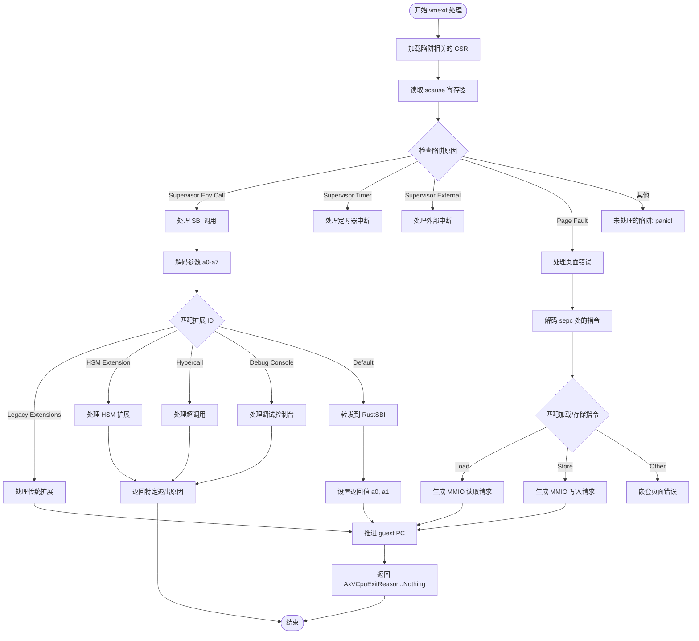
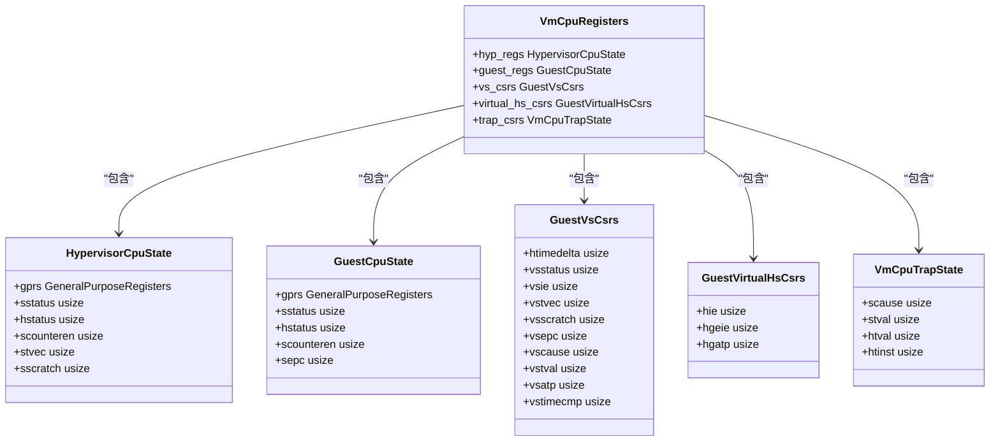

# 项目概述

<cite>
**Referenced Files in This Document**   
- [README.md](file://README.md)
- [Cargo.toml](file://Cargo.toml)
- [src/lib.rs](file://src/lib.rs)
- [src/vcpu.rs](file://src/vcpu.rs)
- [src/percpu.rs](file://src/percpu.rs)
- [src/guest_mem.rs](file://src/guest_mem.rs)
- [src/trap.rs](file://src/trap.rs)
- [src/regs.rs](file://src/regs.rs)
</cite>

## 目录
1. [简介](#简介)
2. [设计目标与技术定位](#设计目标与技术定位)
3. [核心功能详解](#核心功能详解)
4. [模块结构与组件协同](#模块结构与组件协同)
5. [典型应用场景](#典型应用场景)
6. [ArceOS生态系统集成](#arceos生态系统集成)

## 简介

`riscv_vcpu` 是一个专为 RISC-V 架构设计的虚拟 CPU（vCPU）实现库，旨在为嵌入式 hypervisor 和教育场景提供核心支持。该项目实现了符合 RISC-V 虚拟化扩展（RVH）规范的最小化 vCPU 抽象层，并能够在 `no_std` 环境中运行。

该库提供了完整的 vCPU 结构和虚拟化相关接口支持，特别针对 riscv64 架构进行了优化。其主要特性包括异常处理、内存虚拟化（EPT）、VMCS 管理、每 CPU 状态管理以及 SBI 调用支持。作为 ArceOS 生态系统的一部分，`riscv_vcpu` 与其他组件如 AxVisor 协同工作，构建了一个实验性的模块化操作系统或单体内核环境。

**Section sources**
- [README.md](file://README.md#L0-L59)
- [Cargo.toml](file://Cargo.toml#L0-L44)

## 设计目标与技术定位

`riscv_vcpu` 的设计目标是创建一个轻量级且高效的 RISC-V 虚拟 CPU 实现，专注于满足嵌入式 hypervisor 和教育用途的需求。通过遵循 RISC-V 虚拟化扩展（RVH）规范，该项目确保了对现代 RISC-V 处理器虚拟化特性的正确支持。

关键技术定位体现在以下几个方面：首先，项目完全兼容 `no_std` 环境，使其能够应用于资源受限的嵌入式系统和裸机环境；其次，它提供了对硬件虚拟化支持的检测机制，允许在运行时确认底层平台是否具备必要的虚拟化能力；最后，通过与 RustSBI 等标准库的集成，实现了对 RISC-V 标准二进制接口（SBI）的完整支持。

这种设计使得 `riscv_vcpu` 不仅适用于生产级 hypervisor 开发，也为学习和研究 RISC-V 虚拟化技术提供了理想的实验平台。其模块化架构便于理解和扩展，同时保持了高性能和低开销的特点。

**Section sources**
- [src/lib.rs](file://src/lib.rs#L0-L47)
- [README.md](file://README.md#L0-L59)

## 核心功能详解

### 异常处理机制

`riscv_vcpu` 提供了全面的陷阱和异常处理功能，用于管理虚拟化环境中的各种中断和错误情况。当发生虚拟机退出（vmexit）时，`vmexit_handler` 函数会根据 `scause` 寄存器的内容判断具体的陷阱原因，并执行相应的处理逻辑。这包括对 Supervisor 环境调用、定时器中断、外部中断以及页面错误等情况的处理。

对于页面错误，系统能够解码导致故障的指令，区分读取和写入操作，并生成适当的 MMIO 读写请求。这种精细化的异常处理能力确保了虚拟机能够正确响应各种运行时事件，维持系统的稳定性和安全性。



**Diagram sources**
- [src/vcpu.rs](file://src/vcpu.rs#L280-L569)

### 内存虚拟化与 EPT 支持

内存虚拟化是 `riscv_vcpu` 的关键功能之一，通过扩展页表（EPT）机制实现。`set_ept_root` 方法允许设置主机物理地址作为 EPT 根节点，从而建立客户机虚拟地址到主机物理地址的映射关系。这一过程利用了 RISC-V 的 `hgatp` 控制状态寄存器，在硬件层面支持两级地址转换。

为了支持跨地址空间的数据访问，`guest_mem` 模块提供了安全的内存拷贝函数，如 `copy_from_guest` 和 `copy_to_guest`。这些函数通过临时禁用 VSATP 地址转换，直接在物理地址空间进行操作，确保了数据传输的安全性和效率。

**Section sources**
- [src/vcpu.rs](file://src/vcpu.rs#L150-L160)
- [src/guest_mem.rs](file://src/guest_mem.rs#L0-L81)

### VMCS 管理与每 CPU 状态

虚拟机控制结构（VMCS）的管理由 `VmCpuRegisters` 数据结构实现，该结构包含了 hypervisor 和客户机的通用寄存器、CSR 状态以及其他必要的上下文信息。`bind` 和 `unbind` 方法负责将当前 vCPU 绑定到物理 CPU 上，通过设置 `hgatp` 寄存器并执行 `hfence.gvma` 指令来激活虚拟化模式。

每 CPU 状态管理通过 `RISCVPerCpu` 结构实现，初始化过程中配置了 H 模式下的各种控制状态寄存器（CSR），包括异常委托（hedeleg）、中断委托（hideleg）等。这种设计确保了每个物理 CPU 都能独立地管理和切换多个 vCPU 实例。



**Diagram sources**
- [src/regs.rs](file://src/regs.rs#L0-L252)
- [src/vcpu.rs](file://src/vcpu.rs#L0-L569)

### SBI 调用支持

`riscv_vcpu` 完整支持 RISC-V 标准二进制接口（SBI）调用，这是连接客户机操作系统与底层 hypervisor 的关键桥梁。通过 `rustsbi` 库的集成，vCPU 能够处理各种 SBI 扩展请求，包括传统的控制台 I/O、定时器设置、关机命令，以及 HSM（Hart State Management）扩展中的 hart 启动/停止操作。

特殊的超调用（hypercall）机制通过自定义的扩展 ID `EID_HVC` 实现，允许客户机发起特定于 hypervisor 的高级操作。所有未被显式处理的 SBI 调用都会被转发到默认的 RustSBI 实现，保证了向后兼容性和功能完整性。

**Section sources**
- [src/vcpu.rs](file://src/vcpu.rs#L280-L569)
- [Cargo.toml](file://Cargo.toml#L0-L44)

## 模块结构与组件协同

`riscv_vcpu` 的模块化设计体现了清晰的关注点分离原则。各个源文件承担不同的职责，共同构建出完整的 vCPU 抽象层：

- `lib.rs` 作为入口点，定义了公共 API 和配置结构
- `vcpu.rs` 实现了核心的 vCPU 逻辑和生命周期管理
- `percpu.rs` 负责每 CPU 的初始化和硬件状态管理
- `regs.rs` 定义了所有需要保存和恢复的寄存器状态结构
- `trap.rs` 包含汇编级别的陷阱处理代码，与 `vcpu.rs` 中的 `vmexit_handler` 紧密协作
- `guest_mem.rs` 提供安全的跨地址空间内存访问原语
- `sbi_console.rs` 实现了基于 SBI 的控制台 I/O 功能

这些组件通过精心设计的接口相互协作：`RISCVVCpu` 类型聚合了寄存器状态和 SBI 处理器，通过 `AxArchVCpu` trait 与上层 hypervisor 交互；`RISCVPerCpu` 确保每个物理 CPU 正确配置虚拟化环境；而底层的汇编代码则高效地完成上下文切换和陷阱捕获。

```mermaid
graph TB
subgraph "Public Interface"
lib[lib.rs]
end
subgraph "Core Components"
vcpu[vcpu.rs]
percpu[percpu.rs]
regs[regs.rs]
end
subgraph "Support Modules"
trap[trap.rs]
guest_mem[guest_mem.rs]
sbi_console[sbi_console.rs]
end
lib --> vcpu : "导出 RISCVVCpu"
lib --> percpu : "导出 RISCVPerCpu"
lib --> regs : "使用寄存器定义"
vcpu --> regs : "使用 VmCpuRegisters"
vcpu --> trap : "调用 _run_guest"
vcpu --> guest_mem : "调用内存访问函数"
vcpu --> sbi_console : "调用控制台 I/O"
percpu --> regs : "使用 CSR 偏移量"
percpu --> trap : "依赖陷阱处理"
trap --> regs : "使用寄存器偏移宏"
```

**Diagram sources**
- [src/lib.rs](file://src/lib.rs#L0-L47)
- [src/vcpu.rs](file://src/vcpu.rs#L0-L569)
- [src/percpu.rs](file://src/percpu.rs#L0-L83)
- [src/regs.rs](file://src/regs.rs#L0-L252)
- [src/trap.rs](file://src/trap.rs#L0-L102)
- [src/guest_mem.rs](file://src/guest_mem.rs#L0-L81)
- [src/sbi_console.rs](file://src/sbi_console.rs#L0-Lunknown)

**Section sources**
- [src/lib.rs](file://src/lib.rs#L0-L47)
- [src/vcpu.rs](file://src/vcpu.rs#L0-L569)
- [src/percpu.rs](file://src/percpu.rs#L0-L83)

## 典型应用场景

`riscv_vcpu` 的典型使用流程遵循一个清晰的模式：首先检查硬件虚拟化支持，然后创建配置并实例化 vCPU，最后启动执行循环。以下是一个基本的使用示例：

```rust
use riscv_vcpu::{RISCVVCpu, RISCVVCpuCreateConfig, has_hardware_support};

// 检查硬件虚拟化支持
if has_hardware_support() {
    // 创建 vCPU 配置
    let config = RISCVVCpuCreateConfig::default();
    
    // 创建并配置虚拟 CPU
    let mut vcpu = RISCVVCpu::new(config)?;
    
    // 设置入口点地址
    vcpu.set_entry(entry_point)?;
    
    // 设置 EPT 根地址
    vcpu.set_ept_root(ept_root)?;
    
    // 运行虚拟 CPU
    loop {
        match vcpu.run()? {
            AxVCpuExitReason::Nothing => continue,
            AxVCpuExitReason::SystemDown => break,
            AxVCpuExitReason::Hypercall { nr, args } => handle_hypercall(nr, args),
            // 处理其他退出原因...
        }
    }
}
```

这个模式展示了如何将 `riscv_vcpu` 集成到更大的 hypervisor 框架中，通过处理不同的退出原因来实现复杂的虚拟化功能。

**Section sources**
- [README.md](file://README.md#L40-L55)
- [src/vcpu.rs](file://src/vcpu.rs#L100-L270)

## ArceOS生态系统集成

`riscv_vcpu` 是 ArceOS 生态系统的重要组成部分，与多个相关项目紧密集成。作为 ArceOS-Hypervisor 的 riscv vcpu 模块，它直接依赖于 `axaddrspace`、`axvcpu` 和 `axvisor_api` 等 ArceOS 特有的库，形成了一个统一的技术栈。

通过 `axvcpu` crate 提供的 `AxArchVCpu` trait，`riscv_vcpu` 能够无缝集成到更高级别的 hypervisor 实现中，如 AxVisor。这种设计允许不同架构的 vCPU 实现共享相同的抽象接口，促进了代码复用和跨平台兼容性。

此外，项目采用的 `no_std` 设计哲学与 ArceOS 的整体架构理念一致，支持在资源受限环境中构建模块化的操作系统组件。这种深度集成使得开发者能够利用 `riscv_vcpu` 作为基础构件，快速开发定制化的嵌入式 hypervisor 解决方案。

**Section sources**
- [Cargo.toml](file://Cargo.toml#L0-L44)
- [README.md](file://README.md#L50-L55)