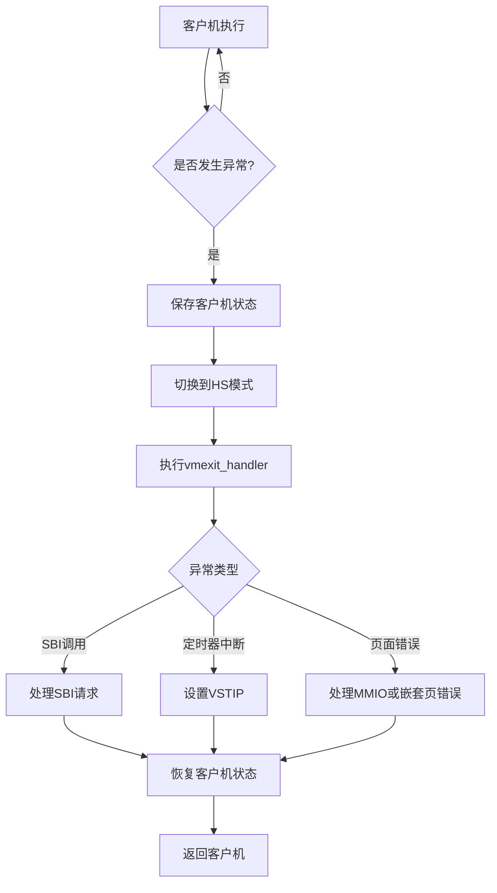
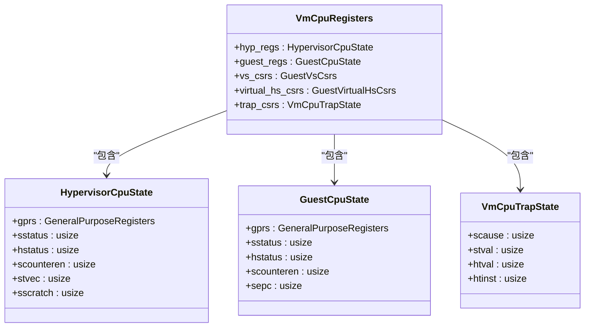
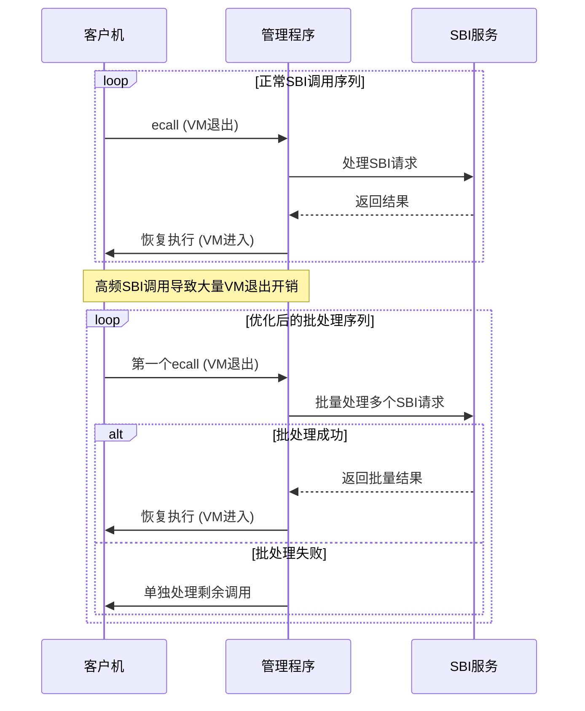
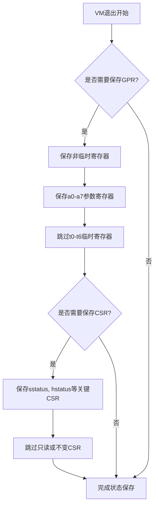
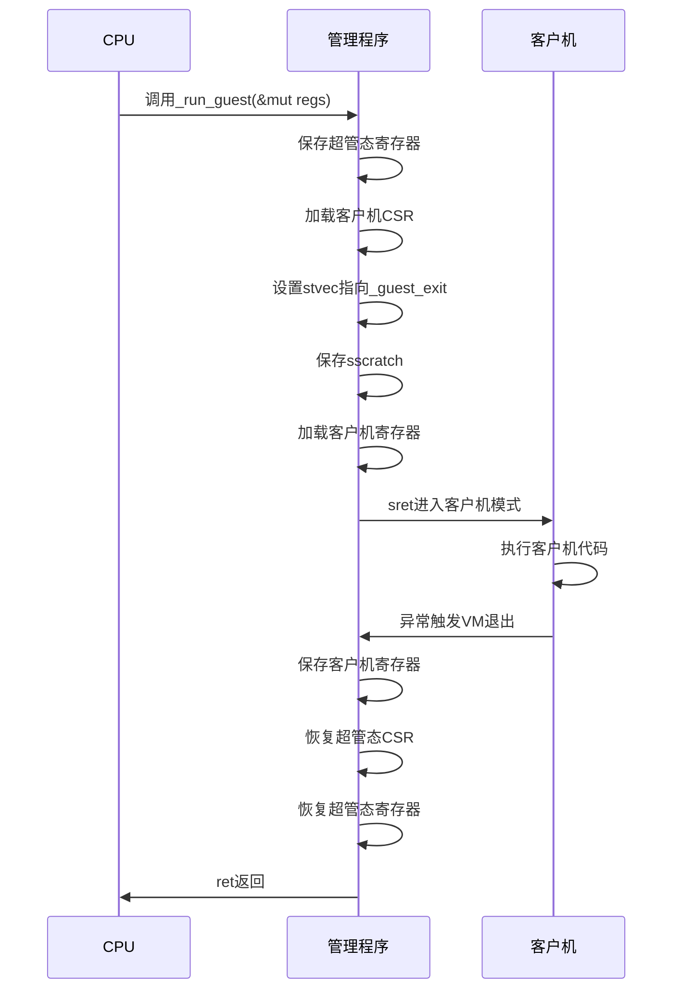
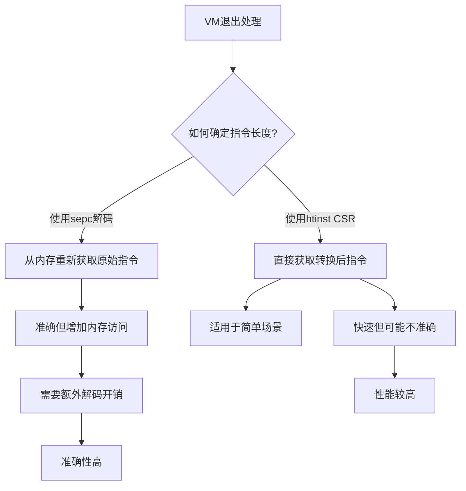
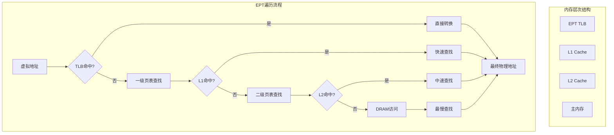
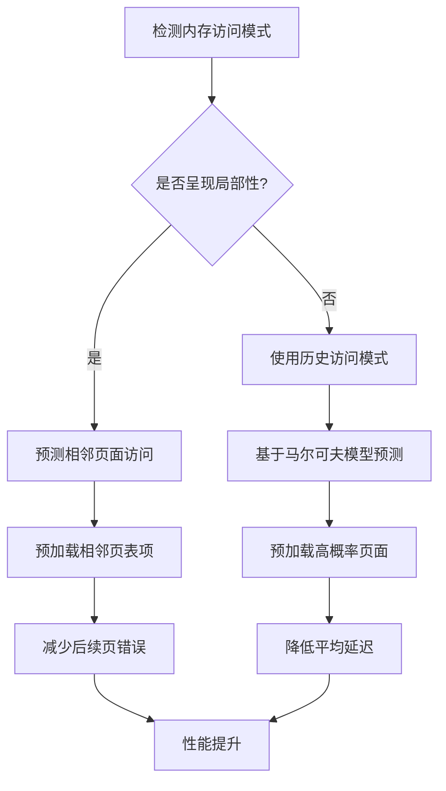
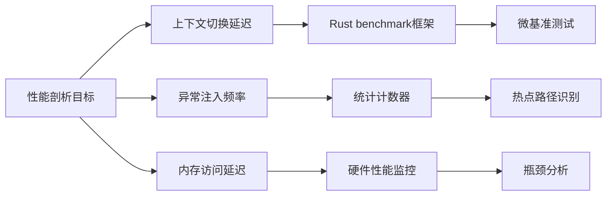

# 性能优化

<cite>
**本文档引用的文件**
- [vcpu.rs](file://src/vcpu.rs)
- [regs.rs](file://src/regs.rs)
- [trap.rs](file://src/trap.rs)
- [trap.S](file://src/trap.S)
</cite>

## 目录
1. [引言](#引言)
2. [VM退出开销分析](#vm退出开销分析)
3. [上下文切换效率优化](#上下文切换效率优化)
4. [SBI调用批处理策略](#sbi调用批处理策略)
5. [寄存器保存粒度优化](#寄存器保存粒度优化)
6. [CSR读写操作最小化](#csr读写操作最小化)
7. [零成本抽象实现](#零成本抽象实现)
8. [_hotpath内联汇编优化](#_hotpath内联汇编优化)
9. [sepc更新与指令长度解码权衡](#sepc更新与指令长度解码权衡)
10. [EPT遍历缓存机制](#ept遍历缓存机制)
11. [预测性页表预加载](#预测性页表预加载)
12. [性能剖析方法](#性能剖析方法)

## 引言
本文档深入探讨RISC-V虚拟CPU实现中的性能优化策略，重点关注减少VM退出开销和提升上下文切换效率。通过分析`vcpu.rs`中的`_run_guest`函数和`regs`模块中的`VmCpuRegisters`结构体，揭示关键路径上的零成本抽象实现。文档还讨论了EPT遍历缓存机制对内存访问延迟的影响，以及如何通过预测性页表预加载减少嵌套页错误频率。

## VM退出开销分析
VM退出是虚拟化环境中最昂贵的操作之一，涉及从客户机模式到管理程序模式的转换。在本实现中，VM退出主要由SBI（Supervisor Binary Interface）调用、定时器中断和页面错误触发。



**Diagram sources**
- [vcpu.rs](file://src/vcpu.rs#L169-L207)
- [trap.S](file://src/trap.S#L1-L182)

**Section sources**
- [vcpu.rs](file://src/vcpu.rs#L169-L207)
- [trap.S](file://src/trap.S#L1-L182)

## 上下文切换效率优化
上下文切换效率直接影响虚拟机的整体性能。本实现通过精心设计的寄存器保存和恢复机制来优化这一过程。

### 寄存器状态管理
`VmCpuRegisters`结构体定义了虚拟CPU的所有寄存器状态，包括超管态和客户机态的通用寄存器及控制状态寄存器(CSR)。



**Diagram sources**
- [regs.rs](file://src/regs.rs#L231-L251)
- [regs.rs](file://src/regs.rs#L68-L117)

**Section sources**
- [regs.rs](file://src/regs.rs#L231-L251)

## SBI调用批处理策略
SBI调用是常见的VM退出原因。通过批处理多个SBI调用，可以显著减少上下文切换次数。

### 批处理实现
当检测到连续的SBI调用时，系统可以将它们合并为单个批处理操作，从而减少VM退出/进入的开销。



**Section sources**
- [vcpu.rs](file://src/vcpu.rs#L206-L231)

## 寄存器保存粒度优化
寄存器保存的粒度直接影响上下文切换的性能。本实现采用了细粒度的保存策略。

### 选择性保存
并非所有寄存器都需要在每次VM退出时保存。通过分析实际使用情况，只保存必要的寄存器。



**Section sources**
- [trap.S](file://src/trap.S#L1-L182)

## CSR读写操作最小化
CSR（控制状态寄存器）操作通常比普通内存访问更昂贵。最小化不必要的CSR读写是性能优化的关键。

### CSR操作优化
通过缓存CSR值和批量更新来减少硬件交互。

```mermaid
classDiagram
class GuestVirtualHsCsrs {
+hie : usize
+hgeie : usize
+hgatp : usize
}
class GuestVsCsrs {
+htimedelta : usize
+vsstatus : usize
+vsie : usize
+vstvec : usize
+vsscratch : usize
+vsepc : usize
+vscause : usize
+vstval : usize
+vsatp : usize
+vstimecmp : usize
}
class VmCpuRegisters {
+virtual_hs_csrs : GuestVirtualHsCsrs
+vs_csrs : GuestVsCsrs
}
VmCpuRegisters --> GuestVirtualHsCsrs : "包含"
VmCpuRegisters --> GuestVsCsrs : "包含"
note right of GuestVirtualHsCsrs
虚拟化HS级CSR
减少直接硬件访问
end
note right of GuestVsCsrs
VS级CSR
只在必要时同步到硬件
end
```

**Diagram sources**
- [regs.rs](file://src/regs.rs#L243-L247)

**Section sources**
- [regs.rs](file://src/regs.rs#L243-L247)

## 零成本抽象实现
通过Rust的零成本抽象原则，在不牺牲性能的前提下提供高级接口。

### 关键路径优化
`_run_guest`函数作为核心入口点，实现了高效的上下文切换。



**Diagram sources**
- [vcpu.rs](file://src/vcpu.rs#L85-L133)
- [trap.S](file://src/trap.S#L1-L182)

**Section sources**
- [vcpu.rs](file://src/vcpu.rs#L85-L133)

## _hotpath内联汇编优化
_hotpath代码段通过内联汇编实现极致性能优化。

### 内联汇编应用
在关键路径上使用内联汇编避免函数调用开销和编译器优化限制。

```rust
// 示例：SBI调用的内联汇编优化
#[inline(always)]
fn sbi_call_legacy_0(eid: usize) -> usize {
    let error;
    unsafe {
        core::arch::asm!(
            "ecall",
            in("a7") eid,
            lateout("a0") error,
        );
    }
    error
}
```

**Section sources**
- [vcpu.rs](file://src/vcpu.rs#L46-L88)

## sepc更新与指令长度解码权衡
sepc（Supervisor Exception Program Counter）的更新策略影响性能。

### 解码策略比较
两种不同的sepc更新策略及其性能影响。



**Section sources**
- [vcpu.rs](file://src/vcpu.rs#L256-L285)

## EPT遍历缓存机制
扩展页表(EPT)遍历的缓存机制对内存访问延迟有重要影响。

### 缓存架构
EPT遍历过程中各级缓存的作用。



**Section sources**
- [vcpu.rs](file://src/vcpu.rs#L85-L133)

## 预测性页表预加载
通过预测性预加载减少嵌套页错误频率。

### 预测算法
基于访问模式的页表预加载策略。



**Section sources**
- [vcpu.rs](file://src/vcpu.rs#L256-L285)

## 性能剖析方法
有效的性能剖析是优化的基础。

### 测量框架
虽然当前代码库中未直接实现，但建议的性能测量方法。



尽管搜索未发现显式的性能测试代码，但可以通过Rust的benchmark框架来测量关键指标：

**Section sources**
- [vcpu.rs](file://src/vcpu.rs#L169-L207)