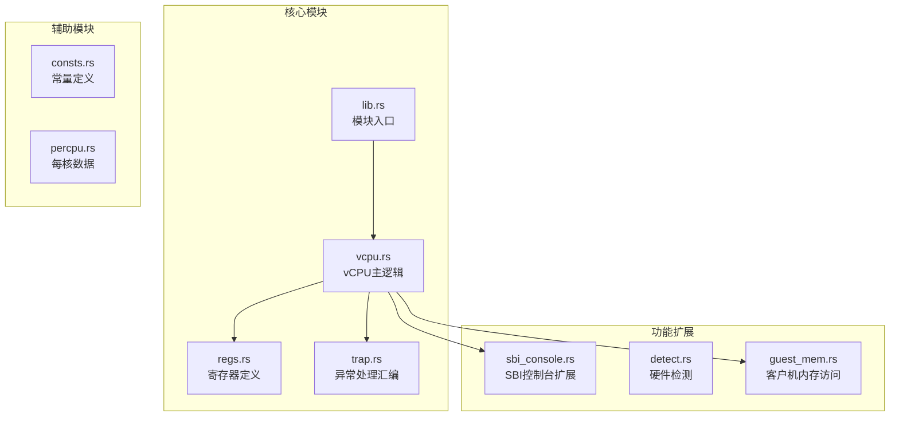
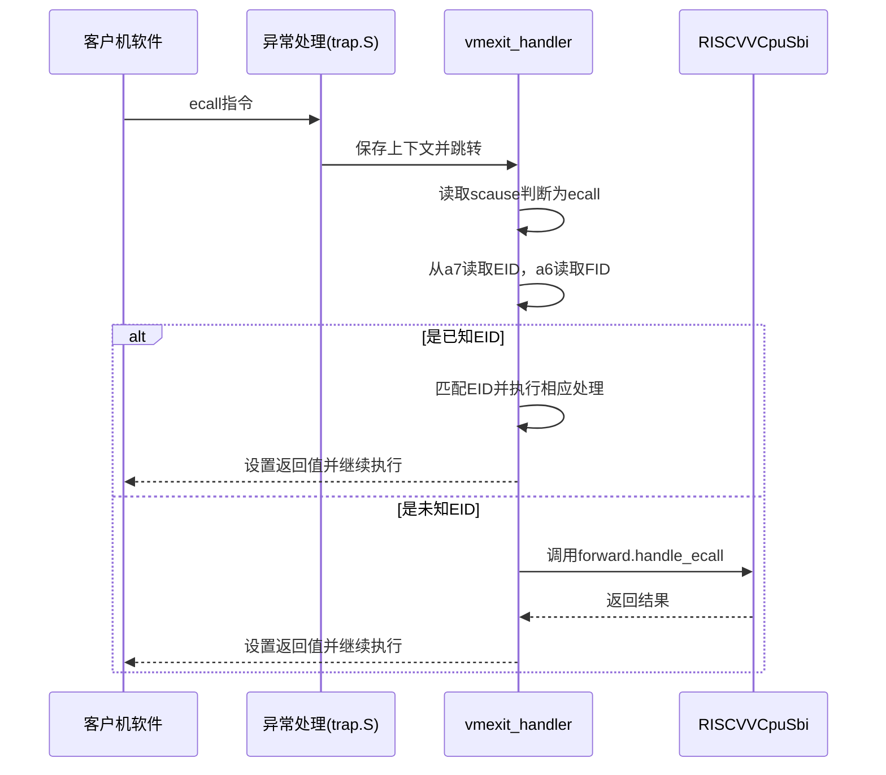
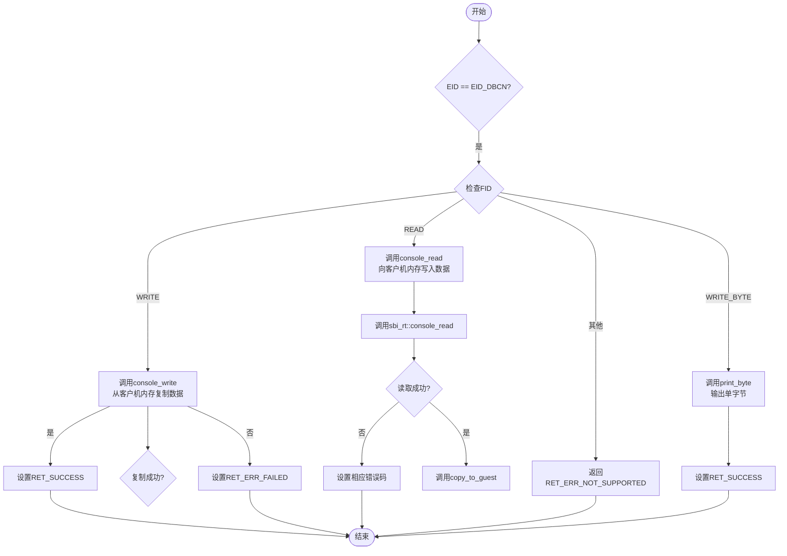

<cite>
**Referenced Files in This Document**
- [lib.rs](file://src/lib.rs)
- [vcpu.rs](file://src/vcpu.rs)
- [sbi_console.rs](file://src/sbi_console.rs)
- [trap.rs](file://src/trap.rs)
- [regs.rs](file://src/regs.rs)
- [consts.rs](file://src/consts.rs)
- [Cargo.toml](file://Cargo.toml)
</cite>

## 目录
1. [简介](#简介)
2. [项目结构](#项目结构)
3. [核心组件](#核心组件)
4. [SBI扩展注册机制](#sbi扩展注册机制)
5. [EID_DBCN控制台扩展实现](#eid_dbcn控制台扩展实现)
6. [错误码体系与内存安全](#错误码体系与内存安全)
7. [axvcpu trait集成](#axvcpu-trait集成)
8. [兼容性验证](#兼容性验证)

## 简介
本文档详细说明如何在RISC-V vCPU中实现自定义SBI（Supervisor Binary Interface）扩展。基于rustsbi和sbi-spec规范，解释了如何在`RISCVVCpuSbi`结构体中注册新的扩展ID（EID）和函数ID（FID），并确保与现有错误码体系兼容。以实现EID_DBCN控制台扩展为例，展示了从trap处理到SBI调用分发的完整路径。文档提供了代码示例：定义新的SBI服务接口、添加请求处理逻辑、正确传播错误码（如`SbiRet::invalid_param`）。强调了no_std环境下内存安全和异步异常处理的注意事项。说明了如何通过axvcpu trait集成架构特定行为，并验证扩展在真实硬件或QEMU模拟器上的兼容性。

## 项目结构
该项目实现了RISC-V架构下的虚拟CPU模块，主要包含vCPU状态管理、寄存器操作、SBI扩展支持和中断/异常处理等功能。项目采用模块化设计，各文件职责分明。

**Diagram sources**
- [lib.rs](file://src/lib.rs#L1-L48)
- [vcpu.rs](file://src/vcpu.rs#L1-L570)
- [sbi_console.rs](file://src/sbi_console.rs#L1-L62)
- [trap.rs](file://src/trap.rs#L1-L103)
- [regs.rs](file://src/regs.rs#L1-L253)

**Section sources**
- [lib.rs](file://src/lib.rs#L1-L48)
- [vcpu.rs](file://src/vcpu.rs#L1-L570)
- [sbi_console.rs](file://src/sbi_console.rs#L1-L62)
- [trap.rs](file://src/trap.rs#L1-L103)

## 核心组件
本项目的核心是`RISCVVCpu`结构体，它实现了`AxArchVCpu` trait，为RISC-V架构提供vCPU功能。该结构体封装了虚拟CPU的寄存器状态、SBI处理能力以及与底层硬件交互的机制。`RISCVVCpuSbi`结构体通过rustsbi框架的宏系统集成了标准SBI扩展，并预留了自定义扩展的实现空间。异常处理流程由汇编代码`trap.S`触发，经由Rust层的`vmexit_handler`方法进行分发，最终将控制权交给相应的SBI处理函数。

**Section sources**
- [vcpu.rs](file://src/vcpu.rs#L1-L570)
- [regs.rs](file://src/regs.rs#L1-L253)
- [trap.rs](file://src/trap.rs#L1-L103)

## SBI扩展注册机制
在RISC-V vCPU中实现自定义SBI扩展需要理解其注册和分发机制。`RISCVVCpuSbi`结构体使用`#[derive(RustSBI)]`宏来声明所支持的SBI扩展。此宏会生成必要的代码来处理标准SBI调用。对于未被宏覆盖的扩展ID，系统会进入默认的转发分支，但自定义扩展应直接在`vmexit_handler`中处理以获得更好的性能和控制。

SBI调用的分发始于`vmexit_handler`方法，当捕获到`SupervisorEnvCall`异常时，该方法会从a7寄存器读取扩展ID（EID），从a6寄存器读取函数ID（FID），并从a0-a5寄存器获取参数。随后，通过匹配EID来决定调用哪个扩展的处理逻辑。

**Diagram sources**
- [vcpu.rs](file://src/vcpu.rs#L1-L570)
- [lib.rs](file://src/lib.rs#L1-L48)

**Section sources**
- [vcpu.rs](file://src/vcpu.rs#L1-L570)
- [lib.rs](file://src/lib.rs#L1-L48)

## EID_DBCN控制台扩展实现
EID_DBCN是一个自定义的调试控制台SBI扩展，其实现展示了完整的SBI扩展开发流程。首先，在`sbi_console.rs`中定义了扩展ID `EID_DBCN` (0x4442434e) 和三个函数ID：`FID_CONSOLE_WRITE`、`FID_CONSOLE_READ`和`FID_CONSOLE_WRITE_BYTE`。这些ID遵循ASCII编码规则，便于记忆和调试。

在`vmexit_handler`中，添加了对`EID_DBCN`的专门处理分支。该分支根据`function_id`的值进一步分发到具体的处理函数：
- `FID_CONSOLE_WRITE`：从客户机物理地址读取指定长度的数据块并写入控制台
- `FID_CONSOLE_READ`：从控制台读取数据并写回客户机内存
- `FID_CONSOLE_WRITE_BYTE`：写入单个字节到控制台

处理过程中，使用`guest_mem::copy_from_guest`和`guest_mem::copy_to_guest`安全地在宿主机和客户机地址空间之间复制数据。所有操作完成后，通过`sbi_return`方法设置a0和a1寄存器作为返回值，并推进客户机程序计数器（sepc）。

**Diagram sources**
- [sbi_console.rs](file://src/sbi_console.rs#L1-L62)
- [vcpu.rs](file://src/vcpu.rs#L1-L570)

**Section sources**
- [sbi_console.rs](file://src/sbi_console.rs#L1-L62)
- [vcpu.rs](file://src/vcpu.rs#L1-L570)

## 错误码体系与内存安全
本项目定义了一套简洁的SBI错误码体系，位于`sbi_console.rs`中，包括`RET_SUCCESS`、`RET_ERR_FAILED`和`RET_ERR_NOT_SUPPORTED`。这些错误码与`SbiRet`类型兼容，确保了与sbi-spec规范的一致性。在处理可能失败的操作（如内存访问）时，必须正确传播错误码，例如在`guest_mem::copy_from_guest`调用后检查实际复制的字节数是否符合预期。

在no_std环境下，内存安全至关重要。项目使用`alloc::vec![0u8; num_bytes as usize]`动态分配缓冲区来处理可变长度的数据传输。`guest_mem`模块提供的安全抽象确保了对客户机内存的访问不会越界或导致未定义行为。异步异常处理方面，系统在`vmexit_handler`中妥善保存了陷阱相关的CSR（如scause、stval），并在处理完同步异常后恢复现场，保证了系统的稳定性和可靠性。

**Section sources**
- [sbi_console.rs](file://src/sbi_console.rs#L1-L62)
- [vcpu.rs](file://src/vcpu.rs#L1-L570)
- [guest_mem.rs](file://src/guest_mem.rs)

## axvcpu trait集成
`RISCVVCpu`结构体通过实现`axvcpu::AxArchVCpu` trait来集成架构特定的行为。该trait定义了vCPU生命周期的关键方法，如`new`、`setup`、`run`和`set_entry`。`run`方法通过调用`_run_guest`汇编函数进入客户机执行模式，当发生异常时返回并调用`vmexit_handler`进行处理。这种设计将底层的上下文切换与上层的逻辑处理分离，提高了代码的可维护性和可移植性。`bind`和`unbind`方法用于管理HS级页表，确保vCPU在运行时能够正确访问其分配的内存区域。

**Section sources**
- [vcpu.rs](file://src/vcpu.rs#L1-L570)
- [axvcpu](file://axvcpu)

## 兼容性验证
要验证自定义SBI扩展的兼容性，可以在QEMU模拟器或真实RISC-V硬件上运行测试。首先，确保客户机操作系统或固件尝试调用`EID_DBCN`扩展。通过日志输出可以观察到`vmexit_handler`中记录的SBI调用详情，包括EID、FID和参数。成功的调用应该能看到预期的控制台输出或输入响应。此外，可以通过触发边界条件（如零长度传输、无效地址）来测试错误处理路径是否按预期工作。Cargo.toml中的依赖项配置确保了与rustsbi、sbi-rt等关键库的版本兼容性。

**Section sources**
- [vcpu.rs](file://src/vcpu.rs#L1-L570)
- [Cargo.toml](file://Cargo.toml#L1-L45)