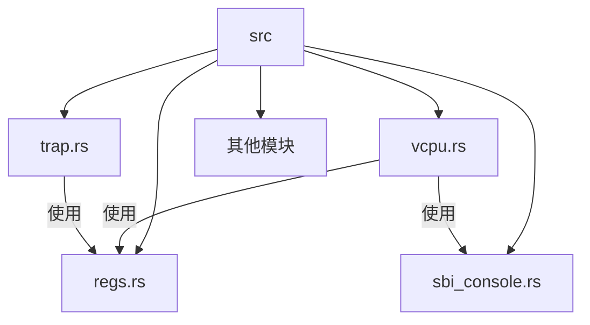
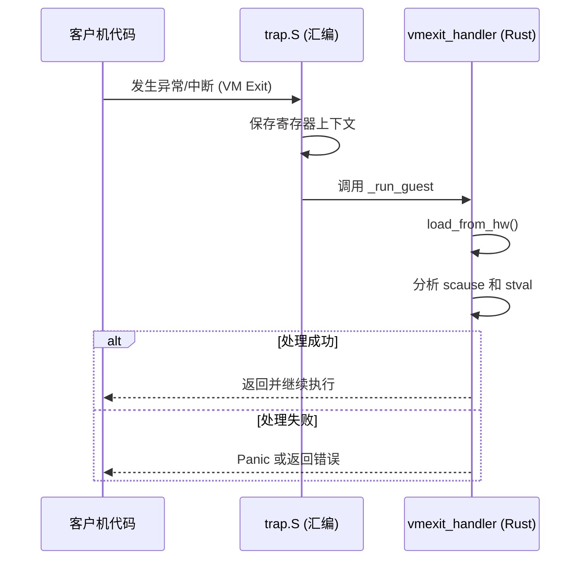
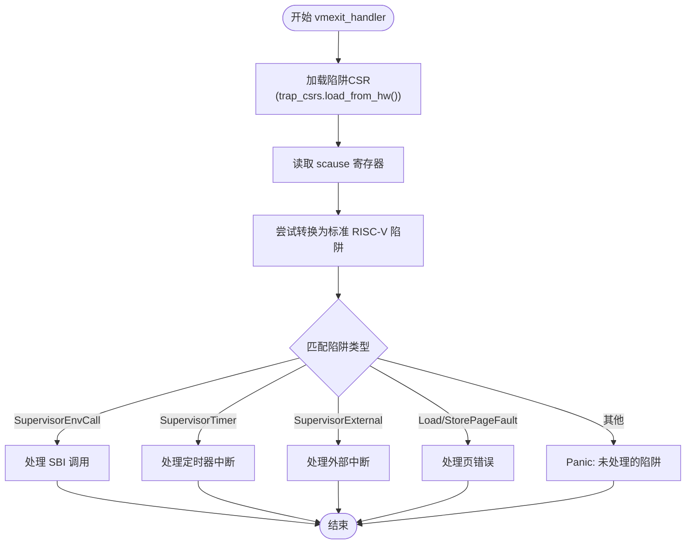
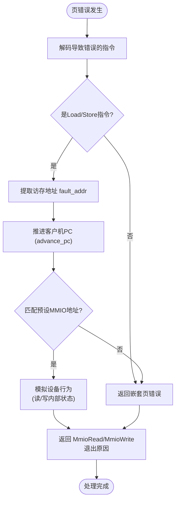
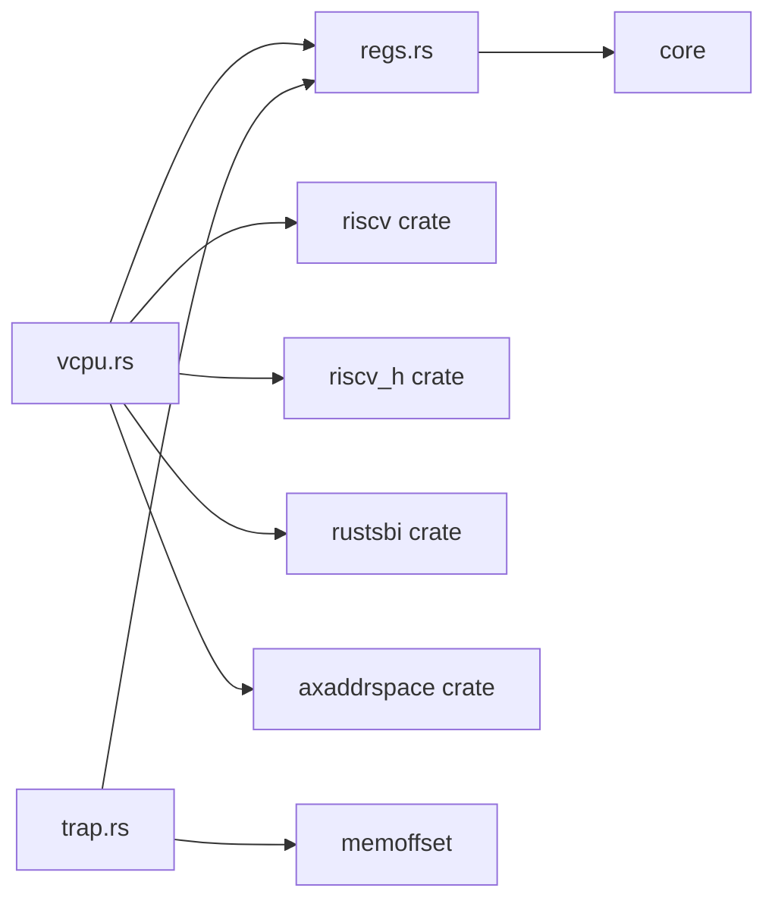

# VM退出处理扩展

<cite>
**本文档引用的文件**
- [vcpu.rs](file://src/vcpu.rs)
- [trap.rs](file://src/trap.rs)
- [regs.rs](file://src/regs.rs)
- [sbi_console.rs](file://src/sbi_console.rs)
</cite>

## 目录
1. [简介](#简介)
2. [项目结构](#项目结构)
3. [核心组件](#核心组件)
4. [架构概述](#架构概述)
5. [详细组件分析](#详细组件分析)
6. [依赖分析](#依赖分析)
7. [性能考虑](#性能考虑)
8. [故障排除指南](#故障排除指南)
9. [结论](#结论)

## 简介
本文档深入讲解如何扩展RISC-V虚拟CPU（vCPU）的VM退出处理机制，以支持新型异常或设备I/O拦截。重点分析`vcpu.rs`中的`vmexit_handler`函数及其match分支结构，演示如何安全地添加对新退出原因（如自定义设备访问、性能监控事件）的处理逻辑。结合`trap.rs`中的汇编偏移量计算，说明上下文保存与恢复的关键约束。提供具体示例：拦截特定MMIO地址范围并模拟设备响应，或注入虚拟中断。强调保持零成本抽象和最小化退出开销的最佳实践，并涵盖调试技巧。

## 项目结构
该项目是一个RISC-V架构的虚拟CPU实现，主要包含以下源文件：
- `src/vcpu.rs`: 核心vCPU实现，包含VM退出处理逻辑。
- `src/trap.rs`: 定义了陷入处理相关的汇编宏和偏移量计算。
- `src/regs.rs`: 定义了vCPU的寄存器状态结构。
- `src/sbi_console.rs`: SBI控制台扩展的常量和辅助函数。
- 其他文件如`consts.rs`, `guest_mem.rs`等提供基础功能。



**图示来源**
- [vcpu.rs](file://src/vcpu.rs)
- [trap.rs](file://src/trap.rs)
- [regs.rs](file://src/regs.rs)
- [sbi_console.rs](file://src/sbi_console.rs)

## 核心组件
核心组件包括`RISCVVCpu`结构体及其`vmexit_handler`方法，负责处理所有从客户机陷入到管理程序的事件。`VmCpuRegisters`结构体用于在硬件和软件之间保存和恢复完整的CPU状态。

**章节来源**
- [vcpu.rs](file://src/vcpu.rs#L0-L569)
- [regs.rs](file://src/regs.rs#L0-L252)

## 架构概述
系统采用分层架构，当客户机发生异常或中断时，硬件会触发VM退出（VM Exit），控制权转移到用汇编编写的陷入处理程序（`trap.S`）。该处理程序保存必要的上下文后，调用Rust编写的`_run_guest`函数，最终进入`vmexit_handler`进行具体的事件分发和处理。



**图示来源**
- [vcpu.rs](file://src/vcpu.rs#L169-L392)
- [trap.rs](file://src/trap.rs#L0-L102)

## 详细组件分析

### VM退出处理机制分析
`vmexit_handler`是整个vCPU的核心，它通过`scause`寄存器确定退出原因，并使用match表达式进行分发。

#### 异常与中断处理流程


**图示来源**
- [vcpu.rs](file://src/vcpu.rs#L169-L392)

#### 扩展SBI调用处理
为了支持新的SBI扩展，可以在`vmexit_handler`的`SupervisorEnvCall`分支中添加新的`match`子句。例如，可以添加一个自定义的EID来处理性能监控事件。

```rust
// 示例：添加新的SBI扩展处理
match extension_id {
    // ...现有处理...
    CUSTOM_EID_PERF => match function_id {
        PERF_START => {
            // 启动性能监控
            self.sbi_return(RET_SUCCESS, 0);
            return Ok(AxVCpuExitReason::Nothing);
        }
        PERF_STOP => {
            // 停止性能监控
            self.sbi_return(RET_SUCCESS, 0);
            return Ok(AxVCpuExitReason::Nothing);
        }
        _ => {
            self.sbi_return(RET_ERR_NOT_SUPPORTED, 0);
            return Ok(AxVCpuExitReason::Nothing);
        }
    },
    // ...默认转发...
}
```

**章节来源**
- [vcpu.rs](file://src/vcpu.rs#L185-L285)

### 设备I/O拦截与模拟
通过利用页错误（Page Fault）机制，可以拦截对特定内存映射I/O（MMIO）地址的访问。

#### MMIO拦截处理流程


**图示来源**
- [vcpu.rs](file://src/vcpu.rs#L490-L544)
- [regs.rs](file://src/regs.rs#L220-L252)

#### 上下文保存与恢复约束
`trap.rs`文件中的宏利用`memoffset`库精确计算了`VmCpuRegisters`结构体内各字段的偏移量。这些偏移量在汇编代码中被用来直接访问和保存寄存器，确保了上下文切换的高效性。

```rust
// 示例：计算寄存器偏移量
const fn guest_gpr_offset(index: GprIndex) -> usize {
    offset_of!(VmCpuRegisters, guest_regs)
        + offset_of!(GuestCpuState, gprs)
        + (index as usize) * size_of::<u64>()
}
```
此机制保证了Rust结构体布局与汇编代码的严格一致，是实现零成本抽象的关键。

**章节来源**
- [trap.rs](file://src/trap.rs#L0-L102)
- [regs.rs](file://src/regs.rs#L0-L252)

## 依赖分析
`RISCVVCpu`模块高度依赖于底层硬件抽象和寄存器操作库。



**图示来源**
- [vcpu.rs](file://src/vcpu.rs#L1-L50)
- [trap.rs](file://src/trap.rs#L1-L10)

## 性能考虑
- **最小化退出开销**: `vmexit_handler`的设计应尽可能轻量，避免复杂计算。对于高频事件（如定时器中断），处理逻辑应简洁。
- **零成本抽象**: 使用`const fn`和宏在编译期计算偏移量，避免运行时开销。
- **批处理**: 对于连续的MMIO访问，可以考虑在管理程序中缓存状态，减少陷入次数。
- **日志追踪**: 使用`trace!`宏记录退出频率和关键参数，有助于识别性能瓶颈。

## 故障排除指南
- **频繁的未知陷阱**: 检查`scause`值是否符合RISC-V特权架构规范，确认`hedeleg`/`hideleg`寄存器配置正确。
- **MMIO模拟不工作**: 确认目标地址确实映射到了页错误区域，并检查`handle_guest_page_fault`中的地址匹配逻辑。
- **上下文损坏**: 验证`trap.S`中的保存/恢复代码与`VmCpuRegisters`的内存布局完全匹配，可通过打印关键寄存器值进行调试。
- **性能低下**: 使用日志分析各类退出的频率，优化最频繁的退出路径。

**章节来源**
- [vcpu.rs](file://src/vcpu.rs#L169-L392)
- [vcpu.rs](file://src/vcpu.rs#L490-L544)

## 结论
扩展vCPU的VM退出处理机制需要深入理解RISC-V的虚拟化架构和当前代码库的设计。通过分析`vmexit_handler`的match结构，开发者可以安全地添加对新SBI扩展或设备I/O的拦截。利用页错误机制模拟MMIO设备是一种强大且灵活的方法。严格遵守上下文保存与恢复的约束，并遵循零成本抽象的原则，是构建高性能虚拟化解决方案的基础。持续的调试和性能分析对于维护系统的稳定性和效率至关重要。