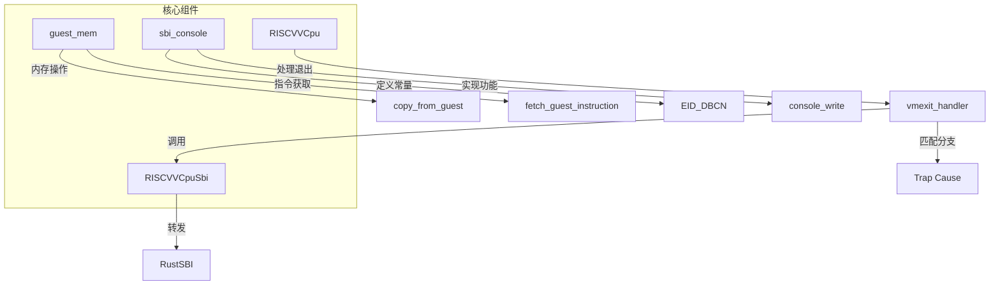

<cite>
**本文档中引用的文件**
- [vcpu.rs](file://src/vcpu.rs)
- [guest_mem.rs](file://src/guest_mem.rs)
- [sbi_console.rs](file://src/sbi_console.rs)
- [lib.rs](file://src/lib.rs)
</cite>

## 目录
1. [引言](#引言)
2. [核心架构与扩展点](#核心架构与扩展点)
3. [新增VM退出原因处理逻辑](#新增vm退出原因处理逻辑)
4. [实现自定义SBI扩展](#实现自定义sbi扩展)
5. [安全参数传递模式](#安全参数传递模式)
6. [保持no_std兼容性](#保持no_std兼容性)
7. [错误传播规范](#错误传播规范)
8. [完整示例：实现宿主机通信超调用](#完整示例实现宿主机通信超调用)
9. [结论](#结论)

## 引言

本文档旨在为开发者提供详细的指导，说明如何在RISC-V虚拟CPU（vCPU）环境中扩展功能。重点涵盖两个关键方面：添加新的虚拟机（VM）退出原因处理逻辑和实现自定义SBI（Supervisor Binary Interface）扩展。通过分析`vcpu.rs`中的`vmexit_handler`匹配分支结构，本文将演示如何安全地集成新型异常类型或设备I/O拦截机制。同时，文档将解释如何利用`axvcpu` trait来扩展架构特定行为，并在`RISCVVCpuSbi`结构体中注册新的SBI扩展ID。

此外，文档还将提供一个具体示例，展示如何实现一个用于宿主机通信的自定义超调用（Hypercall），包括使用`guest_mem`模块中的`copy_from_guest`进行安全参数传递的最佳实践。特别强调了在整个开发过程中保持`no_std`兼容性的重要性，避免引入标准库依赖。最后，文档将描述在新增EID_DBCN控制台扩展时应遵循的错误传播规范，确保与现有的RustSBI错误码体系保持一致。

## 核心架构与扩展点

本节概述了vCPU系统的核心组件及其主要扩展点，为后续的详细开发指南奠定基础。



**Diagram sources**
- [vcpu.rs](file://src/vcpu.rs#L1-L50)
- [sbi_console.rs](file://src/sbi_console.rs#L1-L10)

**Section sources**
- [vcpu.rs](file://src/vcpu.rs#L1-L100)
- [lib.rs](file://src/lib.rs#L1-L20)

## 新增VM退出原因处理逻辑

为了扩展vCPU的功能，开发者可以向`vmexit_handler`函数中添加新的VM退出原因处理逻辑。该函数是所有VM退出事件的中心处理程序，它根据`scause`寄存器的值来决定如何响应不同的陷阱（trap）。

### 扩展方法

1.  **识别退出原因**：首先，确定您希望处理的新的VM退出原因。这通常对应于一个新的异常或中断类型。
2.  **修改匹配分支**：在`vmexit_handler`的`match trap`语句中，添加一个新的分支来处理您的退出原因。例如，如果您想处理一个新的自定义异常，可以添加如下代码：
    ```rust
    // 示例伪代码，实际实现需在源文件中完成
    Trap::Exception(MyCustomException) => {
        // 处理自定义异常的逻辑
        Ok(AxVCpuExitReason::CustomEvent { data: ... })
    }
    ```
3.  **返回适当的退出原因**：处理完逻辑后，返回一个合适的`AxVCpuExitReason`枚举值，以便上层管理程序能够做出相应的决策。

此机制允许灵活地拦截和处理各种硬件事件，如页面错误、外部中断等，从而实现复杂的虚拟化功能。

**Section sources**
- [vcpu.rs](file://src/vcpu.rs#L200-L300)

## 实现自定义SBI扩展

SBI扩展是vCPU与宿主机之间进行高级交互的主要方式。通过实现自定义SBI扩展，可以创建专有的超调用接口。

### 注册新的SBI扩展ID

1.  **定义扩展ID (EID)**：选择一个唯一的32位数值作为您的扩展ID。建议使用ASCII字符的编码来提高可读性，例如`EID_HVC`被定义为`0x485643`，即"HVC"的ASCII码。
    - 参考路径：`[EID_HVC](file://src/lib.rs#L40-L45)`
2.  **在`vmexit_handler`中添加处理分支**：当`SupervisorEnvCall`异常发生时，`vmexit_handler`会检查`a7`寄存器中的`extension_id`。您需要在此处添加一个新的`match`分支来识别您的EID。
    ```rust
    match extension_id {
        // ... 其他已存在的EID ...
        MY_CUSTOM_EID => {
            // 调用专门的处理函数
            self.handle_my_custom_extension(function_id, param);
            self.advance_pc(4); // 安全地推进PC
            Ok(AxVCpuExitReason::Nothing)
        }
        _ => {
            // 默认转发给RustSBI
            let ret = self.sbi.handle_ecall(extension_id, function_id, param);
            self.set_gpr_from_gpr_index(GprIndex::A0, ret.error);
            self.set_gpr_from_gpr_index(GprIndex::A1, ret.value);
            self.advance_pc(4);
            Ok(AxVCpuExitReason::Nothing)
        }
    }
    ```
3.  **实现处理函数**：编写具体的逻辑来处理您的扩展调用。这可能涉及访问虚拟内存、与设备通信或执行其他特权操作。

通过这种方式，您可以无缝地将新的功能集成到现有的SBI框架中。

**Section sources**
- [vcpu.rs](file://src/vcpu.rs#L250-L350)
- [lib.rs](file://src/lib.rs#L40-L45)

## 安全参数传递模式

在实现SBI扩展时，安全地从客户机（guest）内存中读取参数至关重要。直接解引用客户机提供的指针是危险的，因为它可能导致宿主机崩溃或安全漏洞。

### 使用`guest_mem`模块

`guest_mem`模块提供了安全的内存访问原语，它们通过汇编代码在受控环境下执行内存操作。

1.  **`copy_from_guest`**：此函数用于将数据从客户机物理地址复制到宿主机内存。它内部会临时禁用客户机的虚拟地址转换（通过设置`vsatp`为0），从而将客户机物理地址（GPA）直接映射为客户机虚拟地址（GVA）进行访问。
    - 参考路径：`[copy_from_guest](file://src/guest_mem.rs#L50-L65)`
2.  **`fetch_guest_instruction`**：此函数用于从指定的客户机虚拟地址获取一条指令，对于模拟或调试非常有用。
    - 参考路径：`[fetch_guest_instruction](file://src/guest_mem.rs#L75-L80)`

#### 安全实践

- 始终使用这些封装好的函数，而不是直接进行内存访问。
- 在调用`copy_from_guest`之前，验证传入的长度和地址是否合理，以防止缓冲区溢出。
- 检查函数的返回值，确认复制的数据量是否符合预期。

**Section sources**
- [guest_mem.rs](file://src/guest_mem.rs#L1-L82)
- [vcpu.rs](file://src/vcpu.rs#L300-L320)

## 保持no_std兼容性

该项目明确声明了`#![no_std]`属性，这意味着它不能依赖于标准库（`std`），而必须使用核心库（`core`）和分配库（`alloc`）。

### 注意事项

1.  **避免标准库类型**：不要使用`std::vec::Vec`、`std::string::String`等。应使用`alloc::vec::Vec`和`alloc::string::String`。
    - 示例：`[alloc::vec![0u8; num_bytes as usize]](file://src/vcpu.rs#L305-L306)`
2.  **谨慎使用分配**：在`no_std`环境中，动态分配需要显式链接分配器。确保项目配置了合适的全局分配器。
3.  **使用`core`和`alloc`**：所有基础类型、宏和集合都应从`core`或`alloc`中导入。
4.  **内联汇编**：对于底层操作（如CSR访问），使用`core::arch`中的内联汇编是必要的且被允许的。

严格遵守`no_std`规则可以确保代码能够在资源受限的嵌入式环境或操作系统内核中运行。

**Section sources**
- [lib.rs](file://src/lib.rs#L1-L5)
- [vcpu.rs](file://src/vcpu.rs#L305-L306)

## 错误传播规范

当实现新的SBI扩展（如EID_DBCN）时，必须遵循统一的错误码体系，以便客户机能够正确理解和处理错误。

### RustSBI错误码体系

RustSBI定义了一套标准的错误码，这些码被编码在SBI调用的返回值中。

- `RET_SUCCESS` (`0`)：表示调用成功。
- `RET_ERR_FAILED` (`-1`)：表示调用因未知原因失败。
- `RET_ERR_NOT_SUPPORTED` (`-2`)：表示目标操作不被支持。

### 规范实践

1.  **定义清晰的错误码**：在`sbi_console.rs`中，这些常量被明确定义。
    - 参考路径：`[RET_SUCCESS](file://src/sbi_console.rs#L7-L9)`
2.  **在处理函数中设置返回值**：在您的SBI扩展处理逻辑末尾，使用`sbi_return`辅助函数或直接设置`a0`和`a1`寄存器来返回错误码和附加信息。
    ```rust
    // 示例：在控制台写入失败时
    if copied != buf.len() {
        self.sbi_return(RET_ERR_FAILED, 0);
    } else {
        self.sbi_return(RET_SUCCESS, ret.value);
    }
    ```
3.  **一致性**：始终使用这套预定义的错误码，避免引入新的、不兼容的错误码。

这确保了不同SBI扩展之间的行为一致性，简化了客户机软件的错误处理逻辑。

**Section sources**
- [sbi_console.rs](file://src/sbi_console.rs#L5-L15)
- [vcpu.rs](file://src/vcpu.rs#L315-L318)

## 完整示例：实现宿主机通信超调用

本节提供一个完整的示例，演示如何实现一个名为`EID_HOST_COMM`的自定义超调用，用于在客户机和宿主机之间进行通信。

### 步骤1：定义扩展ID和功能ID

在`lib.rs`中定义新的常量：
```rust
// 示例代码，实际修改应在源文件中进行
pub const EID_HOST_COMM: usize = 0x484F5354; // "HOST" in ASCII
pub const FID_SEND_MESSAGE: usize = 0;
pub const FID_RECEIVE_MESSAGE: usize = 1;
```

### 步骤2：扩展`vmexit_handler`

在`vcpu.rs`的`vmexit_handler`中，`SupervisorEnvCall`分支下添加对`EID_HOST_COMM`的处理：
```rust
match extension_id {
    // ... 其他分支 ...
    EID_HOST_COMM => match function_id {
        FID_SEND_MESSAGE => {
            let msg_len = param[0];
            let gpa = join_u64(param[1], param[2]);
            
            if msg_len > 0 && msg_len <= MAX_MSG_LEN {
                let mut buffer = alloc::vec![0u8; msg_len as usize];
                let copied = guest_mem::copy_from_guest(&mut buffer, GuestPhysAddr::from(gpa as usize));
                
                if copied == msg_len as usize {
                    // 将消息发送到宿主机的通信通道
                    host_comm_channel::send(&buffer).unwrap_or_else(|_| {
                        self.sbi_return(RET_ERR_FAILED, 0);
                        return Ok(AxVCpuExitReason::Nothing);
                    });
                    self.sbi_return(RET_SUCCESS, 0);
                } else {
                    self.sbi_return(RET_ERR_FAILED, 0);
                }
            } else {
                self.sbi_return(RET_ERR_FAILED, 0);
            }
            self.advance_pc(4);
            Ok(AxVCpuExitReason::Nothing)
        }
        FID_RECEIVE_MESSAGE => {
            // 类似地实现接收逻辑
            todo!()
        }
        _ => {
            self.sbi_return(RET_ERR_NOT_SUPPORTED, 0);
        }
    },
    // ... 默认转发 ...
}
```

### 步骤3：确保`no_std`兼容性

- 使用`alloc::vec!`进行动态分配。
- 确保`host_comm_channel`模块也是`no_std`兼容的。

### 步骤4：遵循错误传播

- 成功时返回`RET_SUCCESS`。
- 参数无效或操作失败时返回`RET_ERR_FAILED`。
- 调用未实现的功能时返回`RET_ERR_NOT_SUPPORTED`。

这个示例展示了如何将前述的所有概念——扩展ID注册、安全内存访问、`no_std`兼容性和错误传播——整合到一个实际的功能中。

**Section sources**
- [lib.rs](file://src/lib.rs#L40-L45)
- [vcpu.rs](file://src/vcpu.rs#L250-L350)
- [guest_mem.rs](file://src/guest_mem.rs#L50-L65)
- [sbi_console.rs](file://src/sbi_console.rs#L7-L9)

## 结论

本文档详细阐述了如何在RISC-V vCPU项目中进行功能扩展。通过深入分析`vmexit_handler`的结构，开发者可以安全地集成新的VM退出处理逻辑。通过理解`RISCVVCpuSbi`的实现和SBI调用流程，可以轻松注册和实现自定义的SBI扩展。利用`guest_mem`模块提供的安全原语，可以可靠地在宿主机和客户机之间传递数据。严格遵守`no_std`编程规范确保了代码的广泛适用性。最后，遵循统一的错误传播规范保证了系统的健壮性和互操作性。遵循这些指南，开发者可以自信地为vCPU平台添加复杂而强大的新功能。