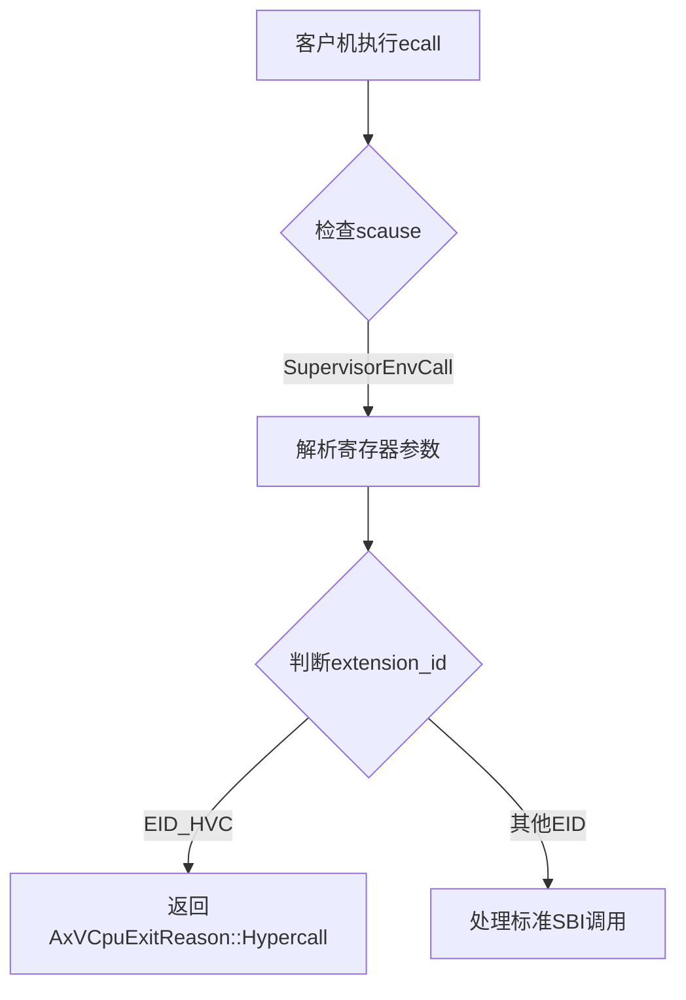
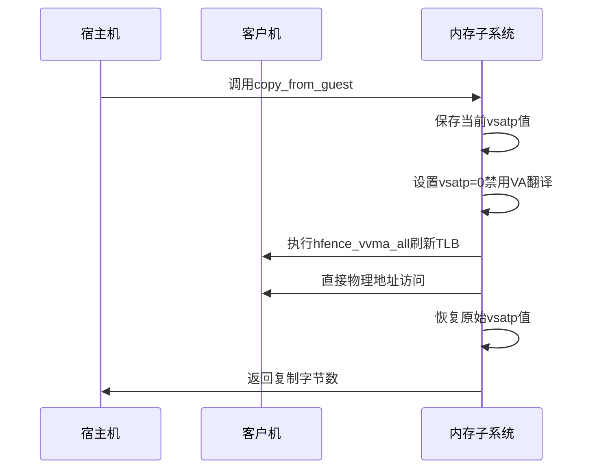
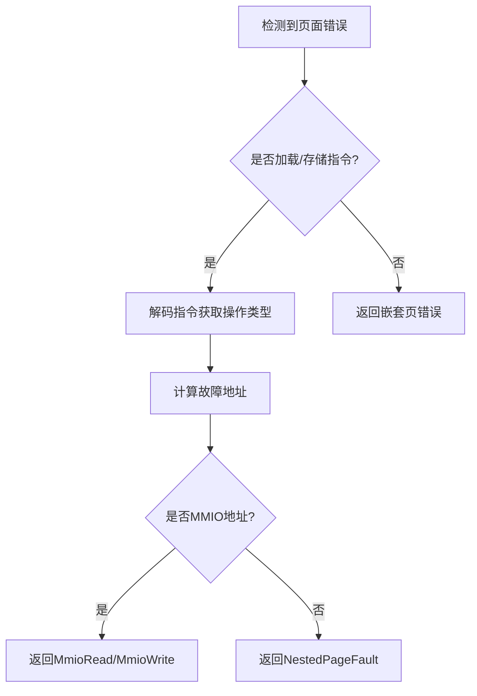
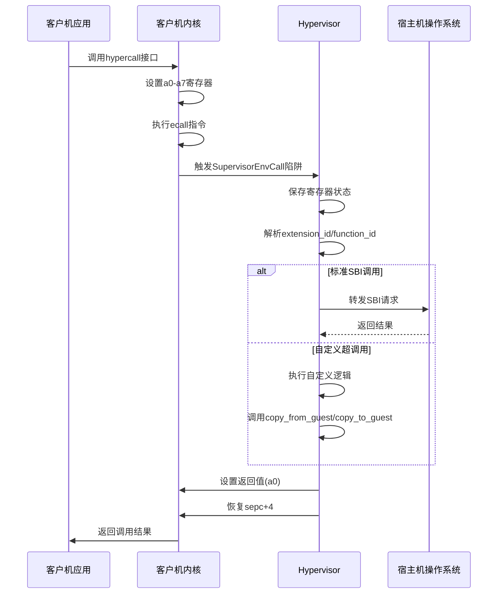

# 自定义超调用实现

<cite>
**Referenced Files in This Document**   
- [vcpu.rs](file://src/vcpu.rs)
- [guest_mem.rs](file://src/guest_mem.rs)
- [regs.rs](file://src/regs.rs)
- [lib.rs](file://src/lib.rs)
- [sbi_console.rs](file://src/sbi_console.rs)
</cite>

## 目录
1. [引言](#引言)
2. [核心机制分析](#核心机制分析)
3. [参数传递约定](#参数传递约定)
4. [安全数据交换实现](#安全数据交换实现)
5. [自定义超调用示例：HYPERCALL_LOG_MESSAGE](#自定义超调用示例：hypercall_log_message)
6. [异常处理与页错误](#异常处理与页错误)
7. [no_std兼容性保证](#no_std兼容性保证)
8. [完整工作流程](#完整工作流程)

## 引言

本文档详细指导开发者如何在RISC-V架构下实现安全高效的自定义超调用（Hypercall）机制，用于客户机（guest）与宿主机（host）之间的通信。基于`vcpu.rs`中的寄存器状态管理，说明如何通过a0-a7寄存器编码命令与参数进行约定。利用`guest_mem.rs`提供的`copy_from_guest`/`copy_to_guest`方法实现跨地址空间的安全数据交换，防止非法内存访问。文档提供完整实现示例，并强调保持no_std兼容性的重要性。

## 核心机制分析

### 超调用触发与识别

在RISC-V虚拟化环境中，超调用通过环境调用（Supervisor Env Call）陷阱触发。当客户机执行ecall指令时，控制权转移至hypervisor，由`vmexit_handler`函数处理该事件。



**Diagram sources**
- [vcpu.rs](file://src/vcpu.rs#L200-L290)

**Section sources**
- [vcpu.rs](file://src/vcpu.rs#L200-L290)

### 寄存器状态管理

`VmCpuRegisters`结构体统一管理虚拟CPU的所有寄存器状态，包括：
- `hyp_regs`: 宿主机HS模式下的寄存器状态
- `guest_regs`: 客户机VS模式下的寄存器状态
- `vs_csrs`: VS级控制状态寄存器
- `virtual_hs_csrs`: 虚拟化的HS级CSR
- `trap_csrs`: 陷入相关CSR

这些状态在VM进入/退出时自动保存和恢复，确保上下文完整性。

**Section sources**
- [regs.rs](file://src/regs.rs#L200-L250)

## 参数传递约定

### 寄存器分配方案

超调用采用标准化的寄存器参数传递方式，遵循RISC-V调用约定：

| 寄存器 | 用途 |
|--------|------|
| a0-a5 | 函数参数（param[0]-param[5]） |
| a6 | 功能ID（function_id） |
| a7 | 扩展ID（extension_id） |

这种设计允许扩展多种自定义超调用功能，同时保持接口一致性。

### 超调用标识符定义

系统使用特定的扩展ID（EID）来区分不同类型的超调用。对于自定义超调用，使用`EID_HVC`作为标识：

```rust
pub const EID_HVC: usize = 0x485643; // "HVC" ASCII码
```

此常量定义在`lib.rs`中，确保全局唯一性和可读性。

**Section sources**
- [lib.rs](file://src/lib.rs#L27)

## 安全数据交换实现

### 跨地址空间内存操作

`guest_mem.rs`模块提供了安全的跨地址空间数据交换原语：

#### 数据复制函数
- `copy_from_guest`: 从客户机物理地址复制数据到宿主机
- `copy_to_guest`: 从宿主机复制数据到客户机物理地址
- `fetch_guest_instruction`: 获取客户机虚拟地址处的指令

这些函数通过临时禁用客户机虚拟地址转换（设置vsatp为0）来直接访问物理内存，避免双重映射问题。



**Diagram sources**
- [guest_mem.rs](file://src/guest_mem.rs#L40-L80)

**Section sources**
- [guest_mem.rs](file://src/guest_mem.rs#L30-L80)

### 安全性保障措施

1. **地址转换隔离**：通过操纵`vsatp`寄存器实现地址空间隔离
2. **TLB刷新**：每次修改`vsatp`后执行`hfence_vvma_all`确保一致性
3. **长度验证**：返回实际复制的字节数，可用于边界检查
4. **无标准库依赖**：所有操作基于裸机环境实现

## 自定义超调用示例：HYPERCALL_LOG_MESSAGE

### 接口设计

定义新的超调用编号和参数结构：

```rust
// 在consts.rs中添加
pub const HYPERCALL_LOG_MESSAGE: usize = 0x1001;
```

客户机调用约定：
- a0: 日志消息缓冲区客户机物理地址低32位
- a1: 日志消息缓冲区客户机物理地址高32位
- a2: 消息长度
- a6: function_id = HYPERCALL_LOG_MESSAGE
- a7: extension_id = EID_HVC

### 宿主机处理逻辑

在`vmexit_handler`中添加对新超调用的支持：

```rust
match extension_id {
    EID_HVC => {
        match function_id {
            HYPERCALL_LOG_MESSAGE => {
                let gpa = join_u64(param[0], param[1]);
                let len = param[2];
                
                if len > 0 && len <= MAX_LOG_LEN {
                    let mut buffer = vec![0u8; len];
                    let copied = guest_mem::copy_from_guest(
                        &mut buffer,
                        GuestPhysAddr::from(gpa)
                    );
                    
                    if copied == len {
                        // 确保字符串以null结尾
                        let msg = String::from_utf8_lossy(&buffer);
                        info!("Guest Log: {}", msg);
                        self.sbi_return(RET_SUCCESS, 0);
                    } else {
                        self.sbi_return(RET_ERR_FAILED, 0);
                    }
                } else {
                    self.sbi_return(RET_ERR_INVALID_PARAM, 0);
                }
                
                return Ok(AxVCpuExitReason::Nothing);
            }
            _ => {
                self.advance_pc(4);
                return Ok(AxVCpuExitReason::Hypercall {
                    nr: function_id as _,
                    args: [param[0] as _, param[1] as _, ...],
                });
            }
        }
    }
    // 其他EID处理...
}
```

**Section sources**
- [vcpu.rs](file://src/vcpu.rs#L260-L280)

## 异常处理与页错误

### 页错误处理机制

当客户机访问未映射内存时，会触发页面错误异常。系统通过以下流程处理：



关键函数`handle_guest_page_fault`能够解析导致错误的具体指令，区分读写操作及数据宽度。

**Section sources**
- [vcpu.rs](file://src/vcpu.rs#L400-L480)

### 权限异常防护

所有客户机内存访问都经过严格的权限检查：
- 使用`MappingFlags`验证访问权限
- 通过`AccessWidth`确保数据对齐
- 在`copy_from_guest`/`copy_to_guest`中实施边界检查

任何非法访问都会被拦截并报告错误，防止越权操作。

## no_std兼容性保证

### 零依赖设计原则

整个超调用机制严格遵循no_std环境要求：

1. **禁止标准库导入**：模块头部声明`#![no_std]`
2. **使用alloc替代std collections**：仅依赖`alloc::vec![]`等
3. **避免动态分配**：尽可能使用栈分配或预分配缓冲区
4. **内联汇编支持**：通过`global_asm!`引入必要的汇编代码

### 关键实现细节

- `mem_extable.S`汇编文件提供底层内存操作支持
- 所有字符串操作使用`String::from_utf8_lossy`等no_std兼容方法
- 错误处理采用`AxResult`/`AxError`而非std::error::Error
- 日志输出依赖`log`宏而非标准打印函数

**Section sources**
- [guest_mem.rs](file://src/guest_mem.rs#L1-L10)

## 完整工作流程

### 超调用生命周期



**Diagram sources**
- [vcpu.rs](file://src/vcpu.rs#L200-L290)
- [guest_mem.rs](file://src/guest_mem.rs#L30-L80)

**Section sources**
- [vcpu.rs](file://src/vcpu.rs#L200-L290)