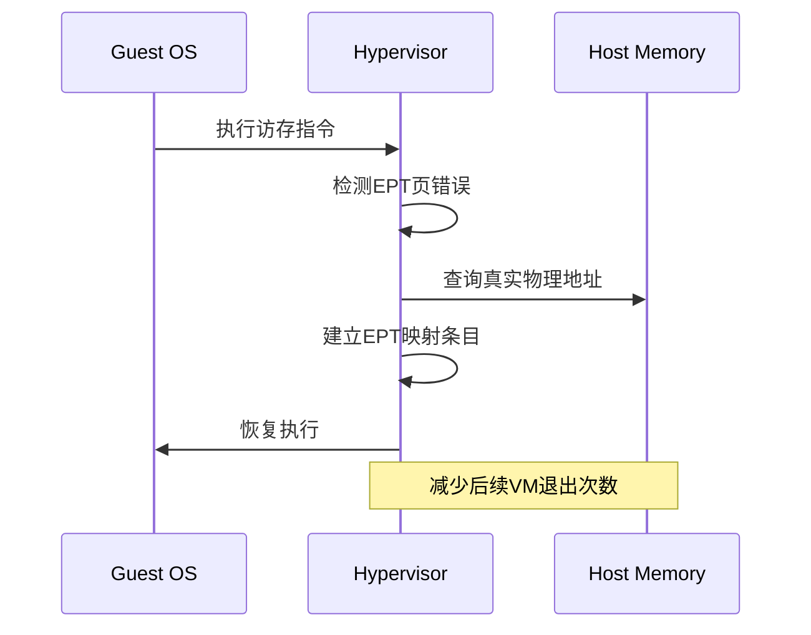

# 故障排查清单

<cite>
**本文档引用的文件**
- [vcpu.rs](file://src/vcpu.rs)
- [trap.rs](file://src/trap.rs)
- [regs.rs](file://src/regs.rs)
- [consts.rs](file://src/consts.rs)
- [guest_mem.rs](file://src/guest_mem.rs)
</cite>

## 目录
1. [启动失败检查项](#启动失败检查项)
2. [权限冲突诊断流程](#权限冲突诊断流程)
3. [频繁VM退出优化建议](#频繁vm退出优化建议)
4. [panic信息反向分析案例](#panic信息反向分析案例)

## 启动失败检查项

当guest OS无法正常启动时，需系统性验证以下关键寄存器状态和配置：

### 验证sepc是否正确初始化为目标地址
在虚拟CPU创建过程中，`set_entry`方法负责将guest OS的入口点地址写入`sepc`（Supervisor Exception Program Counter）寄存器。该操作确保guest OS从正确的物理地址开始执行。

**Section sources**
- [vcpu.rs](file://src/vcpu.rs#L89-L93)

### 确认hstatus.SPVP位已设置以允许HS模式访问VS内存空间
`hstatus`寄存器中的SPVP（Supervisor Previous Virtual Privilege）位必须被置位，以允许HS模式代码安全访问VS模式的内存空间。此配置在`setup`方法中通过调用`hstatus.set_spvp(true)`完成。

**Section sources**
- [vcpu.rs](file://src/vcpu.rs#L75-L80)

### 检查hgatp页表根配置有效性
`hgatp`（Hypervisor Guest Address Translation and Protection）寄存器存储了guest OS页表的根节点物理地址。其格式为[63:60]位表示模式（通常为8代表Sv39），[59:12]位为页表基址。该值通过`set_ept_root`方法配置，并在`bind`时通过`csrw hgatp`指令加载到硬件。

**Section sources**
- [vcpu.rs](file://src/vcpu.rs#L95-L99)
- [vcpu.rs](file://src/vcpu.rs#L115-L120)

## 权限冲突诊断流程

针对由`scause`异常码引发的权限冲突问题，采用基于决策树的系统化分析流程：

```mermaid
flowchart TD
A["解析scause值"] --> B{scause & 0x80000000}
B --> |0| C["异常类型"]
B --> |非0| D["中断类型"]
C --> E{scause[3:0]}
E --> |0| F["指令地址未对齐"]
E --> |1| G["指令访问错误"]
E --> |2| H["非法指令"]
E --> |3| I["断点"]
E --> |4| J["加载地址未对齐"]
E --> |5| K["加载访问错误"]
E --> |6| L["存储地址未对齐"]
E --> |7| M["存储访问错误"]
E --> |8| N["U/VU模式环境调用"]
E --> |9| O["HS模式环境调用"]
E --> |10| P["VS模式环境调用"]
E --> |11| Q["M模式环境调用"]
E --> |12| R["指令页错误"]
E --> |13| S["加载页错误"]
E --> |15| T["存储页错误"]
D --> U{scause[31:0]}
U --> |1| V["用户软件中断"]
U --> |5| W["监督者定时器中断"]
U --> |9| X["监督者外部中断"]
style A fill:#f9f,stroke:#333
style B fill:#bbf,stroke:#333,color:#fff
style C fill:#f96,stroke:#333
style D fill:#f96,stroke:#333
```

**Diagram sources**
- [consts.rs](file://src/consts.rs#L15-L68)

## 频繁VM退出优化建议

对于因频繁VM退出导致性能下降的情况，应采取以下监控与优化措施：

### 监控SBI调用频率
通过在`vmexit_handler`中捕获`SupervisorEnvCall`类型的异常，可统计SBI（Supervisor Binary Interface）调用频次。高频调用可能表明guest OS过度依赖主机服务，建议评估是否存在可批处理的操作或需要本地化的功能。

**Section sources**
- [vcpu.rs](file://src/vcpu.rs#L133-L135)

### 优化EPT预映射策略
利用`handle_guest_page_fault`机制，在首次发生guest页错误时即建立永久映射，避免重复的VM退出开销。结合`gpt_page_fault_addr`获取故障物理地址，实现热点内存区域的主动预映射。



**Diagram sources**
- [vcpu.rs](file://src/vcpu.rs#L347-L349)
- [regs.rs](file://src/regs.rs#L235-L242)

## panic信息反向分析案例

当系统出现panic时，可通过以下步骤从错误信息反推硬件状态：

1. **定位panic上下文**：根据panic输出的`scause`、`sepc`和`stval`值确定异常类型和触发位置。
2. **解析异常原因**：对照`scause`定义表判断是页错误、非法指令还是其他异常。
3. **追踪指令流**：使用`sepc`作为虚拟地址，通过`fetch_guest_instruction`获取出错指令的原始编码。
4. **分析内存访问**：若为页错误，结合`htval`和`stval`计算真实的guest物理故障地址。
5. **验证寄存器状态**：检查`hstatus`、`vsstatus`等控制状态寄存器的配置是否符合预期。

例如，当出现"Unhandled trap" panic且`scause=15`时，表示发生了存储页错误。此时应检查`stval`是否指向合法的设备MMIO区域，或是由于EPT配置缺失导致的映射失败。

**Section sources**
- [vcpu.rs](file://src/vcpu.rs#L389-L395)
- [guest_mem.rs](file://src/guest_mem.rs#L78-L80)