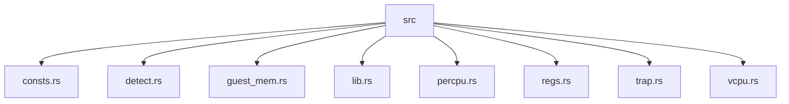
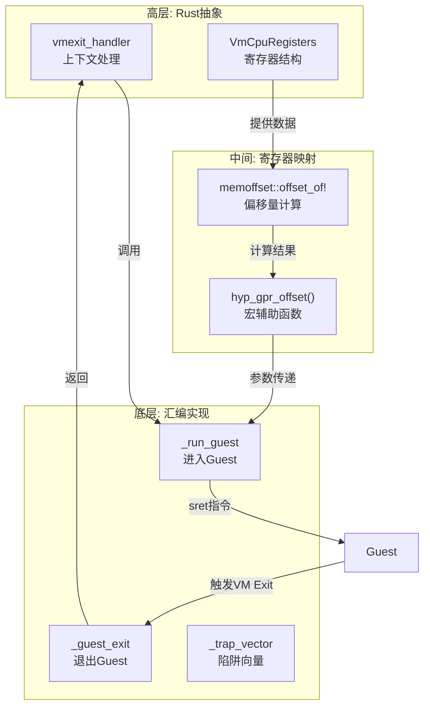
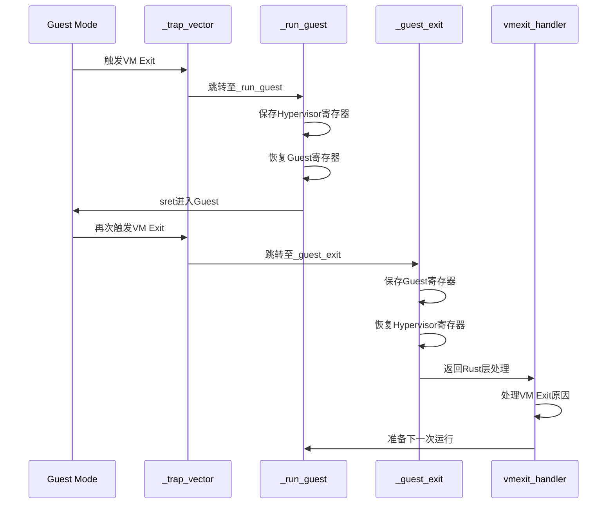
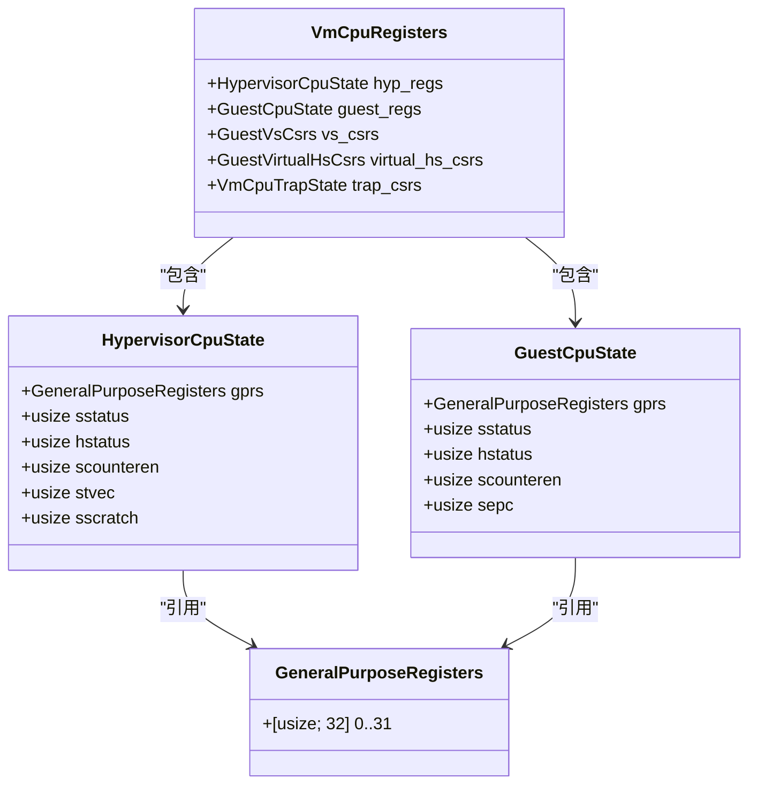
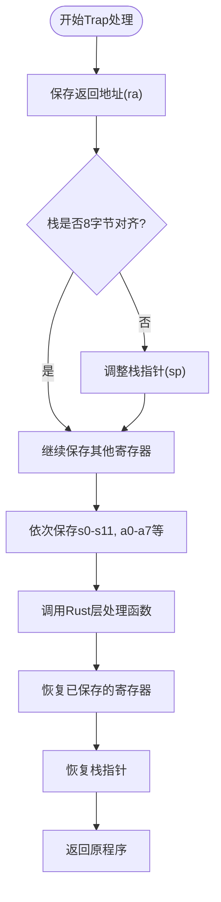
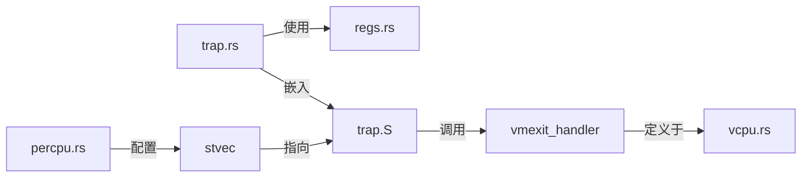

# 断点调试技术

<cite>
**Referenced Files in This Document **   
- [trap.rs](file://src/trap.rs)
- [regs.rs](file://src/regs.rs)
- [trap.S](file://src/trap.S)
- [percpu.rs](file://src/percpu.rs)
</cite>

## 目录
1. [引言](#引言)
2. [项目结构](#项目结构)
3. [核心组件](#核心组件)
4. [架构概述](#架构概述)
5. [详细组件分析](#详细组件分析)
6. [依赖分析](#依赖分析)
7. [性能考虑](#性能考虑)
8. [故障排除指南](#故障排除指南)
9. [结论](#结论)

## 引言

本文档旨在为开发者提供一套完整的汇编与高级语言协同调试指南，重点描述在RISC-V虚拟化环境中如何进行底层调试。文档聚焦于_trap_vector汇编入口函数的硬件断点设置方法，并深入解析其与Rust层_vmexit_handler处理逻辑的关联机制。通过本指南，开发者将掌握利用memoffset库计算GPR寄存器在VmCpuRegisters结构中偏移量的技术，实现对CPU上下文的精确检查。同时，指导开发者在QEMU+GDB环境下分析_trap_vector跳转时的栈帧对齐问题，特别是hypervisor与guest模式间寄存器保存/恢复过程的可视化分析。

## 项目结构

该项目是一个基于RISC-V架构的虚拟CPU实现，采用Rust语言编写，包含底层汇编代码与高层抽象的结合。整体结构清晰地分离了常量定义、寄存器管理、陷阱处理和CPU核心功能等模块。

**Diagram sources**
- [src/consts.rs](file://src/consts.rs)
- [src/detect.rs](file://src/detect.rs)
- [src/guest_mem.rs](file://src/guest_mem.rs)
- [src/lib.rs](file://src/lib.rs)
- [src/percpu.rs](file://src/percpu.rs)
- [src/regs.rs](file://src/regs.rs)
- [src/trap.rs](file://src/trap.rs)
- [src/vcpu.rs](file://src/vcpu.rs)

**Section sources**
- [src/consts.rs](file://src/consts.rs)
- [src/detect.rs](file://src/detect.rs)
- [src/guest_mem.rs](file://src/guest_mem.rs)
- [src/lib.rs](file://src/lib.rs)
- [src/percpu.rs](file://src/percpu.rs)
- [src/regs.rs](file://src/regs.rs)
- [src/trap.rs](file://src/trap.rs)
- [src/vcpu.rs](file://src/vcpu.rs)

## 核心组件

系统的核心组件包括用于管理CPU寄存器状态的`VmCpuRegisters`结构体、负责陷阱处理的`trap.rs`模块以及实现底层汇编跳转的`trap.S`文件。这些组件共同构成了虚拟化环境下的上下文切换和异常处理机制。

**Section sources**
- [src/regs.rs](file://src/regs.rs#L200-L252)
- [src/trap.rs](file://src/trap.rs#L0-L44)
- [src/trap.S](file://src/trap.S#L0-L182)

## 架构概述

该系统的架构设计围绕RISC-V虚拟化扩展(Hypervisor Extension)构建，实现了从hypervisor模式到guest模式的安全切换。整体架构分为三个主要层次：高层Rust抽象层、中间寄存器管理层和底层汇编执行层。

**Diagram sources**
- [src/regs.rs](file://src/regs.rs#L200-L252)
- [src/trap.rs](file://src/trap.rs#L0-L44)
- [src/trap.S](file://src/trap.S#L0-L182)

## 详细组件分析

### Trap处理机制分析

Trap处理机制是整个虚拟化系统的核心，它负责在hypervisor和guest之间安全地切换执行上下文。该机制通过精心设计的汇编代码与Rust代码协同工作，确保所有必要的寄存器状态都能被正确保存和恢复。

#### 汇编与Rust交互流程

**Diagram sources**
- [src/trap.S](file://src/trap.S#L0-L182)
- [src/trap.rs](file://src/trap.rs#L0-L44)

**Section sources**
- [src/trap.S](file://src/trap.S#L0-L182)
- [src/trap.rs](file://src/trap.rs#L0-L44)

### 寄存器偏移量计算分析

寄存器偏移量的精确计算是实现高效上下文切换的关键。系统使用`memoffset`库提供的`offset_of!`宏来静态计算各个寄存器在`VmCpuRegisters`结构中的内存偏移位置。

#### VmCpuRegisters结构关系图

**Diagram sources**
- [src/regs.rs](file://src/regs.rs#L100-L252)

**Section sources**
- [src/regs.rs](file://src/regs.rs#L100-L252)
- [src/trap.rs](file://src/trap.rs#L5-L25)

### 栈帧对齐与调试分析

在QEMU+GDB环境下调试_trap_vector跳转时，栈帧对齐问题是需要特别关注的重点。正确的栈对齐保证了函数调用约定的遵守和数据访问的正确性。

#### Trap向量栈操作流程

**Diagram sources**
- [src/detect.rs](file://src/detect.rs#L133-L188)
- [src/detect.rs](file://src/detect.rs#L185-L236)

**Section sources**
- [src/detect.rs](file://src/detect.rs#L133-L236)

## 依赖分析

系统各组件之间的依赖关系体现了清晰的分层设计理念。高层Rust代码依赖于底层汇编实现，而汇编代码则通过符号链接依赖于Rust定义的数据结构。

**Diagram sources**
- [src/trap.rs](file://src/trap.rs#L3)
- [src/regs.rs](file://src/regs.rs)
- [src/percpu.rs](file://src/percpu.rs#L20-L30)

**Section sources**
- [src/trap.rs](file://src/trap.rs#L1-L10)
- [src/percpu.rs](file://src/percpu.rs#L20-L30)

## 性能考虑

在虚拟化环境中，上下文切换的性能至关重要。每次VM Entry和VM Exit都会带来一定的开销，因此优化寄存器保存/恢复过程对于提高整体性能具有重要意义。

- **最小化保存范围**：仅保存必要的寄存器，避免不必要的内存操作
- **批量操作**：尽可能使用连续的内存访问模式，提高缓存效率
- **静态计算偏移**：使用编译期计算的偏移量，避免运行时计算开销
- **减少分支**：简化条件判断，保持代码路径的线性度

## 故障排除指南

当遇到调试问题时，可以按照以下步骤进行排查：

1. 确认_trap_vector是否正确加载到stvec寄存器
2. 检查栈指针(sp)是否保持正确的对齐方式
3. 验证VmCpuRegisters结构体的内存布局是否符合预期
4. 确保所有使用的寄存器偏移量都已通过memoffset正确计算
5. 在QEMU+GDB中设置断点，逐步跟踪_run_guest和_guest_exit的执行流程

**Section sources**
- [src/percpu.rs](file://src/percpu.rs#L20-L30)
- [src/trap.S](file://src/trap.S#L0-L182)

## 结论

本文档详细阐述了RISC-V虚拟化环境下的断点调试技术，涵盖了从汇编层到Rust层的完整调试链条。通过理解_trap_vector的工作原理、掌握VmCpuRegisters结构的内存布局以及熟悉QEMU+GDB的调试技巧，开发者能够有效地诊断和解决复杂的虚拟化相关问题。这种汇编与高级语言协同调试的方法不仅适用于当前项目，也为类似底层系统开发提供了有价值的参考。