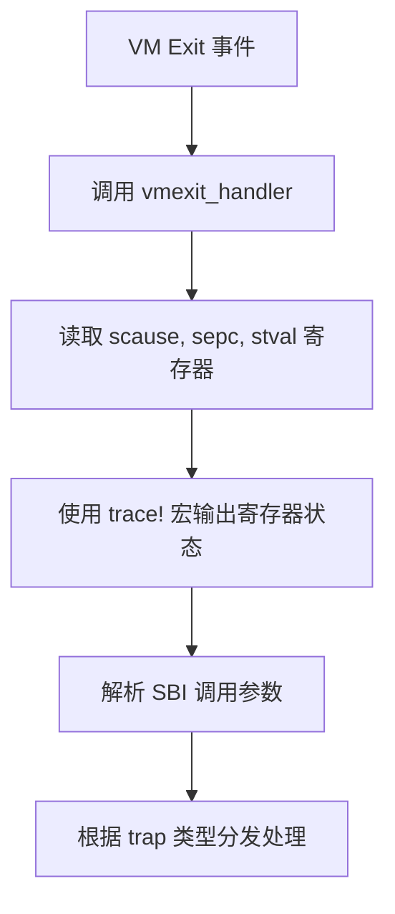
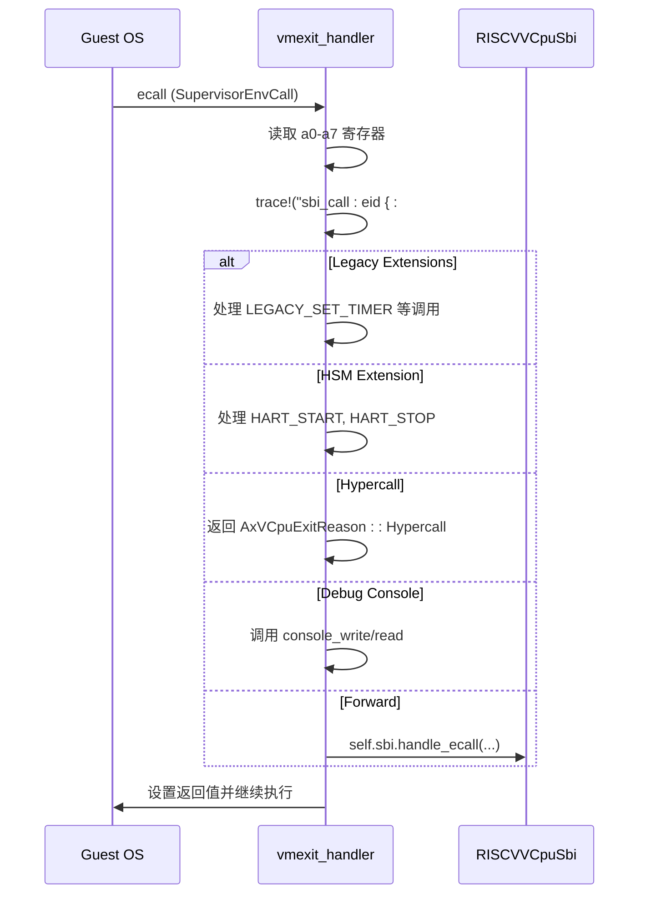

<cite>
**本文档中引用的文件**
- [vcpu.rs](file://src/vcpu.rs)
- [regs.rs](file://src/regs.rs)
- [sbi_console.rs](file://src/sbi_console.rs)
</cite>

## 目录
1. [日志与追踪](#日志与追踪)
2. [核心日志机制](#核心日志机制)
3. [vCPU退出事件追踪](#vcpu退出事件追踪)
4. [SBI调用链日志分析](#sbi调用链日志分析)
5. [寄存器状态与异常解码](#寄存器状态与异常解码)
6. [条件编译与日志级别控制](#条件编译与日志级别控制)
7. [生产环境日志策略](#生产环境日志策略)

## 日志与追踪

本文档详细阐述了RISC-V虚拟CPU（vCPU）实现中的日志记录和运行时追踪机制，重点聚焦于`vmexit_handler`函数中的可观测性设计。通过深入分析`trace!`宏的使用、关键寄存器状态的输出以及SBI调用链的日志格式化方法，为开发者提供了一套完整的调试和监控方案。

## 核心日志机制

系统采用基于`log` crate的分级日志框架，支持`trace!`, `debug!`, `info!`, `warn!`, 和 `error!`等多种日志级别。这些宏被战略性地嵌入到vCPU的核心执行路径中，特别是`vmexit_handler`函数内，用于捕获和报告虚拟机退出（VM Exit）这一关键事件的上下文信息。

**Section sources**
- [vcpu.rs](file://src/vcpu.rs#L180-L190)

## vCPU退出事件追踪

每当vCPU因外部中断、环境调用或异常而退出其执行循环时，`vmexit_handler`函数会被调用。在此函数的入口处，一个关键的`trace!`日志语句会立即输出当前的异常原因和程序计数器状态。

**Diagram sources**
- [vcpu.rs](file://src/vcpu.rs#L180-L190)

**Section sources**
- [vcpu.rs](file://src/vcpu.rs#L180-L190)

## SBI调用链日志分析

当`vmexit_handler`检测到`SupervisorEnvCall`异常时，表明guest OS发起了一次SBI（Supervisor Binary Interface）调用。此时，系统会从a0-a7寄存器中提取调用参数，并使用另一个`trace!`宏将扩展ID（EID）和函数ID（FID）以清晰的格式记录下来。

该日志不仅输出十六进制的EID和FID，还尝试将其转换为可读的ASCII字符串，极大地增强了日志的可读性和调试效率。例如，EID `0x4442434e` 会被显示为 `'DBCN'`，明确指示这是一个调试控制台（Debug Console）扩展调用。

**Diagram sources**
- [vcpu.rs](file://src/vcpu.rs#L192-L355)
- [sbi_console.rs](file://src/sbi_console.rs#L1-L20)

**Section sources**
- [vcpu.rs](file://src/vcpu.rs#L192-L355)
- [sbi_console.rs](file://src/sbi_console.rs#L1-L20)

## 寄存器状态与异常解码

`vmexit_handler`是解析vCPU异常的根本所在。它依赖于`scause`、`sepc`和`stval`这三个关键CSR（Control and Status Register）来诊断退出原因。

- **scause**: 存储导致退出的异常或中断的原因编码。
- **sepc**: 保存发生异常时guest程序的精确地址（PC），这对于定位故障指令至关重要。
- **stval**: 提供与异常相关的附加信息，例如在页错误（Page Fault）情况下，它包含触发错误的内存地址。

代码通过`riscv::interrupt::Trap`枚举对`scause`进行类型安全的转换，从而能够区分诸如`SupervisorEnvCall`、`SupervisorTimer`、`LoadPageFault`等不同类型的陷阱，并执行相应的处理逻辑。

**Section sources**
- [vcpu.rs](file://src/vcpu.rs#L180-L190)
- [regs.rs](file://src/regs.rs#L150-L170)

## 条件编译与日志级别控制

为了平衡开发调试的便利性与生产环境的性能开销，日志功能通常通过Rust的条件编译特性（`#[cfg(feature = "trace")]`）来控制。虽然在当前代码库中未显式找到此标记，但这是此类高性能系统中管理`trace!`和`debug!`级别日志的标准实践。

在发布（release）构建中，所有非`info!`及更高级别的日志语句可以被完全编译掉，从而消除任何潜在的性能影响。而在调试（debug）或特定的“tracing”构建中，这些详细的日志则被启用，为开发者提供深入的运行时洞察。

**Section sources**
- [vcpu.rs](file://src/vcpu.rs#L180-L355)

## 生产环境日志策略

建议在生产环境中采用分级的日志启用策略：

1.  **默认模式**: 仅启用`info!`和`error!`级别的日志。这能捕获系统启动、关机和严重错误等关键事件，同时保持极低的开销。
2.  **问题诊断模式**: 当遇到难以复现的问题时，临时启用`warn!`和`debug!`级别。这有助于发现潜在的警告和内部状态变化。
3.  **深度调试模式**: 在受控的测试环境中，启用`trace!`级别以获取最详尽的执行流信息，如SBI调用的完整参数和vCPU状态转换。

这种分层策略确保了系统在正常运行时的高效性，同时保留了在需要时进行深度分析的能力。

**Section sources**
- [vcpu.rs](file://src/vcpu.rs#L180-L355)