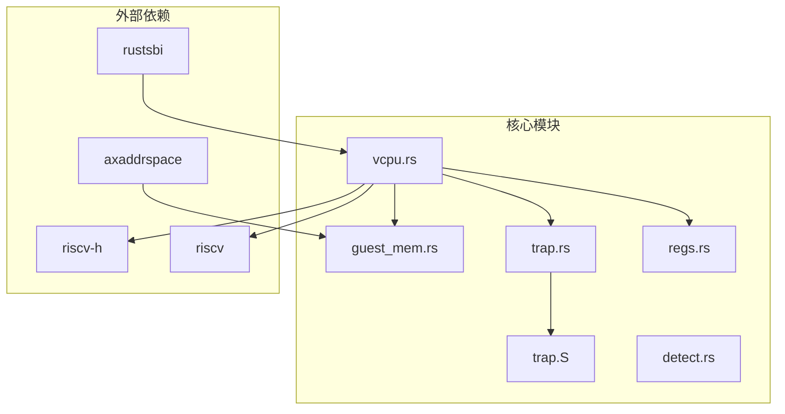
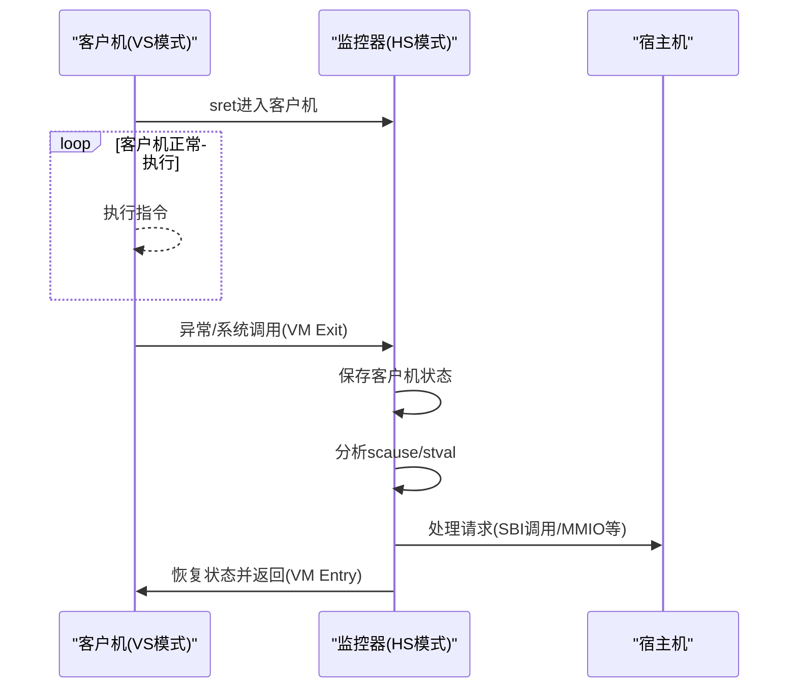
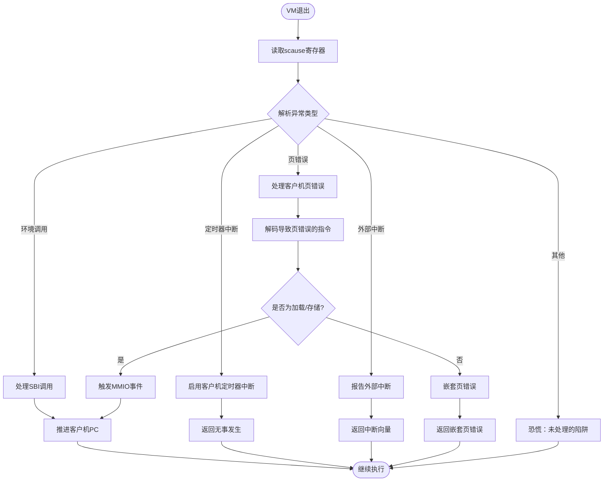
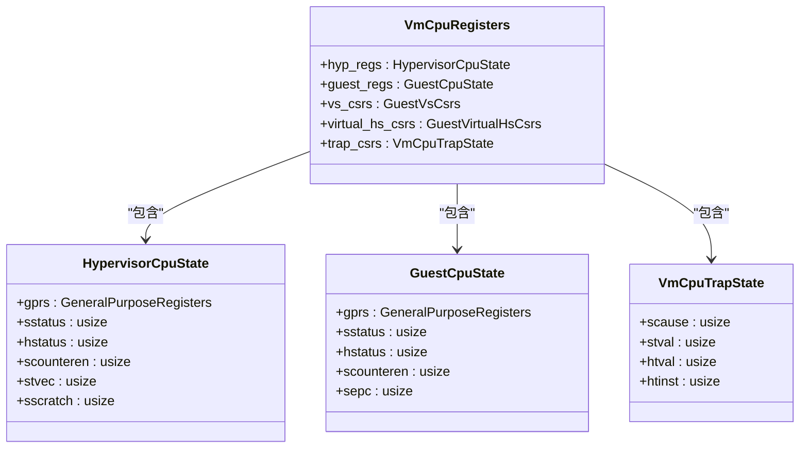
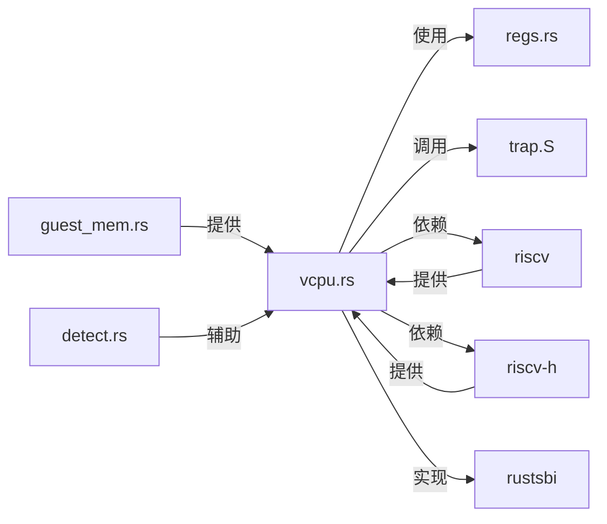

# 调试技巧

<cite>
**本文档引用的文件**
- [vcpu.rs](file://src/vcpu.rs)
- [trap.rs](file://src/trap.rs)
- [regs.rs](file://src/regs.rs)
- [trap.S](file://src/trap.S)
- [detect.rs](file://src/detect.rs)
- [guest_mem.rs](file://src/guest_mem.rs)
</cite>

## 目录
1. [引言](#引言)
2. [项目结构](#项目结构)
3. [核心组件](#核心组件)
4. [架构概述](#架构概述)
5. [详细组件分析](#详细组件分析)
6. [依赖分析](#依赖分析)
7. [性能考虑](#性能考虑)
8. [故障排查指南](#故障排查指南)
9. [结论](#结论)

## 引言
本文档旨在为RISC-V虚拟CPU（vCPU）环境提供全面的调试实践指导，重点解决vCPU执行流的可观测性与稳定性问题。文档涵盖如何利用`trace!`宏追踪VM退出事件链、解析`scause`和`stval`寄存器以定位异常根源、在汇编层设置断点并关联高级别Rust代码的经验，以及使用QEMU+GDB进行远程调试的方法。同时提供常见故障的排查清单和日志分级策略建议。

## 项目结构
本项目采用模块化设计，主要包含虚拟CPU管理、寄存器状态维护、陷阱处理、内存访问及硬件扩展检测等核心功能模块。各模块通过清晰的接口协作，实现对RISC-V vCPU的完整控制与调试支持。

**Diagram sources**
- [vcpu.rs](file://src/vcpu.rs#L1-L50)
- [regs.rs](file://src/regs.rs#L1-L30)
- [trap.rs](file://src/trap.rs#L1-L20)

**Section sources**
- [vcpu.rs](file://src/vcpu.rs#L1-L50)
- [regs.rs](file://src/regs.rs#L1-L30)
- [trap.rs](file://src/trap.rs#L1-L20)

## 核心组件
本节深入分析vCPU调试相关的几个关键组件：`vcpu.rs`中的VM退出处理逻辑、`trap.rs`中定义的寄存器偏移量与汇编入口、`regs.rs`中定义的CPU状态结构体，以及`trap.S`汇编代码中实现的上下文切换机制。

**Section sources**
- [vcpu.rs](file://src/vcpu.rs#L180-L250)
- [trap.rs](file://src/trap.rs#L1-L50)
- [regs.rs](file://src/regs.rs#L1-L100)

## 架构概述
系统整体架构围绕RISC-V特权架构构建，通过HS级（Hypervisor Supervisor Mode）运行虚拟机监控器，管理多个VS级（Virtual Supervisor Mode）的客户机。当客户机发生异常或需要服务时，控制权转移至HS级处理程序，完成相应操作后返回客户机继续执行。

**Diagram sources**
- [vcpu.rs](file://src/vcpu.rs#L180-L250)
- [trap.S](file://src/trap.S#L1-L180)

## 详细组件分析

### VM退出事件追踪与异常诊断
通过`trace!`宏记录每次VM退出的关键信息，包括`scause`、`sepc`和`stval`，是诊断问题的第一步。这些信息帮助开发者理解退出原因、发生位置及附加数据。

#### VM退出处理流程

**Diagram sources**
- [vcpu.rs](file://src/vcpu.rs#L180-L300)

**Section sources**
- [vcpu.rs](file://src/vcpu.rs#L180-L300)

### trap.S汇编层断点设置与栈帧对齐
在`_run_guest`和`_guest_exit`处设置断点，可精确观察上下文切换过程。特别注意`sscratch`寄存器用于交换`a0`（指向`VmCpuRegisters`），确保栈帧正确对齐。

#### 上下文保存与恢复流程

**Diagram sources**
- [regs.rs](file://src/regs.rs#L100-L250)
- [trap.S](file://src/trap.S#L1-L180)

**Section sources**
- [regs.rs](file://src/regs.rs#L100-L250)
- [trap.S](file://src/trap.S#L1-L180)

### 常见故障排查清单
针对典型问题提供快速诊断路径。

#### 故障排查表
| 问题现象 | 可能原因 | 检查点 | 解决方案 |
|---------|--------|-------|--------|
| Guest无法启动 | sepc初始化错误 | `set_entry()`调用 | 确保入口地址正确且对齐 |
| 权限冲突导致崩溃 | hstatus.SPVP位配置错误 | `setup()`中hstatus设置 | 确认SPVP位已置位以允许HS模式访问VS内存 |
| SBI调用失败 | 扩展ID不支持 | `vmexit_handler`分支逻辑 | 添加对应EID处理或转发至RustSBI |
| MMIO访问异常 | 页错误处理不当 | `handle_guest_page_fault()` | 验证指令解码与MMIO宽度匹配 |

**Section sources**
- [vcpu.rs](file://src/vcpu.rs#L100-L150)
- [vcpu.rs](file://src/vcpu.rs#L300-L400)

## 依赖分析
项目依赖于多个底层库协同工作，形成完整的调试能力。

**Diagram sources**
- [Cargo.toml](file://Cargo.toml#L1-L20)
- [vcpu.rs](file://src/vcpu.rs#L1-L20)

**Section sources**
- [Cargo.toml](file://Cargo.toml#L1-L20)
- [vcpu.rs](file://src/vcpu.rs#L1-L20)

## 性能考虑
虽然详细的`trace!`日志有助于调试，但会显著增加运行时开销。建议采用分级日志策略，在开发阶段启用详细日志，生产环境中仅保留关键事件记录。

## 故障排查指南
当遇到vCPU相关问题时，遵循以下步骤进行系统性排查：

1. **确认基本配置**：检查`VCpuConfig`、`RISCVVCpuCreateConfig`等初始化参数是否正确。
2. **验证寄存器状态**：在`_run_guest`前后打印`VmCpuRegisters`内容，确保上下文切换无误。
3. **分析退出原因**：查看`trace!`输出的`scause`值，对照RISC-V规范确定异常类型。
4. **检查内存映射**：若涉及页错误，确认EPT（扩展页表）配置正确，物理地址可访问。
5. **使用GDB调试**：结合QEMU的GDB stub，在关键汇编指令处设置断点，单步跟踪执行流。

**Section sources**
- [vcpu.rs](file://src/vcpu.rs#L180-L250)
- [trap.S](file://src/trap.S#L1-L180)

## 结论
通过对vCPU执行流的深入观测与精准控制，结合有效的日志记录与调试工具，可以高效诊断并解决虚拟化环境中的复杂问题。掌握`trace!`宏的使用、理解`scause`/`stval`的含义、熟悉汇编层上下文切换机制，是提升RISC-V虚拟化调试能力的关键。