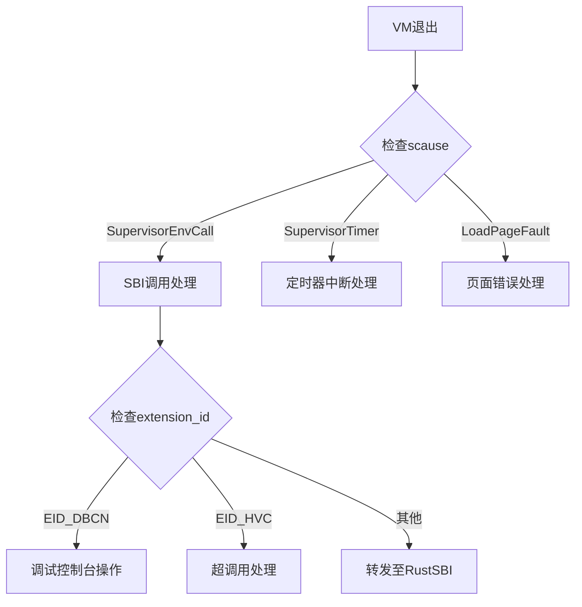
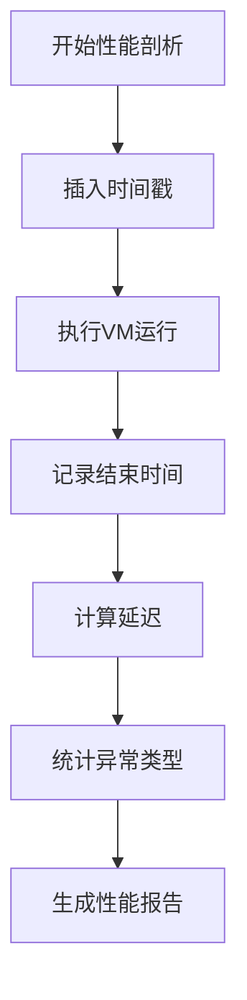

# 高级主题

<cite>
**本文档引用的文件**
- [vcpu.rs](file://src/vcpu.rs)
- [trap.rs](file://src/trap.rs)
- [percpu.rs](file://src/percpu.rs)
- [sbi_console.rs](file://src/sbi_console.rs)
- [regs.rs](file://src/regs.rs)
</cite>

## 目录
1. [性能优化策略](#性能优化策略)
2. [扩展开发指南](#扩展开发指南)
3. [调试技巧](#调试技巧)
4. [多核同步挑战与解决方案](#多核同步挑战与解决方案)
5. [性能剖析建议](#性能剖析建议)
6. [底层汇编代码修改安全实践](#底层汇编代码修改安全实践)

## 性能优化策略

在RISC-V虚拟CPU实现中，VM退出开销是影响整体性能的关键因素。通过分析`vcpu.rs`中的`vmexit_handler`函数和`trap.rs`中的陷阱处理机制，可以识别出多个优化机会。

SBI调用批处理是一种有效的减少VM退出次数的方法。当前实现中每个SBI调用都会触发一次完整的VM退出流程，可以通过引入缓冲机制将多个小的SBI操作合并为单个批量调用。这种优化特别适用于频繁的小型控制台输出操作，如连续的日志打印。

寄存器保存粒度的优化也是提升性能的重要手段。从`regs.rs`定义的`VmCpuRegisters`结构可以看出，系统保存了完整的通用寄存器和CSR状态。对于某些特定类型的VM退出（如已知只影响少数寄存器的操作），可以实现选择性保存策略，仅保存受影响的寄存器子集，从而减少上下文切换的开销。

**Section sources**
- [vcpu.rs](file://src/vcpu.rs#L180-L280)
- [regs.rs](file://src/regs.rs#L1-L253)

## 扩展开发指南

开发者可以通过多种方式扩展虚拟机的功能集。添加新的VM退出原因处理逻辑需要在`vcpu.rs`的`vmexit_handler`方法中进行修改。该方法使用模式匹配来处理不同类型的陷阱，包括环境调用、定时器中断和页面错误等。

要添加新的SBI功能，首先需要定义新的扩展ID（EID）和功能ID（FID）。例如，`sbi_console.rs`中定义了调试控制台扩展（EID_DBCN）及其相关功能。新功能的实现应遵循类似的模式：在`vmexit_handler`中添加对应的匹配分支，并确保正确处理参数传递和返回值设置。

对于HSM（Hart State Management）扩展的增强，可以在现有`hsm::EID_HSM`处理逻辑的基础上添加对`hsm::HART_SUSPEND`等未完全实现功能的支持。这涉及到与底层硬件抽象层（HAL）的协同工作，以正确管理处理器核心的状态转换。

**Section sources**
- [vcpu.rs](file://src/vcpu.rs#L180-L350)
- [sbi_console.rs](file://src/sbi_console.rs#L1-L62)

## 调试技巧

日志记录和断点调试是分析vCPU执行流的有效手段。本项目使用`trace!`宏进行详细的执行跟踪，这些日志语句分布在关键的执行路径上，如`vcpu.rs`中的`vmexit_handler`函数入口处。通过启用适当的日志级别，可以观察到每次VM退出的具体原因、程序计数器位置和相关寄存器值。

**Diagram sources**
- [vcpu.rs](file://src/vcpu.rs#L180-L350)

为了有效使用断点调试，建议在`_run_guest`汇编入口点和`vmexit_handler`之间设置断点，以捕获完整的VM执行周期。同时，可以在特定的SBI处理分支中设置条件断点，以便专注于感兴趣的执行路径。

**Section sources**
- [vcpu.rs](file://src/vcpu.rs#L183)
- [trap.rs](file://src/trap.rs#L1-L103)

## 多核环境下per-CPU状态同步的挑战及解决方案

在多核环境中，每个处理器核心都有其独立的per-CPU状态，这带来了同步和一致性方面的挑战。`percpu.rs`文件中的`RISCVPerCpu`结构体负责管理每个核心的特定状态，包括CSR配置和中断委托设置。

主要挑战包括中断处理的竞争条件和共享资源的访问协调。解决方案包括使用原子操作来更新共享状态，以及通过IPI（处理器间中断）机制进行核心间的通信。`setup_csrs`函数展示了如何为每个核心初始化HS级CSR，确保它们处于一致的状态。

另一个重要方面是时间相关的CSR同步，特别是`htimedelta`寄存器的管理。由于每个核心可能有不同的时间基线，必须确保虚拟机看到的时间视图是一致的。这通常通过主核心广播时间偏移量给其他核心来实现。

**Section sources**
- [percpu.rs](file://src/percpu.rs#L1-L84)
- [regs.rs](file://src/regs.rs#L150-L200)

## 性能剖析建议

测量上下文切换延迟是评估虚拟化性能的关键指标。可以通过在`_run_guest`前后插入高精度时间戳来实现。监控异常频率同样重要，特别是页面错误和非法指令异常的发生率，这些数据可以帮助识别潜在的性能瓶颈或兼容性问题。

**Diagram sources**
- [vcpu.rs](file://src/vcpu.rs#L150-L180)

建议建立一个性能基准测试套件，定期运行以检测回归。重点关注SBI调用的吞吐量、上下文切换的平均延迟以及内存访问模式的影响。这些指标可以指导进一步的优化方向。

**Section sources**
- [vcpu.rs](file://src/vcpu.rs#L1-L200)

## 底层汇编代码修改安全实践

虽然`trap.S`文件在当前项目中未能找到，但根据`trap.rs`中的全局汇编声明，可以推断其存在并包含关键的陷阱处理代码。修改此类底层汇编代码时必须极其谨慎。

首要原则是保持寄存器保存和恢复的完整性。任何修改都必须确保所有被调用约定规定的寄存器都被正确保存和恢复。其次，应避免引入可能导致死锁或竞态条件的长执行路径。

建议的实践包括：在修改前进行全面的备份，使用模拟器进行初步测试，以及逐步部署变更。此外，应该添加详细的注释说明修改的目的和影响范围，以便后续维护。

**Section sources**
- [trap.rs](file://src/trap.rs#L1-L103)